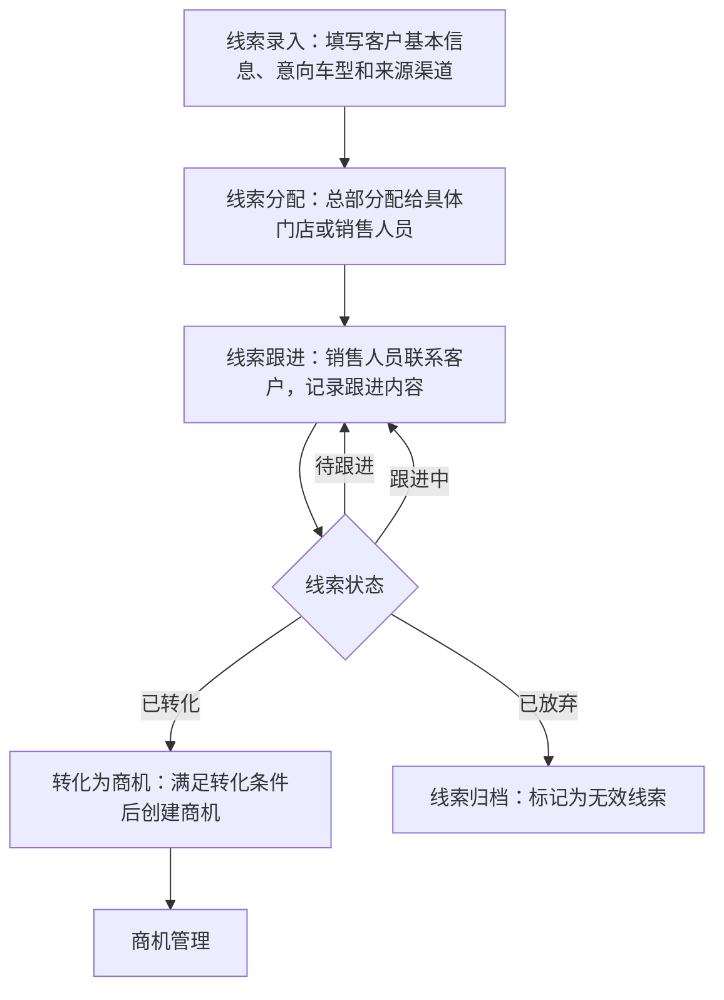
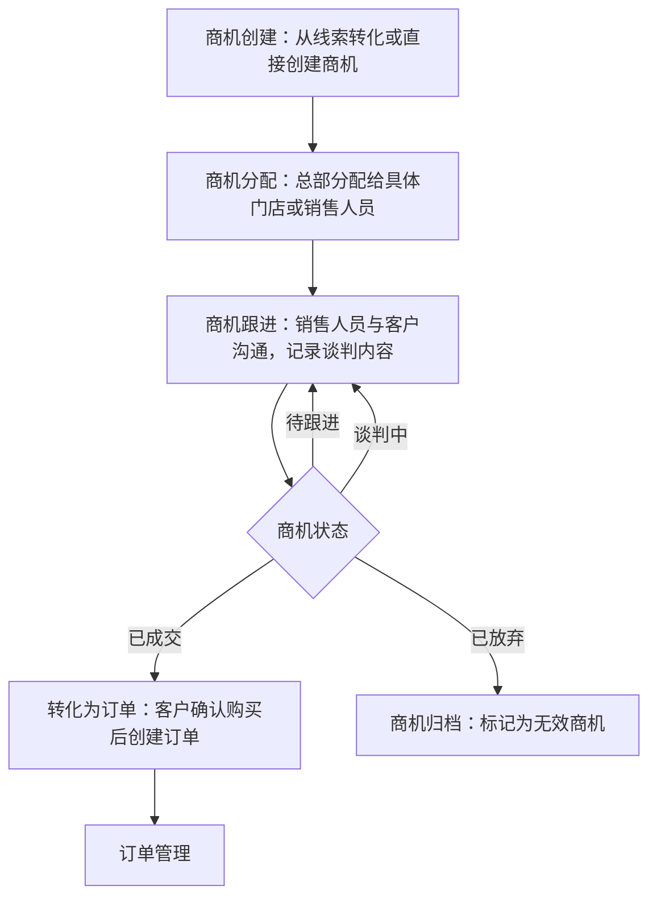
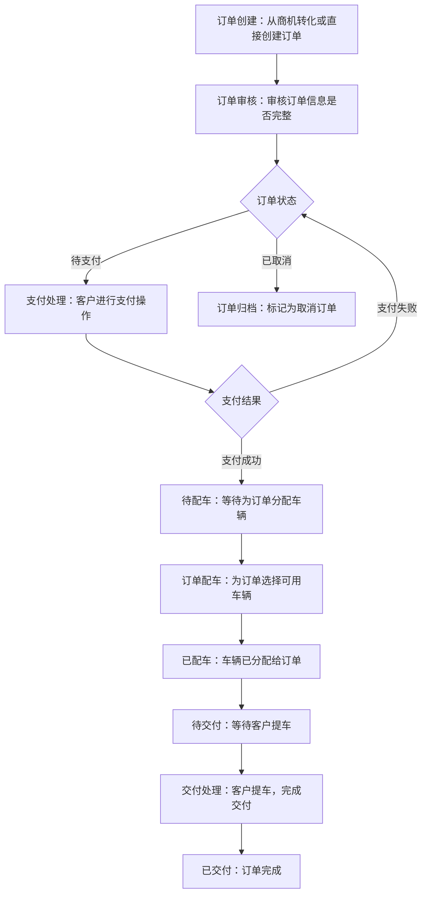
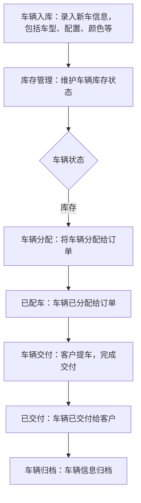
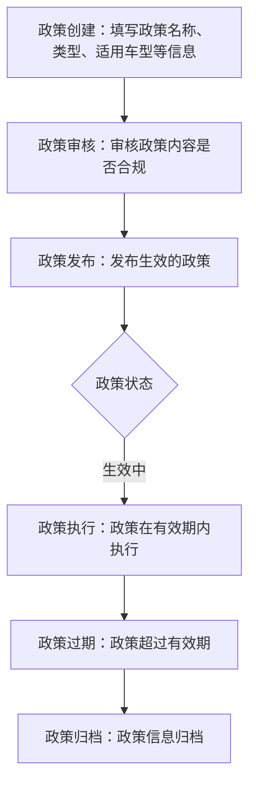
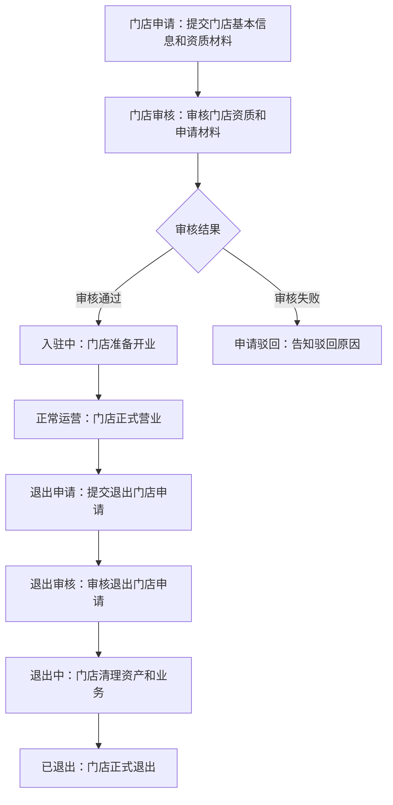
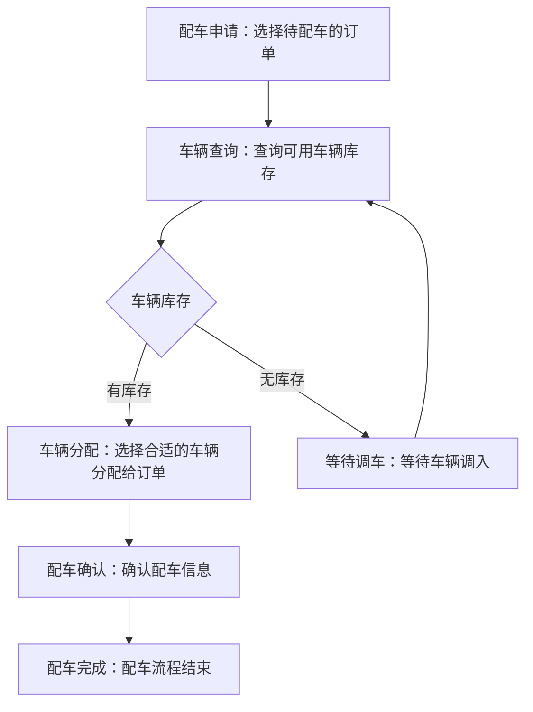
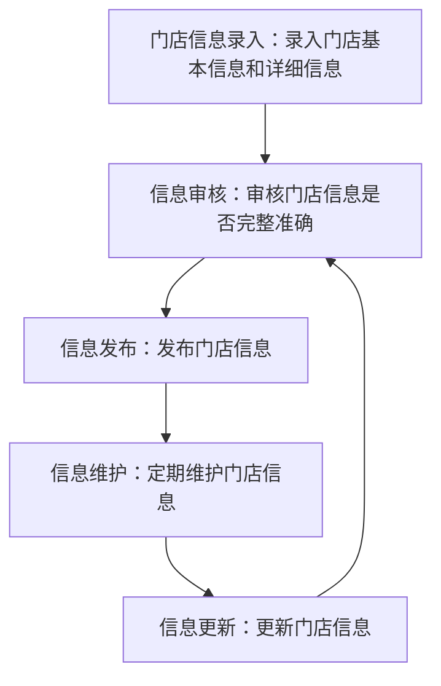
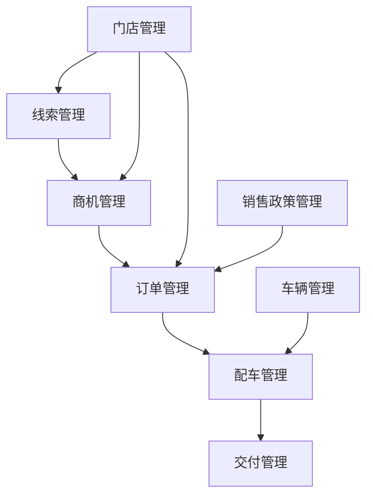

# 小鹏汽车客户管理后台业务流程图

## 1. 客户线索管理流程

```mermaid
flowchart TD
    A[线索录入：填写客户基本信息、意向车型和来源渠道] --> B[线索分配：总部分配给具体门店或销售人员]
    B --> C[线索跟进：销售人员联系客户，记录跟进内容]
    C --> D{线索状态}
    D -->|待跟进| C
    D -->|跟进中| C
    D -->|已转化| E[转化为商机：满足转化条件后创建商机]
    D -->|已放弃| F[线索归档：标记为无效线索]
    E --> G[商机管理]
```

## 2. 客户商机管理流程

```mermaid
flowchart TD
    A[商机创建：从线索转化或直接创建商机] --> B[商机分配：总部分配给具体门店或销售人员]
    B --> C[商机跟进：销售人员与客户沟通，记录谈判内容]
    C --> D{商机状态}
    D -->|待跟进| C
    D -->|谈判中| C
    D -->|已成交| E[转化为订单：客户确认购买后创建订单]
    D -->|已放弃| F[商机归档：标记为无效商机]
    E --> G[订单管理]
```

## 3. 客户订单管理流程

```mermaid
flowchart TD
    A[订单创建：从商机转化或直接创建订单] --> B[订单审核：审核订单信息是否完整]
    B --> C{订单状态}
    C -->|待支付| D[支付处理：客户进行支付操作]
    D --> E{支付结果}
    E -->|支付成功| F[待配车：等待为订单分配车辆]
    E -->|支付失败| C
    F --> G[订单配车：为订单选择可用车辆]
    G --> H[已配车：车辆已分配给订单]
    H --> I[待交付：等待客户提车]
    I --> J[交付处理：客户提车，完成交付]
    J --> K[已交付：订单完成]
    C -->|已取消| L[订单归档：标记为取消订单]
```

## 4. 待售车辆管理流程

```mermaid
flowchart TD
    A[车辆入库：录入新车信息，包括车型、配置、颜色等] --> B[库存管理：维护车辆库存状态]
    B --> C{车辆状态}
    C -->|库存| D[车辆分配：将车辆分配给订单]
    D --> E[已配车：车辆已分配给订单]
    E --> F[车辆交付：客户提车，完成交付]
    F --> G[已交付：车辆已交付给客户]
    G --> H[车辆归档：车辆信息归档]
```

## 5. 销售政策管理流程

```mermaid
flowchart TD
    A[政策创建：填写政策名称、类型、适用车型等信息] --> B[政策审核：审核政策内容是否合规]
    B --> C[政策发布：发布生效的政策]
    C --> D{政策状态}
    D -->|生效中| E[政策执行：政策在有效期内执行]
    E --> F[政策过期：政策超过有效期]
    F --> G[政策归档：政策信息归档]
```

## 6. 门店管理流程

```mermaid
flowchart TD
    A[门店申请：提交门店基本信息和资质材料] --> B[门店审核：审核门店资质和申请材料]
    B --> C{审核结果}
    C -->|审核通过| D[入驻中：门店准备开业]
    D --> E[正常运营：门店正式营业]
    E --> F[退出申请：提交退出门店申请]
    F --> G[退出审核：审核退出门店申请]
    G --> H[退出中：门店清理资产和业务]
    H --> I[已退出：门店正式退出]
    C -->|审核失败| J[申请驳回：告知驳回原因]
```

## 7. 订单配车流程

```mermaid
flowchart TD
    A[配车申请：选择待配车的订单] --> B[车辆查询：查询可用车辆库存]
    B --> C{车辆库存}
    C -->|有库存| D[车辆分配：选择合适的车辆分配给订单]
    D --> E[配车确认：确认配车信息]
    E --> F[配车完成：配车流程结束]
    C -->|无库存| G[等待调车：等待车辆调入]
    G --> B
```

## 8. 门店信息管理流程

```mermaid
flowchart TD
    A[门店信息录入：录入门店基本信息和详细信息] --> B[信息审核：审核门店信息是否完整准确]
    B --> C[信息发布：发布门店信息]
    C --> D[信息维护：定期维护门店信息]
    D --> E[信息更新：更新门店信息]
    E --> B
```

## 9. 整体业务流程

```mermaid
flowchart TD
    A[线索管理] --> B[商机管理]
    B --> C[订单管理]
    C --> D[配车管理]
    D --> E[交付管理]
    F[车辆管理] --> D
    G[门店管理] --> A
    G --> B
    G --> C
    H[销售政策管理] --> C
```