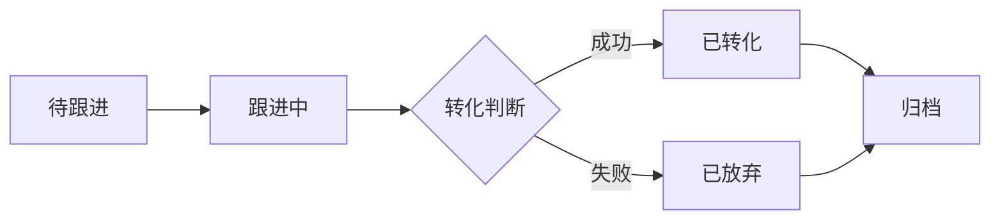
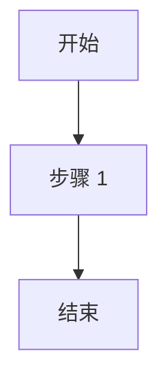
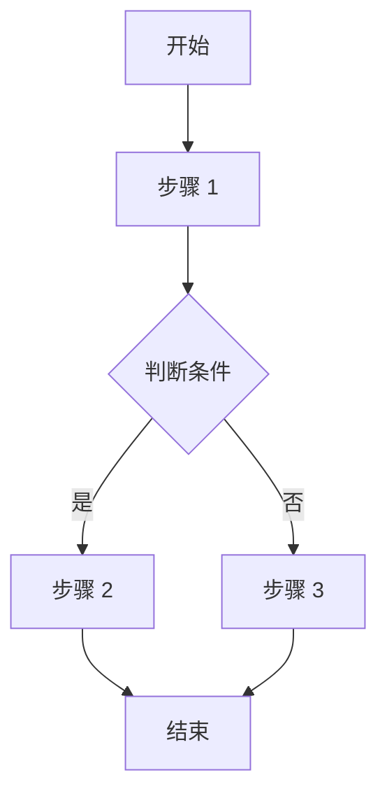
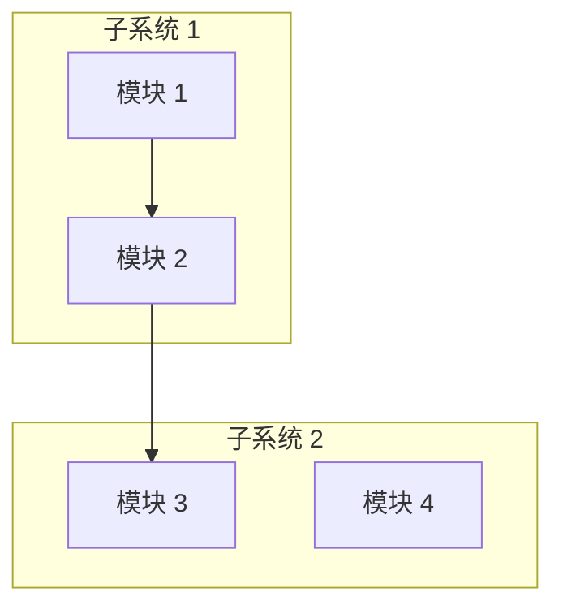

# 需求文档撰写规范

> **说明**：本规范基于多个实际项目需求文档分析提炼而成，旨在统一需求文档撰写标准，提高需求文档质量。

---

## 目录

1. [文档结构规范](#1-文档结构规范)
2. [内容撰写规范](#2-内容撰写规范)
3. [格式规范](#3-格式规范)
4. [术语使用规范](#4-术语使用规范)
5. [最佳实践](#5-最佳实践)
6. [常见错误及避免方法](#6-常见错误及避免方法)
7. [质量检查清单](#7-质量检查清单)

---

## 1. 文档结构规范

### 1.1 标准文档结构

需求文档必须包含以下核心章节（按顺序）：

```
1. 变更记录
2. 文档概述
3. 项目背景
4. 业务场景
5. 目标用户
6. 产品结构
7. 流程图
8. 高保真原型
9. 功能需求
10. 非功能需求
11. 项目范围
12. 风险分析
13. 验收标准
14. 交付物
15. 项目时间计划
16. 联系方式
```

### 1.2 章节编号规范

**正确示例**：
```markdown
## 1. 变更记录
## 2. 文档概述
### 2.1 文档目的
### 2.2 术语定义
## 9. 功能需求
### 9.1 功能模块 1
#### 9.1.1 功能描述
#### 9.1.2 详细需求
##### 9.1.2.1 字段定义
```

**错误示例**：
```markdown
# 一、变更记录
## 第一部分 文档概述
### (1) 文档目的
```

**规范要求**：
- 使用阿拉伯数字编号（1, 2, 3...）
- 层级使用小数点分隔（1.1, 1.1.1, 1.1.1.1）
- 最多支持 5 级标题（####）
- 标题后必须有空格

### 1.3 模块化文档结构

对于复杂系统，采用"主文档 + 详细需求文档"结构：

**主需求文档**：
- 位置：`项目文件夹/需求管理/需求文档主文档/需求文档.md`
- 内容：第 1-8 章完整内容 + 第 9 章概要 + 第 10-16 章完整内容
- 作用：提供系统整体视图和概要需求

**详细需求文档**：
- 位置：`项目文件夹/需求管理/详细需求/模块名称/需求文档.md`
- 内容：重点展开第 9 章功能需求的详细内容
- 结构：每个功能模块独立成文
- 作用：提供功能模块的详细信息

**示例结构**：
```
项目文件夹/
└── 需求管理/
    ├── 需求文档主文档/
    │   └── 需求文档.md
    └── 详细需求/
        ├── 客户线索管理/
        │   └── 需求文档.md
        ├── 客户商机管理/
        │   └── 需求文档.md
        └── 客户订单管理/
            └── 需求文档.md
```

---

## 2. 内容撰写规范

### 2.1 变更记录撰写规范

**必须包含的字段**：
- 版本号：使用语义化版本（1.0, 1.1, 2.0）
- 日期：YYYY-MM-DD 格式
- 变更内容：具体描述变更内容
- 变更人：填写真实姓名或角色
- 审批人：填写审批人姓名（可选但推荐）

**正确示例**：
```markdown
## 1. 变更记录

| 版本 | 日期 | 变更内容 | 变更人 | 审批人 |
|------|------|----------|--------|--------|
| 1.0 | 2026-03-01 | 初始版本 | 张三 | 李四 |
| 1.1 | 2026-03-05 | 新增客户订单管理模块的筛选字段定义 | 张三 | 李四 |
| 2.0 | 2026-03-10 | 重构功能需求章节结构，增加数据权限说明 | 张三 | 李四 |
```

**错误示例**：
```markdown
## 变更记录
- 3 月 1 日：创建文档
- 过几天：修改了一些内容
- 最近：又更新了
```

### 2.2 字段定义撰写规范

**必须包含的字段**：
- 字段名称：使用中文，清晰易懂
- 字段类型：明确具体（字符串、数字、日期时间、枚举等）
- 字段取值逻辑：详细说明取值规则
- 验证规则：必填/可选、格式要求等

**正确示例**：
```markdown
##### 9.1.1.1 字段定义

| 字段名称 | 字段类型 | 字段取值逻辑 | 验证规则 |
|---------|---------|-------------|----------|
| 线索 ID | 字符串 | 系统自动生成，格式：CL+ 年月日 +6 位数字（如 CL20260317000001） | 唯一，不可修改 |
| 客户姓名 | 字符串 | 手动输入 | 必填，长度 1-50 字符 |
| 手机号码 | 字符串 | 手动输入 | 必填，11 位数字，符合手机号格式 |
| 意向车型 | 枚举 | 下拉选择：小鹏 P7/小鹏 P5/小鹏 G3i/小鹏 G9 | 必选 |
| 线索状态 | 枚举 | 系统自动更新：待跟进/跟进中/已转化/已放弃 | 系统自动控制 |
| 创建时间 | 日期时间 | 系统自动生成，格式：YYYY-MM-DD HH:mm:ss | 系统自动填充 |
```

**错误示例**：
```markdown
| 字段 | 类型 | 说明 |
|------|------|------|
| 姓名 | 文本 | 客户的名字 |
| 电话 | 数字 | 客户的电话 |
| 车型 | 选择 | 选择车型 |
```

**问题分析**：
- 字段名称不清晰
- 字段类型不准确（"文本"、"数字"、"选择"过于模糊）
- 缺少验证规则
- 取值逻辑不详细

### 2.3 筛选字段撰写规范

**适用场景**：列表类功能（如客户列表、订单列表等）

**必须包含的字段**：
- 筛选字段：用于筛选的字段名称
- 筛选类型：精确匹配/模糊匹配/下拉选择/日期范围/数值范围
- 筛选操作逻辑：如何使用该筛选条件

**正确示例**：
```markdown
##### 9.1.1.2 筛选字段

| 筛选字段 | 筛选类型 | 筛选操作逻辑 |
|---------|---------|-------------|
| 线索状态 | 下拉选择 | 选择线索状态（待跟进/跟进中/已转化/已放弃），支持多选 |
| 线索来源 | 下拉选择 | 选择线索来源（线上/线下/车展/推荐），支持多选 |
| 客户姓名 | 模糊匹配 | 输入客户姓名的部分或全部，支持模糊搜索 |
| 创建时间 | 日期范围 | 选择开始日期和结束日期，筛选该时间范围内的线索 |
| 跟进人 | 下拉选择 | 选择跟进人，支持多选 |
```

**错误示例**：
```markdown
##### 筛选字段
- 可以按状态筛选
- 可以按时间筛选
- 可以搜索
```

**问题分析**：
- 没有使用表格
- 筛选类型不明确
- 操作逻辑不清晰

### 2.4 操作逻辑撰写规范

**必须包含的字段**：
- 操作按钮：所有可操作的按钮名称
- 操作逻辑：详细的操作步骤和逻辑
- 成功提示：操作成功后的提示信息
- 错误提示：操作失败后的错误提示

**正确示例**：
```markdown
##### 9.1.1.3 操作逻辑

| 操作按钮 | 操作逻辑 | 成功提示 | 错误提示 |
|---------|---------|---------|----------|
| 新增线索 | 1. 点击"新增线索"按钮<br>2. 填写线索信息表单<br>3. 点击"保存"按钮<br>4. 系统验证数据<br>5. 保存成功后返回列表页 | "线索创建成功" | "线索创建失败：[具体错误原因]" |
| 编辑线索 | 1. 在线索列表中点击"编辑"按钮<br>2. 修改线索信息<br>3. 点击"保存"按钮<br>4. 系统验证数据<br>5. 更新成功后返回列表页 | "线索更新成功" | "线索更新失败：[具体错误原因]" |
| 删除线索 | 1. 在线索列表中点击"删除"按钮<br>2. 弹出确认对话框<br>3. 点击"确认"按钮<br>4. 系统执行删除操作<br>5. 删除成功后刷新列表 | "线索删除成功" | "线索删除失败：该线索已转化为商机，无法删除" |
| 跟进线索 | 1. 在线索详情中点击"跟进"按钮<br>2. 填写跟进记录<br>3. 选择跟进结果<br>4. 点击"保存"按钮<br>5. 系统更新线索状态 | "跟进记录保存成功" | "跟进记录保存失败，请重试" |
| 转化线索 | 1. 在线索详情中点击"转化"按钮<br>2. 选择转化类型（商机/订单）<br>3. 填写转化信息<br>4. 点击"确认转化"按钮<br>5. 系统创建商机/订单，更新线索状态 | "线索转化成功" | "线索转化失败：[具体错误原因]" |
```

**错误示例**：
```markdown
##### 操作逻辑
- 新增：点击新增按钮，填写信息，保存
- 编辑：修改信息，保存
- 删除：删除线索
- 跟进：记录跟进内容
```

**问题分析**：
- 操作步骤不详细
- 缺少成功提示和错误提示
- 没有使用表格
- 逻辑描述不完整

### 2.5 状态流转撰写规范

**两种方式**：

**方式一：文本描述（适用于简单状态流转）**
```markdown
##### 9.1.1.4 状态流转

```
待跟进 → 跟进中 → 已转化/已放弃
```

状态说明：
- 待跟进：线索创建后初始状态
- 跟进中：销售人员开始跟进线索
- 已转化：线索成功转化为商机或订单
- 已放弃：线索确认无效，放弃跟进
```

**方式二：流程图描述（适用于复杂状态流转）**
```markdown
##### 9.1.1.4 状态流转



状态转换规则：
- 待跟进 → 跟进中：销售人员首次联系客户后手动转换
- 跟进中 → 已转化：客户确认购买意向，创建商机或订单
- 跟进中 → 已放弃：客户明确表示无购买意向
- 已转化/已放弃 → 归档：系统自动归档，不可再操作
```

**错误示例**：
```markdown
##### 状态流转
线索有不同的状态，会根据跟进情况变化，最后会归档。
```

**问题分析**：
- 没有清晰的状态列表
- 没有状态转换关系
- 没有转换规则说明

### 2.6 数据权限撰写规范

**必须包含的字段**：
- 角色：与第 5 章"目标用户"中的用户角色对应
- 权限限制：明确描述该角色的数据访问权限

**正确示例**：
```markdown
##### 9.1.1.5 数据权限

| 角色 | 权限限制 |
|------|----------|
| 总部管理员 | 可以查看和管理所有线索，包括分配线索给门店 |
| 总部销售经理 | 可以查看所有线索，可以分配线索给门店，不可删除线索 |
| 门店经理 | 可以查看分配到本门店的所有线索，可以分配线索给本门店销售人员 |
| 门店销售人员 | 只能查看分配给自己的线索，可以编辑和跟进自己的线索 |
```

**错误示例**：
```markdown
##### 数据权限
- 总部可以看所有数据
- 门店可以看自己的数据
- 销售只能看自己的线索
```

**问题分析**：
- 角色定义不清晰
- 权限描述不准确
- 没有使用表格
- 缺少具体的权限限制说明

### 2.7 非功能需求撰写规范

**必须包含的内容**：
- 性能要求：响应时间、并发处理、数据处理等
- 可靠性要求：系统可用性、数据备份、故障恢复等
- 安全性要求：数据加密、访问控制、安全审计等
- 易用性要求：用户界面、响应式设计、帮助文档等

**正确示例**：
```markdown
## 10. 非功能需求

### 10.1 性能要求
- **响应时间**：页面加载时间不超过 3 秒，API 接口响应时间不超过 1 秒
- **并发处理**：支持至少 1000 个并发用户同时在线操作
- **数据处理**：批量操作（如批量导入、导出）响应时间不超过 10 秒

### 10.2 可靠性要求
- **系统可用性**：系统可用性达到 99.9%，支持 7×24 小时运行
- **数据备份**：每天凌晨 2 点自动备份数据，保留 30 天的备份记录
- **故障恢复**：系统故障后 30 分钟内恢复正常运行

### 10.3 安全性要求
- **数据加密**：敏感数据（如密码、手机号）使用 AES-256 加密存储
- **访问控制**：基于角色的访问控制（RBAC），不同角色拥有不同的权限
- **安全审计**：所有操作都有日志记录，日志保留 180 天
- **防止攻击**：系统能够防止 SQL 注入、XSS 攻击等常见网络攻击

### 10.4 易用性要求
- **用户界面**：界面简洁明了，符合用户操作习惯
- **响应式设计**：支持 PC 端、平板、手机等不同设备访问
- **错误提示**：操作错误时提供明确、友好的错误提示
- **帮助文档**：提供详细的系统使用帮助文档和在线帮助
```

**错误示例**：
```markdown
## 非功能需求
- 系统要快
- 要安全稳定
- 要好用
```

**问题分析**：
- 要求不具体
- 无法衡量和验证
- 缺少量化指标

---

## 3. 格式规范

### 3.1 Markdown 格式规范

**标题格式**：
```markdown
# 一级标题（文档标题，一般不使用）
## 二级标题（章节标题）
### 三级标题（小节标题）
#### 四级标题（小小节标题）
##### 五级标题（用于字段定义等）
```

**表格格式**：
```markdown
| 列 1 | 列 2 | 列 3 |
|------|------|------|
| 内容 1 | 内容 2 | 内容 3 |
| 内容 4 | 内容 5 | 内容 6 |
```

**注意**：
- 表格必须有表头
- 分隔线必须使用 `|---|` 格式
- 表格内容要对齐

**代码块格式**：
````markdown


```javascript
function hello() {
    console.log("Hello World");
}
```
````

**注意**：
- 代码块必须指定语言（mermaid、javascript、bash 等）
- 代码块前后必须有空行

**列表格式**：
```markdown
- 无序列表项 1
- 无序列表项 2
  - 子列表项 1
  - 子列表项 2

1. 有序列表项 1
2. 有序列表项 2
3. 有序列表项 3
```

**注意**：
- 列表项后必须有空格
- 子列表必须缩进 2 个空格

### 3.2 文档编码规范

- 必须使用 UTF-8 编码
- 避免使用特殊字符和 emoji
- 中文文档使用中文标点符号
- 英文单词和数字前后加空格（中文语境下）

**正确示例**：
```markdown
系统支持 1000 个并发用户，响应时间不超过 3 秒。
使用 AES-256 算法进行数据加密。
```

**错误示例**：
```markdown
系统支持 1000 个并发用户，响应时间不超过 3 秒。
使用 AES-256 算法进行数据加密。
```

### 3.3 文件命名规范

**主需求文档**：
- 命名格式：`需求文档.md`
- 位置：`项目文件夹/需求管理/需求文档主文档/`

**详细需求文档**：
- 命名格式：`需求文档.md`
- 位置：`项目文件夹/需求管理/详细需求/模块名称/`

**示例**：
```
小鹏汽车客户管理后台/
└── 需求管理/
    ├── 需求文档主文档/
    │   └── 需求文档.md
    └── 详细需求/
        ├── 客户线索管理/
        │   └── 需求文档.md
        └── 客户订单管理/
            └── 需求文档.md
```

### 3.4 图表使用规范

**流程图必须使用 Mermaid 语法**：

**正确示例**：
```markdown

```

**产品结构图必须使用 Mermaid 语法**：
```markdown

```

**注意**：
- 流程图统一放在第 7 章"流程图"
- 产品结构图统一放在第 6 章"产品结构"
- 状态流转图放在对应功能模块的"状态流转"小节

---

## 4. 术语使用规范

### 4.1 术语定义规范

**首次出现必须定义**：
- 专业术语首次出现时必须提供解释
- 缩写词首次出现时必须提供全称

**正确示例**：
```markdown
### 2.2 术语定义

| 术语 | 解释 |
|------|------|
| 线索 | 潜在客户信息，尚未转化为商机或订单 |
| 商机 | 有购买意向的潜在客户，已进入销售流程 |
| VIN 码 | Vehicle Identification Number，车辆识别码，是车辆的唯一标识 |
| CRM | Customer Relationship Management，客户关系管理系统 |
```

### 4.2 术语一致性规范

**同一概念使用同一术语**：

**正确示例**：
- 全文统一使用"线索"
- 全文统一使用"商机"
- 全文统一使用"订单"

**错误示例**：
- 前面使用"线索"，后面使用"潜在客户"
- 前面使用"商机"，后面使用"销售机会"
- 前面使用"订单"，后面使用"工单"

### 4.3 用户角色命名规范

**命名原则**：
- 使用中文名称
- 清晰表达角色职责
- 避免使用缩写

**正确示例**：
- 总部管理员
- 门店经理
- 销售人员
- 系统管理员

**错误示例**：
- Admin
- Manager
- Sales
- 管理员 A、管理员 B

---

## 5. 最佳实践

### 5.1 需求描述最佳实践

**使用用户故事格式**：
```markdown
作为 [角色]，
我希望 [做什么]，
以便 [达到什么目的]。
```

**示例**：
```markdown
作为 销售人员，
我希望 能够快速查看分配给自己的线索列表，
以便 及时跟进潜在客户，提高转化率。
```

### 5.2 字段定义最佳实践

**完整性检查**：
- ✓ 所有字段都有定义
- ✓ 字段类型准确
- ✓ 取值逻辑清晰
- ✓ 验证规则明确
- ✓ 默认值说明（如有）
- ✓ 是否必填说明

**示例**：
```markdown
| 字段名称 | 字段类型 | 字段取值逻辑 | 验证规则 |
|---------|---------|-------------|----------|
| 订单状态 | 枚举 | 系统自动更新，取值：待支付/已支付/待配车/已配车/待交付/已交付/已取消 | 系统自动控制，不可手动修改 |
| 支付时间 | 日期时间 | 支付成功后系统自动记录，格式：YYYY-MM-DD HH:mm:ss | 仅在订单状态变为"已支付"时填充 |
```

### 5.3 操作逻辑最佳实践

**步骤详细化**：
1. 分解操作步骤
2. 说明每步的系统响应
3. 说明数据变化
4. 说明页面跳转

**示例**：
```markdown
| 操作按钮 | 操作逻辑 |
|---------|---------|
| 提交订单 | 1. 用户点击"提交订单"按钮<br>2. 系统验证订单信息完整性<br>3. 系统检查库存是否充足<br>4. 验证通过后生成订单号<br>5. 订单状态设置为"待支付"<br>6. 跳转到支付页面<br>7. 发送订单确认短信给用户 |
```

### 5.4 状态流转最佳实践

**完整描述**：
- 列出所有状态
- 说明状态转换条件
- 说明触发转换的操作
- 说明状态转换后的系统行为

**示例**：
```markdown
##### 状态流转

订单状态流转：
```
待支付 → 已支付 → 待配车 → 已配车 → 待交付 → 已交付
          ↓
        已取消
```

状态转换规则：
- 待支付 → 已支付：用户完成支付后系统自动转换
- 已支付 → 待配车：支付成功后系统自动转换
- 待支付 → 已取消：用户主动取消或超过 30 分钟未支付系统自动取消
- 待配车 → 已配车：完成配车操作后系统自动转换
- 已配车 → 待交付：配车完成后系统自动转换
- 待交付 → 已交付：完成交付确认后系统自动转换
```

### 5.5 数据权限最佳实践

**权限矩阵**：
为每个功能模块创建权限矩阵，清晰展示不同角色的权限。

**示例**：
```markdown
##### 数据权限

客户线索管理模块权限矩阵：

| 操作/角色 | 总部管理员 | 总部销售经理 | 门店经理 | 销售人员 |
|----------|-----------|-------------|---------|---------|
| 查看所有线索 | ✓ | ✓ | × | × |
| 查看本门店线索 | ✓ | ✓ | ✓ | × |
| 查看自己的线索 | ✓ | ✓ | ✓ | ✓ |
| 创建线索 | ✓ | ✓ | ✓ | × |
| 编辑线索 | ✓ | ✓ | ✓ | 仅自己的 |
| 删除线索 | ✓ | × | × | × |
| 分配线索 | ✓ | ✓ | ✓ | × |
| 跟进线索 | ✓ | ✓ | ✓ | 仅自己的 |
| 转化线索 | ✓ | ✓ | ✓ | 仅自己的 |
```

---

## 6. 常见错误及避免方法

### 6.1 模糊描述

**错误示例**：
- "系统应该快速响应"
- "界面要美观"
- "支持大量用户"

**正确写法**：
- "系统响应时间不超过 3 秒"
- "界面设计符合 Material Design 规范"
- "支持至少 1000 个并发用户"

**避免方法**：
- 使用量化指标
- 避免主观形容词
- 提供具体的验收标准

### 6.2 逻辑不完整

**错误示例**：
- 只描述正常流程，不描述异常流程
- 只描述操作成功，不描述操作失败
- 只描述主要功能，不描述边界情况

**正确写法**：
- 同时描述正常流程和异常流程
- 同时描述成功提示和错误提示
- 覆盖所有边界情况

**避免方法**：
- 使用流程图完整展示所有分支
- 为每个操作定义成功和错误提示
- 进行全面的场景分析

### 6.3 术语不一致

**错误示例**：
- 前面使用"用户"，后面使用"客户"
- 前面使用"订单"，后面使用"工单"
- 前面使用"门店"，后面使用"店铺"

**避免方法**：
- 在文档开头定义所有术语
- 建立术语表并严格遵守
- 使用文档编辑器的查找功能检查一致性

### 6.4 权限定义不清

**错误示例**：
- "管理员可以管理线索"
- "用户可以查看订单"

**正确写法**：
- "总部管理员可以查看、创建、编辑、删除所有线索，可以分配线索给门店"
- "销售人员只能查看分配给自己的线索，可以编辑和跟进自己的线索"

**避免方法**：
- 明确每个角色的具体权限
- 使用权限矩阵清晰展示
- 区分查看、创建、编辑、删除等不同操作权限

### 6.5 缺少验证规则

**错误示例**：
```markdown
| 字段名称 | 字段类型 | 说明 |
|---------|---------|------|
| 手机号 | 字符串 | 用户的手机号 |
| 价格 | 数字 | 商品价格 |
```

**正确写法**：
```markdown
| 字段名称 | 字段类型 | 字段取值逻辑 | 验证规则 |
|---------|---------|-------------|----------|
| 手机号 | 字符串 | 手动输入 | 必填，11 位数字，符合手机号格式 |
| 价格 | 数字 | 手动输入 | 必填，大于 0，最多保留 2 位小数 |
```

**避免方法**：
- 为每个字段定义验证规则
- 明确必填/可选
- 说明格式要求和取值范围

---

## 7. 质量检查清单

### 7.1 结构完整性检查

- [ ] 文档包含所有必需的章节（第 1-16 章）
- [ ] 章节编号正确且连续
- [ ] 标题层级清晰（最多 5 级）
- [ ] 变更记录包含所有必需字段
- [ ] 术语定义完整且准确

### 7.2 内容完整性检查

**功能需求章节**：
- [ ] 每个功能模块都有功能描述
- [ ] 每个功能模块都有字段定义
- [ ] 字段定义包含字段名称、类型、取值逻辑、验证规则
- [ ] 列表类功能包含筛选字段定义
- [ ] 每个功能模块都有操作逻辑
- [ ] 操作逻辑包含操作按钮、操作逻辑、成功提示、错误提示
- [ ] 每个功能模块都有状态流转
- [ ] 每个功能模块都有数据权限

**非功能需求章节**：
- [ ] 包含性能要求且有量化指标
- [ ] 包含可靠性要求且有具体说明
- [ ] 包含安全性要求且有具体措施
- [ ] 包含易用性要求且有具体描述

**其他章节**：
- [ ] 项目范围明确包含和排除范围
- [ ] 风险分析包含风险识别和缓解措施
- [ ] 验收标准具体、可衡量、可验证
- [ ] 交付物明确具体
- [ ] 项目时间计划包含阶段和里程碑
- [ ] 联系方式包含所有关键角色

### 7.3 格式规范性检查

- [ ] 使用 Markdown 格式
- [ ] 使用 UTF-8 编码
- [ ] 表格格式正确且有表头
- [ ] 流程图使用 Mermaid 语法
- [ ] 代码块指定语言
- [ ] 标题后有空格
- [ ] 列表项后有空格
- [ ] 无乱码和特殊字符

### 7.4 内容质量检查

- [ ] 术语使用一致
- [ ] 无模糊描述
- [ ] 逻辑完整（包含正常流程和异常流程）
- [ ] 权限定义清晰
- [ ] 验证规则完整
- [ ] 用户故事格式正确
- [ ] 无语法错误和错别字
- [ ] 描述清晰、准确、无歧义

### 7.5 一致性检查

- [ ] 主文档与详细需求文档内容一致
- [ ] 用户角色在各章节中一致
- [ ] 字段定义在各模块中一致
- [ ] 状态流转与业务流程一致
- [ ] 数据权限与用户角色一致
- [ ] 流程图与文字描述一致

---

## 附录

### 附录 A：文档模板

- [标准化需求文档模板](./标准化需求文档模板.md)
- [详细需求文档模板](./详细需求文档模板.md)

### 附录 B：参考资料

- Markdown 语法教程
- Mermaid 流程图教程
- 需求工程最佳实践

---

**规范版本**：1.0  
**创建日期**：2026-03-17  
**规范来源**：基于小鹏汽车客户管理后台、宠宝贝应用、贪吃蛇游戏、车辆预约维修管理系统等项目需求文档分析提炼
