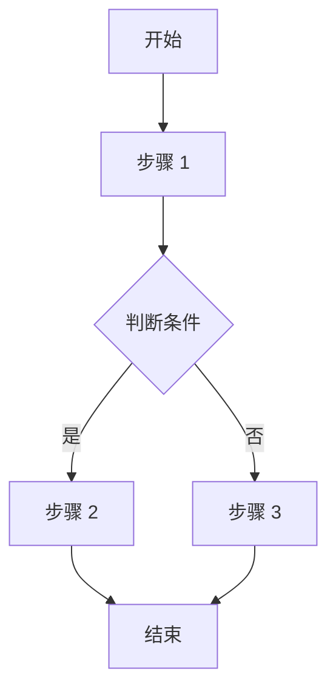
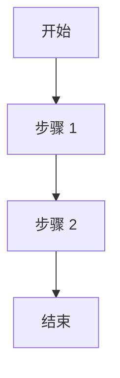

# 需求文档模板（融合版）

> **来源**：融合本地标准化模板与飞书知识库 9 个实际需求文档分析结果  
> **创建日期**：2026-03-17  
> **版本**：2.0（融合版）  
> **适用范围**：各类软件系统项目的需求文档撰写

---

## 模板使用说明

### 文档结构

本模板提供**完整结构**和**简化结构**两种选择：

**完整结构（16 章）**：适用于大型、复杂系统项目
```
1. 变更记录
2. 文档概述
3. 项目背景
4. 业务场景
5. 目标用户
6. 产品结构
7. 流程图
8. 高保真原型
9. 功能需求（核心章节）
10. 非功能需求
11. 数据需求
12. 接口需求
13. 项目范围
14. 风险分析
15. 验收标准
16. 交付物
17. 项目时间计划
18. 联系方式
```

**简化结构（7 章核心）**：适用于小型项目或模块级需求
```
1. 项目背景
2. 需求概述
3. 功能需求
4. 非功能需求
5. 数据需求
6. 接口需求
7. 验收标准
```

### 章节融合说明

| 融合后章节 | 来源 | 说明 |
|-----------|------|------|
| 第 1-2 章：变更记录、文档概述 | 本地模板 | 保持本地模板的完整性 |
| 第 3 章：项目背景 | 融合 | 本地模板 + 飞书模板（增加问题陈述） |
| 第 4 章：业务场景 | 本地模板 | 保持本地模板的详细场景描述 |
| 第 5 章：目标用户 | 融合 | 本地模板 + 飞书模板（增加用户画像） |
| 第 6 章：产品结构 | 本地模板 | 保持本地模板的架构和模块关系 |
| 第 7 章：流程图 | 本地模板 | 保持本地模板的 Mermaid 流程图 |
| 第 8 章：高保真原型 | 本地模板 | 保持本地模板的原型设计要求 |
| 第 9 章：功能需求 | 深度融合 | 本地模板的详细字段 + 飞书模板的用户故事和验收标准 |
| 第 10 章：非功能需求 | 融合 | 本地模板 + 飞书模板（增加兼容性需求） |
| 第 11 章：数据需求 | 飞书模板 | 采用飞书模板的独立章节结构 |
| 第 12 章：接口需求 | 飞书模板 | 采用飞书模板的独立章节结构 |
| 第 13-18 章 | 本地模板 | 保持本地模板的项目管理内容 |

---

## 1. 变更记录

| 版本 | 日期 | 变更内容 | 变更人 | 审批人 |
|------|------|----------|--------|--------|
| 1.0 | YYYY-MM-DD | 初始版本 | [姓名] | [姓名] |
| 1.1 | YYYY-MM-DD | [具体变更内容] | [姓名] | [姓名] |

**版本管理规范**：
- 版本号采用语义化版本格式：主版本号。次版本号（如 1.0、1.1、2.0）
- 重大变更升级主版本号，小幅修改升级次版本号
- 每次变更必须记录变更内容、变更日期、变更人和审批人

---

## 2. 文档概述

### 2.1 文档目的
本文档旨在详细描述 [系统/模块名称] 的需求，包括功能需求、非功能需求、业务场景、产品结构、原型设计和流程图等内容，为开发团队提供清晰的指导，确保系统的开发符合业务需求和用户期望。

### 2.2 术语定义
| 术语 | 解释 |
|------|------|
| [术语 1] | [解释 1] |
| [术语 2] | [解释 2] |

**填写要求**：
- 列出文档中涉及的专业术语、缩写词
- 确保术语解释准确、简洁
- 便于非专业人员理解文档内容

---

## 3. 项目背景

### 3.1 项目简介
[简要描述项目的背景、起源和基本情况，200-300 字]

### 3.2 业务背景
[描述项目发起的业务背景，包括行业趋势、市场环境、业务现状等]

### 3.3 业务痛点/问题陈述
- [痛点 1：描述当前业务存在的问题]
- [痛点 2：描述当前业务存在的问题]
- [痛点 3：描述当前业务存在的问题]

### 3.4 项目目标
- [目标 1：具体、可衡量的目标]
- [目标 2：具体、可衡量的目标]
- [目标 3：具体、可衡量的目标]

### 3.5 项目范围
**包含范围**：
- [包含功能 1]
- [包含功能 2]

**排除范围**：
- [排除功能 1]
- [排除功能 2]

**填写要求**：
- 项目简介应简洁明了，说明项目为什么做
- 业务背景要具体，避免空泛描述
- 业务痛点应具体、真实，反映实际问题
- 项目目标应符合 SMART 原则（具体、可衡量、可实现、相关性、时限性）
- 项目范围要明确边界，避免范围蔓延

---

## 4. 业务场景

### 4.1 典型业务场景
- **场景一：[场景名称]**
  - **描述**：[场景详细描述]
  - **流程**：
    1. [步骤 1]
    2. [步骤 2]
    3. [步骤 3]

- **场景二：[场景名称]**
  - **描述**：[场景详细描述]
  - **流程**：
    1. [步骤 1]
    2. [步骤 2]
    3. [步骤 3]

### 4.2 业务流程
- [业务流程 1：描述流程名称和简要说明]
- [业务流程 2：描述流程名称和简要说明]

**填写要求**：
- 业务场景应覆盖所有主要的使用场景
- 每个场景应包含场景描述和流程步骤
- 可配合流程图使用（见第 7 章）

---

## 5. 目标用户

### 5.1 用户画像
[描述目标用户群体的特征，包括用户角色、使用场景等]

### 5.2 用户角色
| 角色 | 职责 | 核心需求 | 使用频率 |
|------|------|----------|----------|
| [角色 1] | [职责描述] | [核心需求描述] | [高/中/低] |
| [角色 2] | [职责描述] | [核心需求描述] | [高/中/低] |

### 5.3 用户需求
- [用户需求 1：从用户角度描述需求]
- [用户需求 2：从用户角度描述需求]

**填写要求**：
- 用户画像要具体，包括角色、场景
- 用户角色应覆盖所有系统使用者
- 职责描述应清晰明确
- 核心需求应简洁、具体

---

## 6. 产品结构

### 6.1 系统整体架构
[描述系统的整体架构，包括前端、后端、数据库等组成部分]

### 6.2 模块关系
[描述各功能模块之间的关系和数据流向]

### 6.3 技术实现建议
[技术栈建议、架构选型建议等]

**产品结构图**：
```mermaid
graph TD
    subgraph [子系统 1]
        A[模块 1]
        B[模块 2]
    end
    
    subgraph [子系统 2]
        C[模块 3]
        D[模块 4]
    end
    
    A --> B
    B --> C
    C --> D
```

**填写要求**：
- 系统架构描述应清晰、完整
- 模块关系应说明数据流和业务流
- 必须提供产品结构图（使用 Mermaid 语法）

---

## 7. 流程图

### 7.1 系统整体流程
[系统整体流程图，展示系统的核心业务流程]



### 7.2 核心业务流程
- **[流程 1 名称]**：[流程描述]



- **[流程 2 名称]**：[流程描述]


**填写要求**：
- 每个核心业务流程都应提供流程图
- 流程图应使用 Mermaid 语法
- 流程图应清晰展示状态转换和判断逻辑

---

## 8. 高保真原型

### 8.1 设计风格
[描述系统的整体设计风格，包括配色方案、设计语言等]

### 8.2 页面设计
- **[页面 1 名称]**：[页面功能描述]
  - 主要元素：[元素列表]
  - 交互说明：[交互描述]

- **[页面 2 名称]**：[页面功能描述]
  - 主要元素：[元素列表]
  - 交互说明：[交互描述]

### 8.3 交互设计
[描述系统的交互设计原则和关键交互流程]

**填写要求**：
- 设计风格应与产品定位一致
- 页面设计应覆盖所有主要页面
- 可附原型图链接或截图

---

## 9. 功能需求（核心章节）

> **重要说明**：本章节是需求文档的核心部分，每个功能模块都应按照以下结构详细描述。对于复杂系统，建议将每个功能模块的详细需求单独成文（放在详细需求文件夹中）。

### 9.1 [功能模块 1 名称]

#### 9.1.1 功能描述
[简要描述该功能模块的作用和主要功能]

#### 9.1.2 详细需求
- [详细需求 1]
- [详细需求 2]
- [详细需求 3]

#### 9.1.3 需求优先级
- **优先级**：[P0/P1/P2/P3]
- **优先级说明**：[说明为什么是这个优先级]

**优先级定义**：
- **P0（Must have）**：必须做，没有这个功能产品无法上线
- **P1（Should have）**：应该做，重要但不紧急
- **P2（Could have）**：可以做，有了更好
- **P3（Won't have）**：暂不做，后续版本考虑

#### 9.1.4 用户故事
```
作为 [用户角色]
我想要 [功能/活动]
以便于 [商业价值/用户价值]

验收标准：
Given [前提条件]
When [操作]
Then [预期结果]
```

#### 9.1.5 功能详细设计

**输入**：
- [描述功能的输入数据或条件]

**处理逻辑**：
- [详细描述功能的处理逻辑和业务流程]
- [可以使用流程图辅助说明]

**输出**：
- [描述功能的输出结果]

#### 9.1.6 界面原型
[附上界面原型图或链接]

#### 9.1.7 字段定义
| 字段名称 | 字段类型 | 字段取值逻辑 | 验证规则 |
|---------|---------|-------------|----------|
| [字段 1] | [类型] | [取值逻辑说明] | [验证规则] |
| [字段 2] | [类型] | [取值逻辑说明] | [验证规则] |

**字段类型参考**：
- 字符串、数字、布尔值、日期时间、枚举、数组、对象等

**填写要求**：
- 字段名称应使用中文，清晰易懂
- 字段类型应明确具体
- 字段取值逻辑应详细说明
- 验证规则应明确必填/可选、格式要求等

#### 9.1.8 筛选字段（如适用）
| 筛选字段 | 筛选类型 | 筛选操作逻辑 |
|---------|---------|-------------|
| [字段 1] | [精确匹配/模糊匹配/下拉选择/日期范围] | [操作逻辑说明] |
| [字段 2] | [精确匹配/模糊匹配/下拉选择/日期范围] | [操作逻辑说明] |

**填写要求**：
- 仅列表类功能需要填写筛选字段
- 筛选类型应明确匹配方式
- 筛选操作逻辑应说明如何使用

#### 9.1.9 操作逻辑
| 操作按钮 | 操作逻辑 | 成功提示 | 错误提示 |
|---------|---------|---------|----------|
| [按钮 1] | [详细操作步骤] | [成功提示信息] | [错误提示信息] |
| [按钮 2] | [详细操作步骤] | [成功提示信息] | [错误提示信息] |

**填写要求**：
- 操作按钮应列出所有可操作项
- 操作逻辑应详细描述操作步骤
- 成功提示和错误提示应具体明确

#### 9.1.10 状态流转
```
状态 1 → 状态 2 → 状态 3
```

或使用流程图：


**填写要求**：
- 状态流转应清晰展示状态转换关系
- 复杂状态流转建议使用流程图
- 应说明触发状态转换的条件

#### 9.1.11 数据权限
| 角色 | 权限限制 |
|------|----------|
| [角色 1] | [权限描述，如：只能查看自己的数据] |
| [角色 2] | [权限描述，如：可以查看本部门数据] |

**填写要求**：
- 数据权限应与第 5 章的用户角色对应
- 权限描述应明确数据访问范围
- 应覆盖所有用户角色

#### 9.1.12 验收标准
```
Given [前提条件]
When [操作]
Then [预期结果]
```

### 9.2 [功能模块 2 名称]

[按照 9.1 结构继续描述其他功能模块]

---

## 10. 非功能需求

### 10.1 性能要求
- **响应时间**：[具体要求，如：页面加载时间不超过 3 秒]
- **并发处理**：[具体要求，如：支持 1000 人同时在线]
- **吞吐量**：[具体要求，如：每秒处理 100 个请求]
- **数据处理**：[具体要求，如：批量操作响应时间不超过 5 秒]

### 10.2 可靠性要求
- **系统可用性**：[具体要求，如：99.9%]
- **数据备份**：[具体要求，如：每天自动备份]
- **故障恢复**：[具体要求，如：系统故障后 30 分钟内恢复]
- **容错能力**：[描述系统的容错和异常处理能力]

### 10.3 安全性要求
- **数据加密**：[具体要求，如：敏感数据加密存储]
- **访问控制**：[具体要求，如：基于角色的权限控制]
- **安全审计**：[具体要求，如：所有操作都有日志记录]
- **认证授权**：[描述用户认证和权限管理要求]

### 10.4 易用性要求
- **用户界面**：[具体要求，如：界面简洁明了]
- **响应式设计**：[具体要求，如：支持不同设备访问]
- **帮助文档**：[具体要求，如：提供详细的使用帮助]
- **操作便捷性**：[描述操作便捷性要求]

### 10.5 兼容性需求
- **浏览器兼容**：[描述支持的浏览器类型和版本]
- **设备兼容**：[描述支持的设备类型，如 PC、移动端]
- **系统兼容**：[描述支持的操作系统]

### 10.6 可扩展性要求（如适用）
- **功能扩展**：[具体要求]
- **集成能力**：[具体要求]
- **数据接口**：[具体要求]

**填写要求**：
- 非功能需求应具体、可衡量
- 应避免模糊的描述
- 应根据项目实际情况调整要求

---

## 11. 数据需求

### 11.1 数据模型
[描述系统的数据模型，包括 ER 图、数据表结构等]

#### 11.1.1 [数据表 1]
| 字段名 | 数据类型 | 长度 | 必填 | 默认值 | 说明 |
|-------|---------|-----|------|--------|------|
| id | INT | - | 是 | 自增 | 主键 |
| name | VARCHAR | 100 | 是 | - | 名称 |

#### 11.1.2 [数据表 2]
[按照 11.1.1 结构继续描述其他数据表]

### 11.2 数据流
[描述数据在系统中的流转过程，可以使用数据流图]

### 11.3 数据迁移（如适用）
[如果有数据迁移需求，描述迁移方案和策略]

### 11.4 数据治理（如适用）
[描述数据质量管理、数据标准等要求]

**填写要求**：
- 数据模型要清晰，表结构完整
- 数据流要准确，说明数据来源和去向
- 数据迁移要详细，包括迁移步骤和验证

---

## 12. 接口需求

### 12.1 内部接口
[描述系统内部模块之间的接口定义]

#### 12.1.1 [接口名称 1]
- **接口描述**：[描述接口的作用]
- **请求方式**：GET/POST/PUT/DELETE
- **请求 URL**：[接口路径]
- **请求参数**：
  ```json
  {
    "param1": "value1",
    "param2": "value2"
  }
  ```
- **响应参数**：
  ```json
  {
    "code": 200,
    "data": {},
    "message": "success"
  }
  ```

### 12.2 外部接口
[描述与外部系统的接口定义]

#### 12.2.1 [外部系统名称]
- **接口描述**：[描述接口的作用]
- **接口类型**：[RESTful/RPC/WebService 等]
- **调用方式**：[同步/异步]
- **数据格式**：[JSON/XML 等]

### 12.3 接口安全
[描述接口的安全认证机制，如 API Key、OAuth 等]

**填写要求**：
- 接口定义要完整，包括 URL、方法、参数
- 请求和响应格式要明确
- 安全机制要具体

---

## 13. 项目范围

### 13.1 包含范围
- [包含功能 1]
- [包含功能 2]
- [包含功能 3]

### 13.2 排除范围
- [排除功能 1]
- [排除功能 2]

**填写要求**：
- 包含范围应明确项目交付的功能
- 排除范围应明确项目不交付的功能
- 有助于管理项目干系人期望

---

## 14. 风险分析

### 14.1 风险识别
- **风险 1：[风险名称]**
  - 风险描述：[详细描述]
  - 影响程度：[高/中/低]
  - 发生概率：[高/中/低]

- **风险 2：[风险名称]**
  - 风险描述：[详细描述]
  - 影响程度：[高/中/低]
  - 发生概率：[高/中/低]

### 14.2 风险缓解措施
- **风险 1**：[具体缓解措施]
- **风险 2**：[具体缓解措施]

**填写要求**：
- 风险识别应全面，覆盖技术、业务、项目等方面
- 影响程度和发生概率应客观评估
- 缓解措施应具体可行

---

## 15. 验收标准

### 15.1 功能验收
| 验收项 | 验收方法 | 验收标准 | 验收结果 |
|-------|---------|---------|---------|
| 功能 1 | 测试用例 1 | 预期结果 1 | ☐ 通过  失败 |
| 功能 2 | 测试用例 2 | 预期结果 2 | ☐ 通过  失败 |

### 15.2 性能验收
- [ ] 响应时间满足要求
- [ ] 并发能力满足要求
- [ ] 吞吐量满足要求

### 15.3 安全验收
- [ ] 认证授权机制正常
- [ ] 数据加密符合要求
- [ ] 审计日志完整

### 15.4 可用性验收
- [ ] 用户界面友好
- [ ] 操作便捷
- [ ] 帮助文档完整

### 15.5 文档验收
- [ ] 需求文档完整
- [ ] 设计文档完整
- [ ] 用户手册完整
- [ ] API 文档完整

**填写要求**：
- 验收标准应具体、可衡量、可验证
- 应覆盖功能、性能、安全、可用性等方面
- 便于项目验收时使用

---

## 16. 交付物

### 16.1 文档交付物
- [文档 1：如需求文档、设计文档等]
- [文档 2：如测试文档、用户手册等]

### 16.2 代码交付物
- [代码 1：如前端代码、后端代码等]
- [代码 2：如数据库脚本等]

### 16.3 其他交付物
- [其他 1：如部署文档、培训材料等]
- [其他 2：如运维手册等]

**填写要求**：
- 交付物应明确具体
- 应包含所有需要交付的内容
- 便于项目交付时核对

---

## 17. 项目时间计划

### 17.1 项目阶段
| 阶段 | 时间 | 主要任务 | 交付物 |
|------|------|----------|--------|
| 需求阶段 | [开始日期] 至 [结束日期] | [任务描述] | [交付物] |
| 设计阶段 | [开始日期] 至 [结束日期] | [任务描述] | [交付物] |
| 开发阶段 | [开始日期] 至 [结束日期] | [任务描述] | [交付物] |
| 测试阶段 | [开始日期] 至 [结束日期] | [任务描述] | [交付物] |
| 部署阶段 | [开始日期] 至 [结束日期] | [任务描述] | [交付物] |
| 培训阶段 | [开始日期] 至 [结束日期] | [任务描述] | [交付物] |

### 17.2 关键里程碑
- [里程碑 1：名称和日期]
- [里程碑 2：名称和日期]

**填写要求**：
- 项目阶段应覆盖完整的项目生命周期
- 时间和任务应具体明确
- 关键里程碑应突出重要节点

---

## 18. 联系方式

### 18.1 项目团队
| 角色 | 姓名 | 电话 | 邮箱 |
|------|------|------|------|
| 产品负责人 | [姓名] | [电话] | [邮箱] |
| 技术负责人 | [姓名] | [电话] | [邮箱] |
| 测试负责人 | [姓名] | [电话] | [邮箱] |
| 项目协调 | [姓名] | [电话] | [邮箱] |

### 18.2 沟通方式
- 项目会议：[会议频率，如：每周一次]
- 日常沟通：[沟通工具，如：企业微信]
- 问题跟踪：[跟踪工具，如：JIRA]

**填写要求**：
- 项目团队应包含所有关键角色
- 联系方式应准确有效
- 沟通方式应明确具体

---

## 附录

### 附录 A：参考资料
- [参考资料 1]
- [参考资料 2]

### 附录 B：相关文档
- [相关文档 1]
- [相关文档 2]

---

## 文档撰写说明

### 1. 文档结构使用指南

**大型复杂项目**：
- 必须包含所有章节（第 1-18 章）
- 采用"主文档 + 详细需求文档"结构
- 每个功能模块独立成文

**中小型项目**：
- 可简化第 6-8 章（产品结构、流程图、高保真原型）
- 重点撰写第 9 章（功能需求）
- 其他章节根据项目实际情况裁剪

**模块级需求**：
- 重点撰写第 9 章（功能需求）
- 其他章节可简化或省略

### 2. 模块化文档结构

对于复杂系统，建议采用"主文档 + 详细需求文档"的结构：

**主需求文档**：
- 位置：`项目文件夹/需求管理/需求文档主文档/需求文档.md`
- 内容：第 1-8 章、第 10-18 章，以及第 9 章的概要
- 作用：提供系统整体视图和概要需求

**详细需求文档**：
- 位置：`项目文件夹/需求管理/详细需求/模块名称/需求文档.md`
- 内容：重点展开第 9 章功能需求的详细内容
- 结构：每个功能模块独立成文
- 作用：提供功能模块的详细信息

**示例结构**：
```
项目文件夹/
└── 需求管理/
    ├── 需求文档主文档/
    │   └── 需求文档.md
    └── 详细需求/
        ├── 客户线索管理/
        │   └── 需求文档.md
        ├── 客户商机管理/
        │   └── 需求文档.md
        └── 客户订单管理/
        │   └── 需求文档.md
```

### 3. 文档格式要求

- 使用 Markdown 格式
- 使用 UTF-8 编码
- 表格使用 Markdown 表格语法
- 流程图使用 Mermaid 语法
- 代码块使用 Markdown 代码块语法
- 标题层级清晰（最多 5 级）

### 4. 版本管理

- 使用 Git 进行版本控制
- 每次修改必须更新变更记录
- 主分支保护，使用功能分支开发
- 定期提交需求文档的修改

### 5. 最佳实践

**内容撰写**：
- 使用清晰、准确的描述，避免模糊词汇
- 每个需求都应该是可验证、可测试的
- 使用用户故事格式描述需求，关注用户价值
- 为每个功能模块定义明确的验收标准
- 字段定义、操作逻辑、状态流转、数据权限要完整

**文档维护**：
- 保持文档的更新和维护
- 需求变更时及时更新文档
- 保留历史版本，便于追溯变更
- 定期审查文档的完整性和准确性

---

## 模板融合说明

### 融合来源

**本地标准化模板**：
- 来源：基于小鹏汽车客户管理后台、宠宝贝应用、贪吃蛇游戏、车辆预约维修管理系统等项目
- 优势：16 章完整结构，详细的项目管理内容，完善的字段定义和操作逻辑

**飞书知识库模板**：
- 来源：基于飞书知识库（KAKA 知识）中 9 个实际需求文档（中心仓、企微 RPA 项目、大模型外呼）
- 优势：7 章核心结构，需求优先级管理，用户故事和验收标准格式，独立的数据需求和接口需求

### 融合原则

1. **保持完整性**：保留本地模板的 16 章完整结构
2. **吸收优点**：融入飞书模板的需求优先级、用户故事、验收标准等最佳实践
3. **独立章节**：将数据需求和接口需求独立成章（第 11、12 章）
4. **灵活裁剪**：提供完整结构和简化结构两种选择
5. **实用导向**：根据项目规模和复杂度选择合适的章节

### 主要改进

**新增内容**：
- 需求优先级管理（P0/P1/P2/P3）
- 用户故事标准格式（As a... I want... So that...）
- 验收标准格式（Given-When-Then）
- 问题陈述（业务痛点）
- 用户画像
- 数据需求独立成章
- 接口需求独立成章
- 兼容性需求

**优化内容**：
- 功能需求章节深度融合两种模板的优点
- 非功能需求增加兼容性要求
- 验收标准增加表格形式和检查清单
- 文档结构提供完整和简化两种选择

---

**模板版本**：2.0（融合版）  
**创建日期**：2026-03-17  
**模板来源**：
- 本地标准化模板（基于小鹏汽车、宠宝贝、贪吃蛇游戏、车辆预约维修管理系统等项目）
- 飞书知识库模板（基于 KAKA 知识库 9 个实际需求文档：中心仓、企微 RPA 项目、大模型外呼）
