# 宠宝贝应用产品结构图

```mermaid
graph TD
    subgraph 宠宝贝应用
        subgraph H5前端
            A[我的宠物] --> A1[宠物信息管理]
            A --> A2[健康记录]
            A --> A3[提醒功能]
            A --> A4[宠物相册]
            B[宠物广场] --> B1[动态发布]
            B --> B2[点赞评论]
            B --> B3[关注功能]
            B --> B4[话题讨论]
            B --> B5[搜索功能]
            C[宠物商城] --> C1[商品浏览]
            C --> C2[商品搜索]
            C --> C3[购物车]
            C --> C4[订单管理]
            C --> C5[支付功能]
        end
        
        subgraph 后端管理系统
            D[宠物信息管理] --> D1[宠物信息审核]
            D --> D2[宠物信息查询]
            D --> D3[宠物信息统计]
            E[账号权限管理] --> E1[用户账号管理]
            E --> E2[权限管理]
            E --> E3[登录日志]
            F[商品库存管理] --> F1[商品管理]
            F --> F2[库存管理]
            F --> F3[价格管理]
            G[订单系统管理] --> G1[订单处理]
            G --> G2[订单查询]
            G --> G3[订单统计]
            G --> G4[物流管理]
        end
        
        H5前端 --> 后端管理系统
    end
```

## 产品结构说明

1. **H5前端**：面向宠物主人的用户界面，包含三个主要模块：
   - **我的宠物**：管理宠物基本信息、健康记录、提醒和相册
   - **宠物广场**：社交分享平台，用户可以发布动态、点赞评论、关注其他用户、参与话题讨论和搜索内容
   - **宠物商城**：在线购物平台，用户可以浏览商品、搜索商品、管理购物车、查看订单和进行支付

2. **后端管理系统**：面向管理员的管理界面，包含四个主要模块：
   - **宠物信息管理**：审核、查询和统计宠物信息
   - **账号权限管理**：管理用户账号、权限和登录日志
   - **商品库存管理**：管理商品信息、库存和价格
   - **订单系统管理**：处理订单、查询订单、统计订单和管理物流

3. **数据流**：H5前端与后端管理系统之间通过API进行数据交互，确保数据的实时性和一致性。
