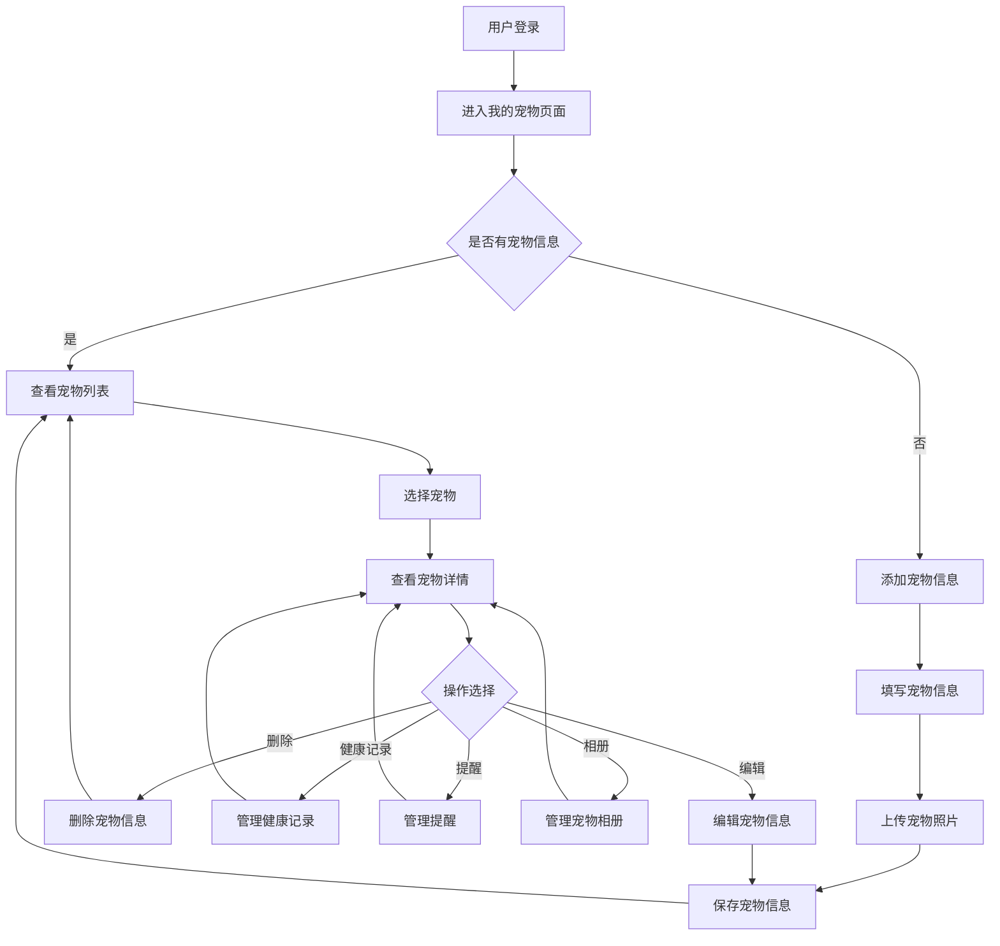
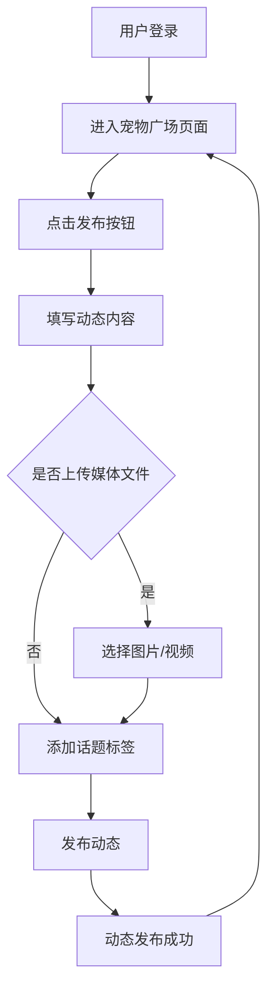
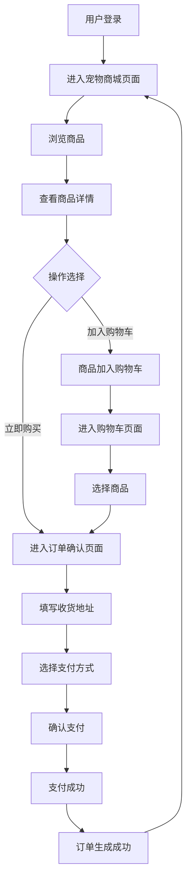
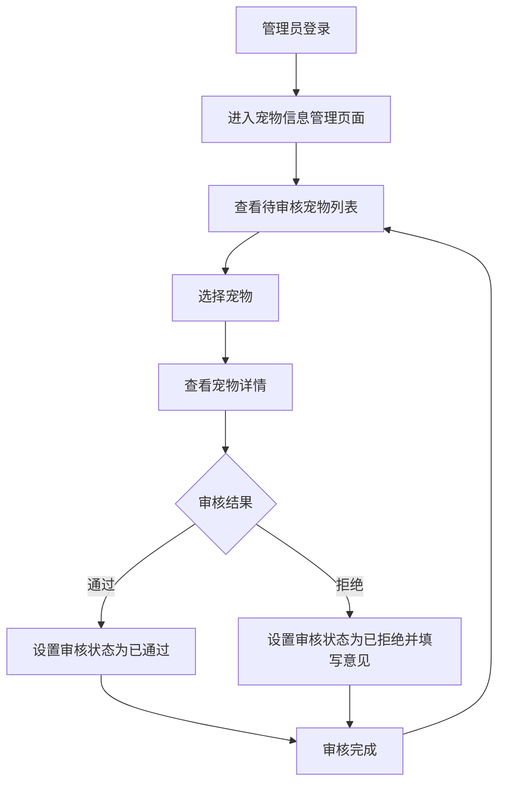
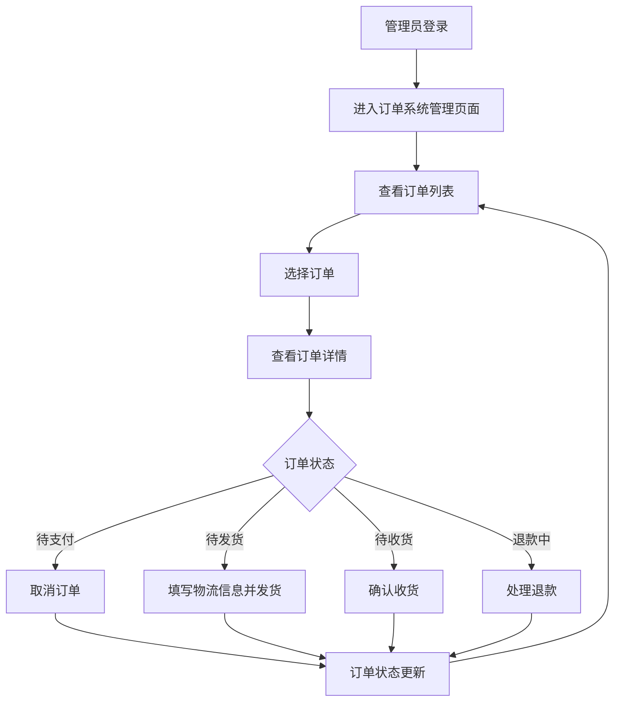

# 宠宝贝应用需求文档

## 1. 变更记录

| 版本 | 日期 | 变更内容 | 变更人 |
|------|------|----------|--------|
| 1.0  | 2026-03-03 | 初始版本 | 产品专家 |

## 2. 文档概述

本需求文档描述了宠宝贝应用的功能需求、技术要求和用户体验设计。宠宝贝应用是一款面向宠物主人的综合服务平台，旨在提供宠物管理、社交分享和商品购买等功能。应用分为H5前端和后端管理系统两部分，其中H5前端包含我的宠物、宠物广场、宠物商城3个主要模块，后端管理系统包含宠物信息、账号权限、商品库存、订单系统等管理模块。

## 3. 项目背景

随着人们生活水平的提高，宠物已经成为许多家庭的重要成员，宠物相关市场需求日益增长。为了满足宠物主人的多样化需求，我们计划开发宠宝贝应用，整合宠物管理、社交分享和商品购买功能，形成一站式服务平台。

## 4. 业务场景

### 4.1 H5前端业务场景

#### 4.1.1 我的宠物
- **场景1**：用户添加宠物信息，记录宠物基本信息、健康状况和疫苗接种情况
- **场景2**：用户设置宠物提醒，如疫苗接种、体检、喂食等
- **场景3**：用户上传宠物照片和视频，管理宠物相册

#### 4.1.2 宠物广场
- **场景1**：用户发布宠物动态，分享宠物照片、视频和文字内容
- **场景2**：用户浏览其他用户的动态，进行点赞和评论
- **场景3**：用户关注其他宠物主人，查看其动态
- **场景4**：用户参与宠物相关话题的讨论

#### 4.1.3 宠物商城
- **场景1**：用户浏览宠物食品、用品、玩具等商品
- **场景2**：用户搜索商品，根据分类和价格进行筛选
- **场景3**：用户将商品加入购物车，进行结算和支付
- **场景4**：用户查看订单状态，管理历史订单

### 4.2 后端管理系统业务场景

#### 4.2.1 宠物信息管理
- **场景1**：管理员审核用户提交的宠物信息
- **场景2**：管理员查询和统计宠物信息

#### 4.2.2 账号权限管理
- **场景1**：管理员管理用户账号，包括添加、编辑、删除用户
- **场景2**：管理员设置用户权限，分配角色
- **场景3**：管理员查看用户登录日志

#### 4.2.3 商品库存管理
- **场景1**：管理员添加、编辑、删除商品信息
- **场景2**：管理员管理商品库存，设置库存预警
- **场景3**：管理员设置商品价格，管理促销活动

#### 4.2.4 订单系统管理
- **场景1**：管理员处理用户订单，更新订单状态
- **场景2**：管理员查询和统计订单信息
- **场景3**：管理员管理订单物流信息

## 5. 目标用户

### 5.1 H5前端目标用户
- **宠物主人**：20-40岁之间，有一定经济能力，关注宠物健康和生活质量
- **宠物爱好者**：喜欢宠物，乐于分享宠物相关内容
- **宠物用品消费者**：需要购买宠物食品、用品、玩具等

### 5.2 后端管理系统目标用户
- **系统管理员**：负责管理系统用户、权限和配置
- **内容管理员**：负责审核宠物信息、管理商品和订单
- **运营人员**：负责数据分析和运营策略制定

## 6. 产品结构

```mermaid
graph TD
    subgraph 宠宝贝应用
        subgraph H5前端
            A[我的宠物] --> A1[宠物信息管理]
            A --> A2[健康记录]
            A --> A3[提醒功能]
            A --> A4[宠物相册]
            B[宠物广场] --> B1[动态发布]
            B --> B2[点赞评论]
            B --> B3[关注功能]
            B --> B4[话题讨论]
            B --> B5[搜索功能]
            C[宠物商城] --> C1[商品浏览]
            C --> C2[商品搜索]
            C --> C3[购物车]
            C --> C4[订单管理]
            C --> C5[支付功能]
        end
        
        subgraph 后端管理系统
            D[宠物信息管理] --> D1[宠物信息审核]
            D --> D2[宠物信息查询]
            D --> D3[宠物信息统计]
            E[账号权限管理] --> E1[用户账号管理]
            E --> E2[权限管理]
            E --> E3[登录日志]
            F[商品库存管理] --> F1[商品管理]
            F --> F2[库存管理]
            F --> F3[价格管理]
            G[订单系统管理] --> G1[订单处理]
            G --> G2[订单查询]
            G --> G3[订单统计]
            G --> G4[物流管理]
        end
        
        H5前端 --> 后端管理系统
    end
```

## 7. 流程图

### 7.1 H5前端流程图

#### 7.1.1 宠物信息管理流程

#### 7.1.2 动态发布流程

#### 7.1.3 商品购买流程

### 7.2 后端管理系统流程图

#### 7.2.1 宠物信息审核流程

#### 7.2.2 订单处理流程

## 8. 高保真原型

### 8.1 H5前端原型

#### 8.1.1 我的宠物页面
- **页面布局**：顶部导航栏，中间宠物列表，底部添加按钮
- **配色方案**：活力黄为主色调，搭配白色和浅灰色
- **交互设计**：点击宠物进入详情页，点击添加按钮进入添加页面

#### 8.1.2 宠物广场页面
- **页面布局**：顶部导航栏，中间动态列表，底部发布按钮
- **配色方案**：活力黄为主色调，搭配白色和浅灰色
- **交互设计**：下拉刷新，上拉加载更多，点击动态进入详情页

#### 8.1.3 宠物商城页面
- **页面布局**：顶部搜索栏，中间商品列表，底部购物车按钮
- **配色方案**：活力黄为主色调，搭配白色和浅灰色
- **交互设计**：点击商品进入详情页，点击购物车按钮进入购物车页面

### 8.2 后端管理系统原型

#### 8.2.1 宠物信息管理页面
- **页面布局**：左侧导航栏，右侧内容区，顶部搜索和操作按钮
- **配色方案**：蓝色为主色调，搭配白色和浅灰色
- **交互设计**：表格展示宠物信息，支持批量操作和导出

#### 8.2.2 账号权限管理页面
- **页面布局**：左侧导航栏，右侧内容区，顶部搜索和操作按钮
- **配色方案**：蓝色为主色调，搭配白色和浅灰色
- **交互设计**：表格展示用户信息，支持批量操作和权限分配

#### 8.2.3 商品库存管理页面
- **页面布局**：左侧导航栏，右侧内容区，顶部搜索和操作按钮
- **配色方案**：蓝色为主色调，搭配白色和浅灰色
- **交互设计**：表格展示商品信息，支持批量操作和库存管理

#### 8.2.4 订单系统管理页面
- **页面布局**：左侧导航栏，右侧内容区，顶部搜索和操作按钮
- **配色方案**：蓝色为主色调，搭配白色和浅灰色
- **交互设计**：表格展示订单信息，支持批量操作和物流管理

## 9. 功能需求

### 9.1 H5前端功能需求

#### 9.1.1 我的宠物
- **宠物信息管理**：添加、编辑、删除宠物基本信息
- **健康记录**：记录宠物疫苗接种、疾病治疗、体检等健康信息
- **提醒功能**：设置宠物疫苗接种、体检、喂食等提醒
- **宠物相册**：上传、管理宠物照片和视频

#### 9.1.2 宠物广场
- **动态发布**：发布宠物照片、视频和文字内容
- **点赞评论**：对其他用户的动态进行点赞和评论
- **关注功能**：关注其他宠物主人，查看其动态
- **话题讨论**：参与宠物相关话题的讨论
- **搜索功能**：搜索用户、话题和动态

#### 9.1.3 宠物商城
- **商品浏览**：浏览宠物食品、用品、玩具等商品
- **商品搜索**：根据分类、关键词搜索商品
- **购物车**：添加、删除商品，修改商品数量
- **订单管理**：查看订单状态，管理历史订单
- **支付功能**：支持在线支付

### 9.2 后端管理系统功能需求

#### 9.2.1 宠物信息管理
- **宠物信息审核**：审核用户提交的宠物信息
- **宠物信息查询**：根据条件查询宠物信息
- **宠物信息统计**：统计宠物种类、数量等信息

#### 9.2.2 账号权限管理
- **用户账号管理**：创建、编辑、删除用户账号
- **权限管理**：设置用户权限，分配角色
- **登录日志**：记录用户登录记录

#### 9.2.3 商品库存管理
- **商品管理**：添加、编辑、删除商品信息
- **库存管理**：管理商品库存，设置库存预警
- **价格管理**：设置商品价格，管理促销活动

#### 9.2.4 订单系统管理
- **订单处理**：处理用户订单，更新订单状态
- **订单查询**：根据条件查询订单信息
- **订单统计**：统计订单数量、金额等信息
- **物流管理**：管理订单物流信息

## 10. 非功能需求

### 10.1 性能需求
- **H5前端**：页面加载时间不超过2秒，操作响应时间不超过1秒
- **后端管理系统**：页面加载时间不超过2秒，操作响应时间不超过1秒
- **数据处理**：支持批量操作，实时更新数据

### 10.2 安全需求
- **数据安全**：对敏感数据进行加密存储，数据传输需要加密
- **访问控制**：严格的访问控制，确保数据安全
- **操作日志**：记录用户操作日志，便于追溯

### 10.3 兼容性需求
- **H5前端**：支持主流移动浏览器，响应式设计，适配不同屏幕尺寸
- **后端管理系统**：支持主流浏览器，响应式设计，适配不同屏幕尺寸

### 10.4 用户体验需求
- **H5前端**：采用充满活力的配色，参考闲鱼APP的活力黄，界面简洁明了，操作便捷
- **后端管理系统**：界面专业简洁，功能明确，操作流程简化，提高管理效率

## 11. 项目范围

### 11.1 功能范围
- **H5前端**：我的宠物、宠物广场、宠物商城3个主要模块
- **后端管理系统**：宠物信息、账号权限、商品库存、订单系统4个主要模块

### 11.2 技术范围
- **H5前端**：使用Vue.js或React等前端框架，响应式设计
- **后端管理系统**：使用Java、Python或PHP等后端语言，MySQL、MongoDB等数据库

### 11.3 时间范围
- 项目周期：3个月
- 开发阶段：2个月
- 测试阶段：1个月

## 12. 风险分析

### 12.1 技术风险
- **技术选型**：选择合适的技术栈，确保系统稳定性和可扩展性
- **性能风险**：确保系统在高并发情况下的性能表现
- **安全风险**：防止数据泄露和安全攻击

### 12.2 业务风险
- **用户需求变化**：用户需求可能会随时间变化，需要及时调整产品功能
- **市场竞争**：市场上同类产品较多，需要突出产品特色
- **运营风险**：需要有效的运营策略，提高用户活跃度和粘性

### 12.3 应对措施
- **技术风险**：进行充分的技术调研和测试，选择成熟的技术栈
- **业务风险**：定期与用户沟通，了解需求变化，及时调整产品功能
- **运营风险**：制定有效的运营策略，加强社区运营，提高用户活跃度

## 13. 验收标准

### 13.1 功能验收
- **H5前端**：所有功能模块正常运行，操作流畅，响应及时
- **后端管理系统**：所有管理功能正常运行，数据处理准确

### 13.2 性能验收
- **页面加载时间**：不超过2秒
- **操作响应时间**：不超过1秒
- **系统稳定性**：连续运行24小时无故障

### 13.3 安全验收
- **数据加密**：敏感数据加密存储
- **访问控制**：权限控制有效
- **安全测试**：通过安全测试，无安全漏洞

### 13.4 兼容性验收
- **浏览器兼容**：支持主流浏览器
- **设备兼容**：适配不同屏幕尺寸的设备

## 14. 交付物

### 14.1 文档交付物
- **需求文档**：详细的功能需求和非功能需求
- **产品结构图**：应用的整体结构和模块关系
- **流程图**：核心业务流程的流程图
- **高保真原型**：H5前端和后端管理系统的原型设计

### 14.2 代码交付物
- **H5前端代码**：完整的前端代码，包括所有功能模块
- **后端管理系统代码**：完整的后端代码，包括所有管理模块
- **数据库设计**：数据库表结构和关系设计

### 14.3 测试交付物
- **测试计划**：详细的测试计划和测试用例
- **测试报告**：测试结果和问题分析
- **验收报告**：系统验收结果和评价

## 15. 项目时间计划

| 阶段 | 时间 | 任务 |
|------|------|------|
| 需求分析 | 第1-2周 | 需求调研、分析和文档撰写 |
| 设计阶段 | 第3-4周 | 产品设计、UI设计和数据库设计 |
| 开发阶段 | 第5-12周 | H5前端和后端管理系统开发 |
| 测试阶段 | 第13-16周 | 功能测试、性能测试和安全测试 |
| 部署阶段 | 第17周 | 系统部署和上线 |
| 验收阶段 | 第18周 | 系统验收和交付 |

## 16. 联系方式

| 角色 | 姓名 | 邮箱 | 电话 |
|------|------|------|------|
| 产品专家 | 张三 | zhangsan@example.com | 13800138000 |
| 技术负责人 | 李四 | lisi@example.com | 13900139000 |
| 测试负责人 | 王五 | wangwu@example.com | 13700137000 |
| 项目管理 | 赵六 | zhaoliu@example.com | 13600136000 |
