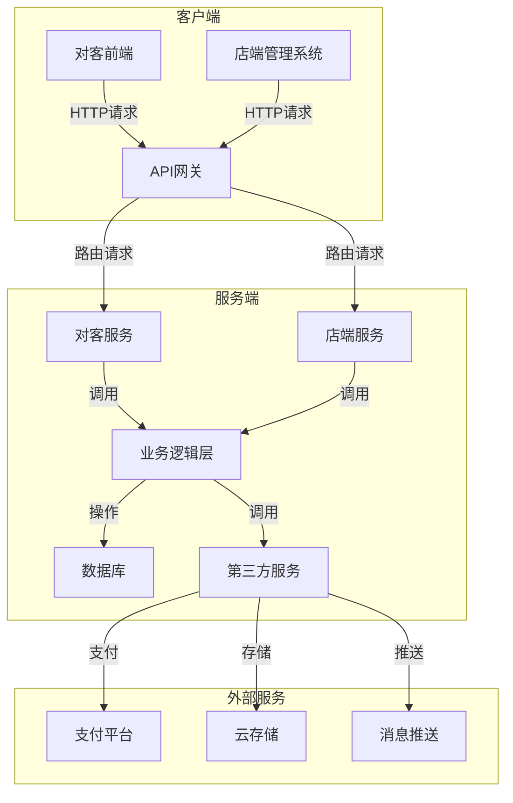

# 宠物服务系统项目文档

## 1. 项目概述

本项目旨在开发一个宠物服务系统，包含对客前端和店端管理系统两大部分。系统将支持宠物预约服务、疫苗接种、体检、宠物圈社交功能以及店端的商品管理、订单处理等核心功能。

## 2. 项目计划

### 2.1 项目阶段划分

- **第一阶段：需求分析与设计**（2周）
  - 需求收集与分析
  - 系统架构设计
  - 数据库设计
  - 界面原型设计

- **第二阶段：前端开发**（4周）
  - 对客前端开发
  - 店端管理系统前端开发
  - 响应式适配
  - 功能测试

- **第三阶段：后端开发**（4周）
  - API接口开发
  - 业务逻辑实现
  - 数据库集成
  - 安全性测试

- **第四阶段：集成与测试**（2周）
  - 前后端集成
  - 系统测试
  - 性能优化
  - 安全测试

- **第五阶段：部署与上线**（1周）
  - 系统部署
  - 上线准备
  - 员工培训
  - 系统运维

### 2.2 项目里程碑

1. **需求文档完成** - 第2周
2. **设计稿完成** - 第3周
3. **前端开发完成** - 第7周
4. **后端开发完成** - 第11周
5. **系统测试完成** - 第13周
6. **系统上线** - 第14周

### 2.3 项目时间线

| 阶段 | 开始日期 | 结束日期 | 持续时间 |
|------|---------|---------|----------|
| 需求分析与设计 | 2026-03-01 | 2026-03-14 | 2周 |
| 前端开发 | 2026-03-15 | 2026-04-11 | 4周 |
| 后端开发 | 2026-03-15 | 2026-04-11 | 4周 |
| 集成与测试 | 2026-04-12 | 2026-04-25 | 2周 |
| 部署与上线 | 2026-04-26 | 2026-05-02 | 1周 |

## 3. 功能需求

### 3.1 对客前端

#### 3.1.1 用户管理
- **注册/登录**：用户可以通过手机号/邮箱注册账号，支持密码登录和第三方登录（微信、支付宝）
- **个人信息管理**：用户可以查看和修改个人基本信息，如姓名、联系方式、地址等
- **宠物信息管理**：用户可以添加、编辑、删除宠物信息，包括宠物名称、品种、年龄、性别、体重等基本信息

#### 3.1.2 服务预约
- **预约看病**：用户可以选择宠物医院、医生、时间进行预约，填写症状描述
- **疫苗接种预约**：用户可以选择疫苗类型、接种时间进行预约
- **体检预约**：用户可以选择体检套餐、预约时间
- **预约管理**：用户可以查看历史预约记录，取消或修改未完成的预约

#### 3.1.3 宠物圈
- **发布帖子**：用户可以发布宠物相关的文字、图片、视频内容
- **查看帖子**：用户可以浏览宠物圈的帖子，支持按热度、时间排序
- **评论功能**：用户可以对帖子进行评论和回复
- **点赞/分享**：用户可以对帖子进行点赞，分享到第三方平台

#### 3.1.4 商品购买
- **商品浏览**：用户可以浏览店铺商品，支持分类、搜索、筛选
- **购物车**：用户可以将商品加入购物车，管理购物车商品
- **在线支付**：支持微信支付、支付宝等支付方式
- **订单查询**：用户可以查看历史订单，了解订单状态

### 3.2 店端管理系统

#### 3.2.1 基础管理
- **用户管理**：管理系统用户，包括添加、编辑、删除用户，设置用户权限
- **权限管理**：设置不同角色的权限，如管理员、员工等
- **系统设置**：配置系统基本信息，如店铺信息、营业时间等

#### 3.2.2 宠物信息管理
- **宠物档案管理**：管理客户的宠物信息，包括基本信息、健康状况等
- **健康记录**：记录宠物的就诊记录、治疗方案等
- **疫苗接种记录**：记录宠物的疫苗接种情况，包括疫苗类型、接种时间、下次接种时间等

#### 3.2.3 商品管理
- **商品信息维护**：添加、编辑、删除商品信息，包括商品名称、描述、价格、图片等
- **仓储管理**：管理商品库存，包括入库、出库、库存盘点
- **定价管理**：设置商品的销售价格、促销价格等
- **货架信息**：管理商品的货架位置、陈列信息
- **库存管理**：实时监控商品库存，设置库存预警

#### 3.2.4 订单管理
- **预约订单处理**：处理客户的服务预约订单，包括确认、修改、取消订单
- **商品订单处理**：处理客户的商品购买订单，包括确认、发货、退款等
- **订单状态更新**：实时更新订单状态，如待确认、已确认、已完成、已取消等
- **订单统计**：统计订单数量、金额、类型等数据

#### 3.2.5 帖子管理
- **帖子审核**：审核用户发布的帖子，包括通过、驳回、删除
- **内容管理**：管理帖子内容，包括编辑、置顶、推荐
- **评论管理**：管理帖子评论，包括删除不良评论

## 4. 系统流程图

### 4.1 系统架构图



### 4.2 核心流程

- **用户注册/登录流程**：用户输入注册信息，系统验证并创建账户；用户输入登录信息，系统验证并生成Token。
- **服务预约流程**：用户选择服务类型、日期、时间，系统创建预约记录。
- **宠物圈发帖流程**：用户输入内容、上传媒体文件，系统创建帖子记录。
- **商品购买流程**：用户浏览商品、加入购物车、确认订单、完成支付，系统创建订单记录。
- **商品管理流程**：管理员登录系统、管理商品信息、更新库存。
- **订单处理流程**：管理员查看订单、处理订单、更新订单状态。
- **宠物信息管理流程**：管理员管理宠物档案、健康记录、疫苗记录。
- **帖子管理流程**：管理员审核帖子、管理内容、处理评论。

## 5. 高保真原型设计

### 5.1 对客前端设计

#### 5.1.1 首页
- **布局**：顶部导航栏、轮播图、服务分类、宠物圈动态、底部导航栏
- **交互**：点击服务分类进入对应服务页面，点击轮播图进入活动详情，点击宠物圈帖子进入详情页

#### 5.1.2 服务预约页面
- **布局**：服务类型选择、日期选择器、时间选择器、宠物选择、医生选择、疫苗类型选择、体检套餐选择、备注输入、提交按钮
- **交互**：选择服务类型后显示对应选项，选择日期后显示可预约时间，点击提交后显示预约成功提示

#### 5.1.3 宠物圈页面
- **布局**：顶部导航、帖子列表、底部导航栏
- **交互**：点击帖子进入详情页，点击发布按钮进入发布页面，点击点赞按钮进行点赞，点击评论按钮进入评论页面

#### 5.1.4 个人中心页面
- **布局**：用户头像、昵称、个人信息编辑按钮、功能列表、底部导航栏
- **交互**：点击个人信息编辑进入编辑页面，点击功能列表项进入对应页面

### 5.2 店端管理系统设计

#### 5.2.1 登录页面
- **布局**：登录表单、登录按钮、忘记密码链接
- **交互**：输入用户名密码后点击登录，登录成功后进入首页

#### 5.2.2 首页
- **布局**：左侧导航栏、顶部导航、主内容区、快捷操作
- **交互**：点击左侧导航切换功能模块，点击数据概览图表查看详情，点击待处理任务进入处理页面

#### 5.2.3 商品管理页面
- **布局**：左侧导航、顶部操作栏、商品列表、分页控件
- **交互**：点击添加商品按钮进入添加页面，点击商品列表项进入编辑页面，点击批量操作进行批量修改/删除

#### 5.2.4 订单管理页面
- **布局**：左侧导航、顶部操作栏、订单列表、分页控件
- **交互**：点击订单列表项进入详情页面，点击状态列进行状态更新，点击批量操作进行批量处理

### 5.3 设计规范

- **颜色方案**：
  - 对客前端：主色调 #4CAF50（绿色），辅助色 #FF9800（橙色）
  - 店端管理系统：主色调 #2196F3（蓝色），辅助色 #4CAF50（绿色）

- **字体方案**：
  - 主字体：PingFang SC、Microsoft YaHei、Helvetica Neue
  - 标题字体大小：18px-24px
  - 正文字体大小：14px-16px
  - 辅助文字字体大小：12px

- **组件规范**：
  - 按钮：主要按钮填充主色调，次要按钮边框主色调
  - 输入框：常规状态浅灰色边框，聚焦状态主色调边框
  - 卡片：圆角8px，轻微阴影
  - 图标：线性图标，大小16px-24px

## 6. 版本控制计划

### 6.1 代码仓库结构

- **主仓库**：宠物服务系统主代码库
  - 包含前端和后端代码
  - 包含所有配置文件和文档

- **分支结构**：
  - `main`：主分支，用于发布稳定版本
  - `develop`：开发分支，集成所有功能开发
  - `feature/*`：功能分支，用于开发新功能
  - `bugfix/*`： bug修复分支，用于修复生产环境问题
  - `release/*`：发布分支，用于准备发布版本

### 6.2 提交规范

- **提交信息格式**：
  ```
  <类型>(<范围>): <描述>
  
  [可选的正文]
  
  [可选的页脚]
  ```

- **提交类型**：
  - `feat`：新功能
  - `fix`：bug修复
  - `docs`：文档更新
  - `style`：代码风格调整
  - `refactor`：代码重构
  - `test`：测试代码
  - `chore`：构建过程或辅助工具的变动

### 6.3 代码审查流程

1. 开发者在功能分支上完成开发
2. 提交代码并推送至远程仓库
3. 创建合并请求，指定目标分支
4. 团队成员进行代码审查
5. 审查通过后，由项目负责人合并代码
6. 合并后删除功能分支

### 6.4 发布流程

1. 从develop分支创建release分支
2. 在release分支上进行最后的测试和修复
3. 测试通过后，合并到main分支
4. 在main分支上打标签，标签格式：`vX.Y.Z`
5. 将main分支的变更合并回develop分支
6. 部署发布版本

## 7. 质量检查报告

### 7.1 检查结果

| 文档 | 状态 | 备注 |
|------|------|------|
| 项目计划 | ✅ 合格 | 目标明确，符合客户需求 |
| 需求文档 | ✅ 合格 | 需求明确，覆盖完整 |
| 系统流程图 | ✅ 合格 | 流程清晰，逻辑正确 |
| 高保真原型设计 | ✅ 合格 | 设计美观，交互友好 |

### 7.2 改进建议

1. **项目计划**：
   - 建议增加预算规划部分
   - 建议细化每个阶段的具体任务和责任人

2. **需求文档**：
   - 建议增加更多的业务场景描述
   - 建议细化非功能需求的具体指标

3. **系统流程图**：
   - 建议增加异常流程的处理
   - 建议添加更多的状态转换说明

4. **高保真原型设计**：
   - 建议增加更多的交互动效说明
   - 建议提供更多的设计资源和组件库

## 8. 项目团队结构

| 角色 | 职责 | 人数 |
|------|------|------|
| 产品经理 | 需求分析、产品设计 | 1 |
| UI/UX设计师 | 界面设计、用户体验 | 1 |
| 前端开发 | 前端界面开发 | 2 |
| 后端开发 | 后端服务开发 | 2 |
| 测试工程师 | 系统测试、质量保证 | 1 |
| 运维工程师 | 系统部署、维护 | 1 |

## 9. 技术栈选择

### 9.1 前端技术
- React/Vue.js
- HTML5/CSS3
- JavaScript/TypeScript
- Ant Design/Element UI

### 9.2 后端技术
- Node.js/Java Spring Boot
- MySQL/PostgreSQL
- Redis
- RESTful API

### 9.3 其他
- 云服务器
- 支付接口集成
- 消息推送服务

## 10. 风险管理

1. **需求变更** - 建立变更管理流程，评估影响后执行
2. **技术难点** - 提前进行技术调研，制定解决方案
3. **时间风险** - 预留缓冲时间，合理安排任务
4. **质量风险** - 建立严格的测试流程，确保系统质量

## 11. 沟通机制

- 每周项目例会
- 每日站会
- 项目管理工具（如Jira、Trello）
- 代码版本控制（Git）
- 文档共享（Confluence）

## 12. 交付物

1. 需求文档
2. 系统设计文档
3. 前端代码
4. 后端代码
5. 测试报告
6. 部署文档
7. 用户手册

## 13. 成功标准

1. 系统功能完整，满足所有需求
2. 系统性能稳定，响应速度快
3. 用户体验良好，界面美观易用
4. 系统安全可靠，数据保护措施到位
5. 项目按时完成，预算控制在范围内