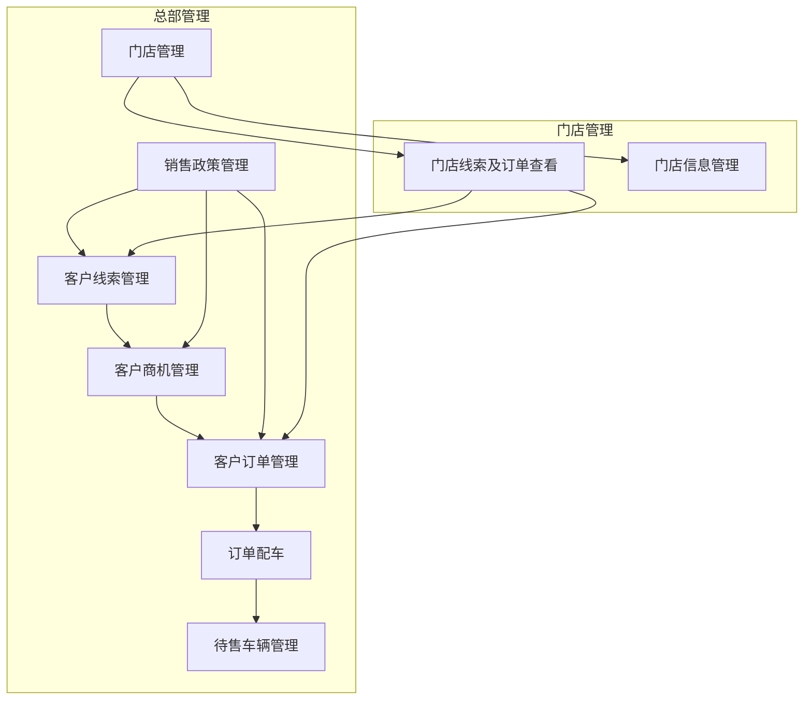

# 小鹏汽车客户管理后台产品结构图

## 产品结构说明

1. **总部管理**：包含核心业务功能，由总部管理人员操作
   - **客户线索管理**：管理来自各种渠道的客户线索，包括录入、分配、跟进和转化
   - **客户商机管理**：跟踪客户从线索到商机的转化过程，管理商机状态和进展
   - **客户订单管理**：全流程管理客户订单，包括创建、审批、配车、交付等环节
   - **待售车辆管理**：管理全国门店的待售车辆库存，包括入库、出库、调拨等
   - **销售政策管理**：统一管理销售政策，确保各门店执行一致的销售策略
   - **门店管理**：管理门店的入驻、退出、评级等流程，监控门店运营情况
   - **订单配车**：根据订单需求和车辆库存，智能匹配车辆资源

2. **门店管理**：包含门店级别的功能，由门店人员操作
   - **门店线索及订单查看**：查看分配到本门店的客户线索和订单信息
   - **门店信息管理**：维护门店的基本信息、人员信息等

## 业务流程关系

- 客户线索管理是客户管理的起点，线索可以转化为商机
- 商机可以转化为订单
- 订单需要进行配车，配车依赖于待售车辆管理
- 销售政策影响线索、商机和订单的处理
- 门店管理为门店线索及订单查看和门店信息管理提供基础
- 门店线索及订单查看依赖于客户线索管理和客户订单管理