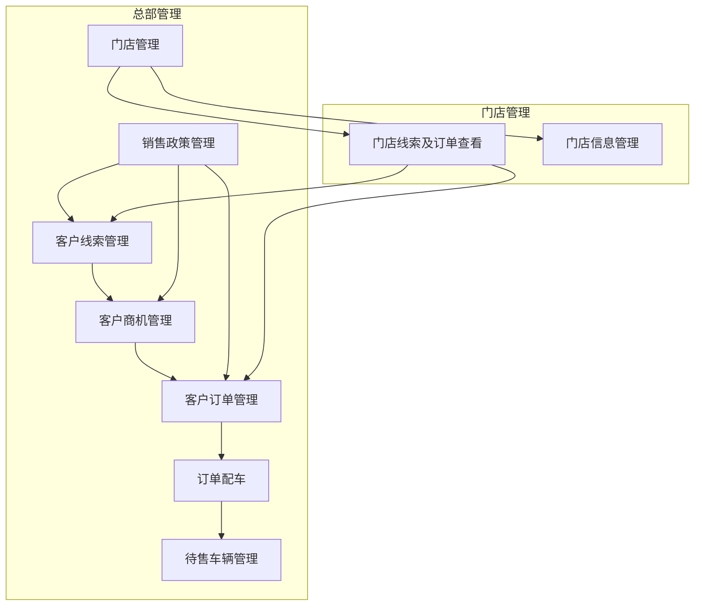
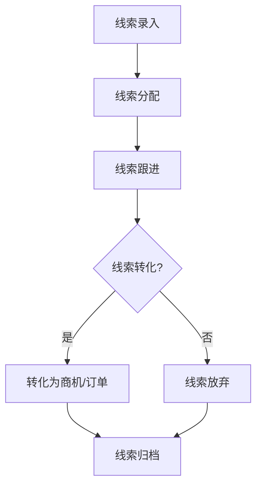
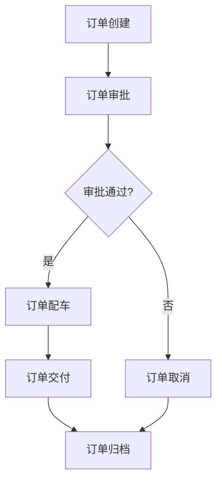
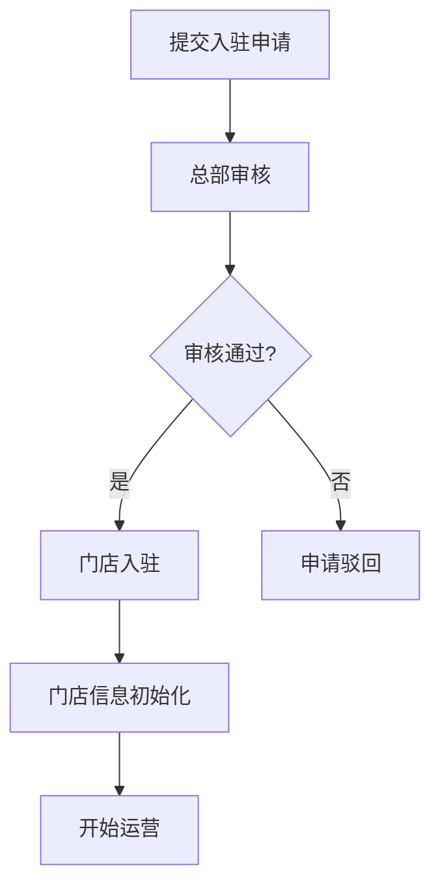

# 小鹏汽车客户管理后台需求文档

## 变更记录

| 版本 | 日期 | 变更内容 | 变更人 | 审批人 |
|------|------|----------|--------|--------|
| V1.0 | 2026-03-01 | 初始版本 | 产品专家 | 待定 |

## 文档概述

本文档详细描述了小鹏汽车客户管理后台系统的需求，包括总部和门店的所有功能模块。系统旨在实现客户线索、商机、订单的全流程管理，优化门店管理流程，提高销售效率和客户满意度。

## 项目背景

随着小鹏汽车业务的快速发展，客户管理变得越来越复杂。为了提高客户管理效率，提升销售转化率，优化门店管理流程，需要构建一个统一的客户管理后台系统，实现总部与门店之间的信息协同，全流程管理客户线索、商机、订单等业务环节。

## 业务场景

### 场景一：客户线索管理

**描述**：总部市场部门通过线上渠道获取客户线索，系统自动分配给相应的门店，门店销售人员跟进线索，将线索转化为商机或订单。

**流程**：
1. 市场部门录入线索信息
2. 系统根据规则自动分配线索给门店
3. 门店销售人员查看并跟进线索
4. 销售人员将线索转化为商机或订单
5. 系统更新线索状态

### 场景二：客户订单管理

**描述**：客户在门店下单，销售人员创建订单，系统进行审批，审批通过后进行配车，配车完成后通知客户提车。

**流程**：
1. 销售人员创建订单
2. 系统根据订单金额和类型进行审批
3. 审批通过后，系统进行智能配车
4. 配车完成后，通知客户提车
5. 客户提车后，订单状态更新为已交付

### 场景三：门店入驻管理

**描述**：新门店提交入驻申请，总部审核通过后，门店入驻系统，开始运营。

**流程**：
1. 新门店提交入驻申请
2. 总部审核申请
3. 审核通过后，门店入驻系统
4. 门店信息初始化
5. 门店开始运营

## 目标用户

| 用户角色 | 功能权限 | 备注 |
|---------|---------|------|
| 总部管理员 | 所有功能 | 系统最高权限 |
| 总部销售经理 | 客户线索、商机、订单、销售政策管理 | 管理销售相关业务 |
| 总部运营经理 | 待售车辆、门店管理 | 管理车辆和门店 |
| 门店经理 | 门店线索及订单查看、门店信息管理 | 管理门店运营 |
| 门店销售人员 | 门店线索及订单查看 | 跟进客户线索和订单 |

## 产品结构

## 流程图

### 客户线索管理流程

### 客户订单管理流程

### 门店入驻流程

## 高保真原型

### 登录页面

**功能**：用户登录系统
**元素**：用户名输入框、密码输入框、登录按钮、忘记密码链接

### 首页

**功能**：展示系统概览和快捷入口
**元素**：导航菜单、数据统计卡片、待办事项列表、快捷操作按钮

### 客户线索管理页面

**功能**：管理客户线索
**元素**：线索列表、搜索筛选、批量操作、线索详情、跟进记录

### 客户订单管理页面

**功能**：管理客户订单
**元素**：订单列表、搜索筛选、订单详情、审批记录、配车信息

### 待售车辆管理页面

**功能**：管理待售车辆库存
**元素**：车辆列表、搜索筛选、库存统计、车辆详情、调拨记录

## 功能需求

### 1. 客户线索管理

**字段定义**：
| 字段名称 | 字段类型 | 字段取值逻辑 |
|---------|---------|------------|
| 线索ID | 字符串 | 系统自动生成 |
| 姓名 | 字符串 | 手动输入 |
| 电话 | 字符串 | 手动输入，格式验证 |
| 性别 | 枚举 | 男/女 |
| 年龄 | 数字 | 手动输入 |
| 所在地区 | 字符串 | 手动输入或选择 |
| 线索来源 | 枚举 | 线上/线下/车展/其他 |
| 线索状态 | 枚举 | 待分配/已分配/跟进中/已转化/已放弃 |
| 分配门店 | 字符串 | 系统自动分配或手动选择 |
| 分配时间 | 时间戳 | 系统自动生成 |
| 跟进人 | 字符串 | 系统自动分配或手动选择 |
| 跟进时间 | 时间戳 | 系统自动生成 |
| 跟进内容 | 文本 | 手动输入 |
| 转化时间 | 时间戳 | 系统自动生成 |
| 转化类型 | 枚举 | 商机/订单 |

**筛选字段**：
- 线索状态
- 线索来源
- 分配门店
- 跟进人
- 时间范围

**操作逻辑**：
1. **线索录入**：点击"新增线索"按钮，填写线索信息，保存后线索状态为"待分配"
2. **线索分配**：系统自动分配或手动分配线索给门店，分配后线索状态为"已分配"
3. **线索跟进**：销售人员点击"跟进"按钮，填写跟进内容，跟进后线索状态为"跟进中"
4. **线索转化**：销售人员点击"转化"按钮，选择转化类型（商机/订单），转化后线索状态为"已转化"
5. **线索放弃**：销售人员点击"放弃"按钮，填写放弃原因，放弃后线索状态为"已放弃"

**状态流转**：
待分配 → 已分配 → 跟进中 → 已转化/已放弃

**数据权限**：
- 总部管理员：查看所有线索
- 总部销售经理：查看所有线索
- 门店经理：查看分配到本门店的线索
- 门店销售人员：查看分配给自己的线索

### 2. 客户商机管理

**字段定义**：
| 字段名称 | 字段类型 | 字段取值逻辑 |
|---------|---------|------------|
| 商机ID | 字符串 | 系统自动生成 |
| 客户姓名 | 字符串 | 从线索或手动输入 |
| 客户电话 | 字符串 | 从线索或手动输入 |
| 产品需求 | 字符串 | 手动输入 |
| 预算 | 数字 | 手动输入 |
| 商机状态 | 枚举 | 初步接触/需求分析/方案制定/商务谈判/成交/失败 |
| 预计成交金额 | 数字 | 手动输入 |
| 预计成交时间 | 日期 | 手动输入 |
| 跟进人 | 字符串 | 系统自动分配或手动选择 |
| 跟进时间 | 时间戳 | 系统自动生成 |
| 跟进内容 | 文本 | 手动输入 |
| 成交时间 | 时间戳 | 系统自动生成 |
| 失败原因 | 文本 | 手动输入 |

**筛选字段**：
- 商机状态
- 跟进人
- 预计成交时间
- 金额范围

**操作逻辑**：
1. **商机创建**：从线索转化或点击"新增商机"按钮，填写商机信息
2. **商机评估**：评估商机的可行性和价值，更新商机信息
3. **商机跟进**：销售人员点击"跟进"按钮，填写跟进内容，更新商机状态
4. **商机转化**：点击"转化为订单"按钮，创建订单，商机状态为"成交"
5. **商机失败**：点击"标记为失败"按钮，填写失败原因，商机状态为"失败"

**状态流转**：
初步接触 → 需求分析 → 方案制定 → 商务谈判 → 成交/失败

**数据权限**：
- 总部管理员：查看所有商机
- 总部销售经理：查看所有商机
- 门店经理：查看本门店的商机
- 门店销售人员：查看自己的商机

### 3. 客户订单管理

**字段定义**：
| 字段名称 | 字段类型 | 字段取值逻辑 |
|---------|---------|------------|
| 订单ID | 字符串 | 系统自动生成 |
| 客户姓名 | 字符串 | 从商机或手动输入 |
| 客户电话 | 字符串 | 从商机或手动输入 |
| 产品型号 | 字符串 | 手动选择 |
| 颜色 | 字符串 | 手动选择 |
| 配置 | 字符串 | 手动选择 |
| 数量 | 数字 | 手动输入 |
| 单价 | 数字 | 系统自动计算 |
| 总价 | 数字 | 系统自动计算 |
| 订单状态 | 枚举 | 待审批/已审批/待配车/已配车/待交付/已交付/已取消 |
| 创建时间 | 时间戳 | 系统自动生成 |
| 创建人 | 字符串 | 系统自动生成 |
| 审批人 | 字符串 | 系统自动生成 |
| 审批时间 | 时间戳 | 系统自动生成 |
| 审批意见 | 文本 | 手动输入 |
| 配车时间 | 时间戳 | 系统自动生成 |
| 配车人 | 字符串 | 系统自动生成 |
| 交付时间 | 时间戳 | 系统自动生成 |
| 交付地点 | 字符串 | 手动输入 |
| 交付人 | 字符串 | 手动输入 |

**筛选字段**：
- 订单状态
- 客户姓名/电话
- 产品型号
- 时间范围
- 金额范围

**操作逻辑**：
1. **订单创建**：从商机转化或点击"新增订单"按钮，填写订单信息，订单状态为"待审批"
2. **订单审批**：审批人点击"审批"按钮，填写审批意见，审批通过后订单状态为"已审批"，否则为"已取消"
3. **订单配车**：点击"配车"按钮，系统智能匹配车辆或手动选择车辆，配车完成后订单状态为"已配车"
4. **订单交付**：点击"交付"按钮，填写交付信息，交付完成后订单状态为"已交付"
5. **订单取消**：点击"取消"按钮，填写取消原因，订单状态为"已取消"

**状态流转**：
待审批 → 已审批/已取消 → 待配车 → 已配车 → 待交付 → 已交付

**数据权限**：
- 总部管理员：查看所有订单
- 总部销售经理：查看所有订单
- 门店经理：查看本门店的订单
- 门店销售人员：查看自己的订单

### 4. 待售车辆管理

**字段定义**：
| 字段名称 | 字段类型 | 字段取值逻辑 |
|---------|---------|------------|
| 车辆ID | 字符串 | 系统自动生成 |
| 车型 | 字符串 | 手动选择 |
| 颜色 | 字符串 | 手动选择 |
| 配置 | 字符串 | 手动选择 |
| 车架号 | 字符串 | 手动输入 |
| 发动机号 | 字符串 | 手动输入 |
| 车辆状态 | 枚举 | 在库/已销售/调拨中/维修中 |
| 所在门店 | 字符串 | 手动选择 |
| 入库时间 | 时间戳 | 系统自动生成 |
| 入库价格 | 数字 | 手动输入 |
| 销售价格 | 数字 | 手动输入 |
| 调拨时间 | 时间戳 | 系统自动生成 |
| 调出门店 | 字符串 | 手动选择 |
| 调入门店 | 字符串 | 手动选择 |

**筛选字段**：
- 车辆状态
- 车型
- 颜色
- 所在门店
- 入库时间

**操作逻辑**：
1. **车辆入库**：点击"新增车辆"按钮，填写车辆信息，车辆状态为"在库"
2. **车辆出库**：点击"出库"按钮，选择订单，车辆状态为"已销售"
3. **车辆调拨**：点击"调拨"按钮，选择调出门店和调入门店，车辆状态为"调拨中"，调拨完成后更新所在门店和车辆状态
4. **库存查询**：通过筛选条件查询车辆库存
5. **库存分析**：查看库存周转率、滞销车辆等分析数据

**状态流转**：
在库 → 已销售/调拨中/维修中 → 在库（调拨完成后）

**数据权限**：
- 总部管理员：查看所有车辆
- 总部运营经理：查看所有车辆
- 门店经理：查看本门店的车辆
- 门店销售人员：查看本门店的车辆

### 5. 销售政策管理

**字段定义**：
| 字段名称 | 字段类型 | 字段取值逻辑 |
|---------|---------|------------|
| 政策ID | 字符串 | 系统自动生成 |
| 政策名称 | 字符串 | 手动输入 |
| 政策类型 | 枚举 | 折扣/促销/赠品/其他 |
| 适用范围 | 字符串 | 手动选择（全国/区域/门店） |
| 有效期开始 | 日期 | 手动输入 |
| 有效期结束 | 日期 | 手动输入 |
| 政策内容 | 文本 | 手动输入 |
| 政策状态 | 枚举 | 草稿/已发布/已过期 |
| 创建时间 | 时间戳 | 系统自动生成 |
| 创建人 | 字符串 | 系统自动生成 |
| 发布时间 | 时间戳 | 系统自动生成 |
| 发布人 | 字符串 | 系统自动生成 |

**筛选字段**：
- 政策状态
- 政策类型
- 适用范围
- 有效期

**操作逻辑**：
1. **政策创建**：点击"新增政策"按钮，填写政策信息，政策状态为"草稿"
2. **政策发布**：点击"发布"按钮，政策状态为"已发布"，系统通知相关门店
3. **政策执行**：监控政策执行情况，收集销售数据
4. **政策分析**：分析政策对销售的影响，评估政策效果

**状态流转**：
草稿 → 已发布 → 已过期

**数据权限**：
- 总部管理员：查看和管理所有政策
- 总部销售经理：查看和管理所有政策
- 门店经理：查看适用于本门店的政策
- 门店销售人员：查看适用于本门店的政策

### 6. 门店线索及订单查看

**字段定义**：
| 字段名称 | 字段类型 | 字段取值逻辑 |
|---------|---------|------------|
| 门店ID | 字符串 | 系统自动生成 |
| 门店名称 | 字符串 | 系统自动获取 |
| 线索数量 | 数字 | 系统自动计算 |
| 订单数量 | 数字 | 系统自动计算 |
| 线索列表 | 列表 | 系统自动获取 |
| 订单列表 | 列表 | 系统自动获取 |

**筛选字段**：
- 线索状态
- 订单状态
- 时间范围

**操作逻辑**：
1. **线索查看**：门店用户登录系统后，查看分配到本门店的线索列表
2. **订单查看**：门店用户登录系统后，查看本门店的订单列表
3. **数据统计**：查看本门店的线索和订单数据统计

**数据权限**：
- 门店经理：查看本门店的所有线索和订单
- 门店销售人员：查看分配给自己的线索和自己的订单

### 7. 门店管理

**字段定义**：
| 字段名称 | 字段类型 | 字段取值逻辑 |
|---------|---------|------------|
| 门店ID | 字符串 | 系统自动生成 |
| 门店名称 | 字符串 | 手动输入 |
| 地址 | 字符串 | 手动输入 |
| 联系人 | 字符串 | 手动输入 |
| 联系电话 | 字符串 | 手动输入 |
| 门店状态 | 枚举 | 待审核/已入驻/已退出/暂停营业 |
| 入驻时间 | 时间戳 | 系统自动生成 |
| 退出时间 | 时间戳 | 系统自动生成 |
| 评级等级 | 枚举 | A/B/C/D |
| 评级时间 | 时间戳 | 系统自动生成 |
| 评级理由 | 文本 | 手动输入 |
| 销售额 | 数字 | 系统自动计算 |
| 订单量 | 数字 | 系统自动计算 |
| 客户满意度 | 数字 | 系统自动计算 |

**筛选字段**：
- 门店状态
- 评级等级
- 地区

**操作逻辑**：
1. **门店入驻**：新门店提交入驻申请，总部审核通过后，门店状态为"已入驻"
2. **门店退出**：门店提交退出申请或总部强制退出，门店状态为"已退出"
3. **门店评级**：根据门店业绩和服务质量进行评级，更新评级等级
4. **门店监控**：监控门店的运营数据和服务质量，及时发现问题

**状态流转**：
待审核 → 已入驻 → 暂停营业/已退出

**数据权限**：
- 总部管理员：查看和管理所有门店
- 总部运营经理：查看和管理所有门店
- 门店经理：查看和管理本门店信息

### 8. 订单配车

**字段定义**：
| 字段名称 | 字段类型 | 字段取值逻辑 |
|---------|---------|------------|
| 配车ID | 字符串 | 系统自动生成 |
| 订单ID | 字符串 | 手动选择 |
| 车辆ID | 字符串 | 系统自动匹配或手动选择 |
| 配车时间 | 时间戳 | 系统自动生成 |
| 配车人 | 字符串 | 系统自动生成 |
| 配车状态 | 枚举 | 待配车/已配车/配车失败 |
| 配车规则 | 文本 | 手动设置 |

**筛选字段**：
- 配车状态
- 订单ID
- 时间范围

**操作逻辑**：
1. **配车规则设置**：设置配车优先级和规则，如按距离、库存等
2. **智能配车**：系统根据配车规则自动匹配车辆，生成配车方案
3. **手动配车**：支持人工干预配车过程，手动选择车辆
4. **配车结果确认**：确认配车结果，更新订单状态为"已配车"

**状态流转**：
待配车 → 已配车/配车失败

**数据权限**：
- 总部管理员：查看和管理所有配车
- 总部运营经理：查看和管理所有配车
- 门店经理：查看本门店的配车

### 9. 门店信息管理

**字段定义**：
| 字段名称 | 字段类型 | 字段取值逻辑 |
|---------|---------|------------|
| 门店ID | 字符串 | 系统自动生成 |
| 门店名称 | 字符串 | 手动输入 |
| 地址 | 字符串 | 手动输入 |
| 联系人 | 字符串 | 手动输入 |
| 联系电话 | 字符串 | 手动输入 |
| 营业时间 | 字符串 | 手动输入 |
| 门店规模 | 字符串 | 手动输入 |
| 人员信息 | 列表 | 手动添加 |
| 组织架构 | 文本 | 手动输入 |

**筛选字段**：
- 门店名称
- 地区

**操作逻辑**：
1. **信息编辑**：门店经理点击"编辑"按钮，修改门店基本信息
2. **人员管理**：添加、编辑、删除门店人员信息
3. **权限设置**：设置门店人员的系统权限

**数据权限**：
- 总部管理员：查看和管理所有门店信息
- 总部运营经理：查看和管理所有门店信息
- 门店经理：查看和管理本门店信息

## 非功能需求

### 1. 性能需求

- **响应时间**：系统响应时间应在3秒以内，批量操作响应时间应在10秒以内
- **并发处理**：系统应支持至少1000个并发用户
- **数据处理**：系统应能处理大量的客户数据和订单数据

### 2. 安全性需求

- **数据安全**：客户信息和订单信息应进行加密存储
- **访问控制**：严格的权限控制，确保不同角色只能访问相应的功能和数据
- **审计日志**：记录系统的操作日志，便于追溯和审计

### 3. 可靠性需求

- **系统可用性**：系统应保持99.9%的可用性
- **数据备份**：定期备份系统数据，确保数据安全
- **故障恢复**：系统出现故障时，应能快速恢复正常运行

### 4. 易用性需求

- **用户界面**：界面简洁明了，操作流程清晰
- **培训成本**：系统应易于学习和使用，降低培训成本
- **帮助文档**：提供详细的帮助文档和操作指南

### 5. 可扩展性需求

- **功能扩展**：系统应支持功能的扩展和定制
- **集成能力**：系统应能与其他系统（如CRM、ERP等）进行集成
- **数据接口**：提供标准的数据接口，便于数据的导入和导出

## 项目范围

### 包含功能

- 客户线索管理
- 客户商机管理
- 客户订单管理
- 待售车辆管理
- 销售政策管理
- 门店线索及订单查看
- 门店管理（包含入驻与退出机制）
- 订单配车
- 门店信息管理

### 不包含功能

- 财务管理
- 售后服务管理
- 供应链管理
- 生产管理

## 风险分析

### 1. 技术风险

- **系统集成**：与现有系统的集成可能存在技术挑战
- **数据迁移**：历史数据的迁移可能存在数据丢失或错误的风险
- **性能瓶颈**：系统在高并发情况下可能出现性能瓶颈

### 2. 业务风险

- **流程变更**：系统实施可能需要调整现有的业务流程，可能遇到阻力
- **用户接受度**：用户可能对新系统不熟悉，需要时间适应
- **数据安全**：客户信息和订单信息的安全可能面临威胁

### 3. 项目风险

- **时间风险**：项目可能无法按时完成
- **成本风险**：项目成本可能超出预算
- **质量风险**：系统可能存在功能缺陷或性能问题

## 验收标准

### 1. 功能验收

- 所有功能模块均已实现，符合需求文档的要求
- 功能操作流程清晰，无逻辑错误
- 数据处理准确，无数据丢失或错误

### 2. 性能验收

- 系统响应时间在3秒以内
- 系统支持至少1000个并发用户
- 批量操作响应时间在10秒以内

### 3. 安全性验收

- 数据加密存储
- 权限控制有效
- 操作日志完整

### 4. 可靠性验收

- 系统可用性达到99.9%
- 数据备份机制有效
- 故障恢复时间在规定范围内

### 5. 易用性验收

- 界面简洁明了
- 操作流程清晰
- 帮助文档完整

## 交付物

- 需求文档
- 设计文档
- 测试文档
- 部署文档
- 帮助文档
- 系统源代码

## 项目时间计划

| 阶段 | 时间 | 任务 |
|------|------|------|
| 需求分析 | 2周 | 需求调研、需求分析、需求文档撰写 |
| 系统设计 | 3周 | 系统架构设计、数据库设计、界面设计 |
| 系统开发 | 8周 | 核心功能开发、集成测试、性能优化 |
| 系统测试 | 3周 | 功能测试、性能测试、安全测试 |
| 系统部署 | 2周 | 系统部署、数据迁移、用户培训 |
| 系统上线 | 1周 | 系统上线、监控运行、问题修复 |

## 联系方式

| 角色 | 姓名 | 电话 | 邮箱 |
|------|------|------|------|
| 产品负责人 | 产品专家 | 13800138000 | product@example.com |
| 技术负责人 | 技术专家 | 13900139000 | tech@example.com |
| 项目管理 | 项目管理专家 | 13700137000 | pm@example.com |