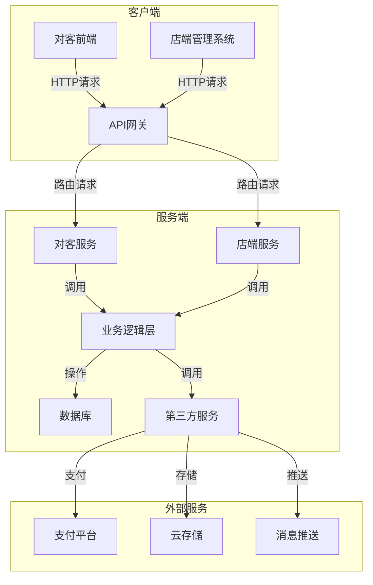
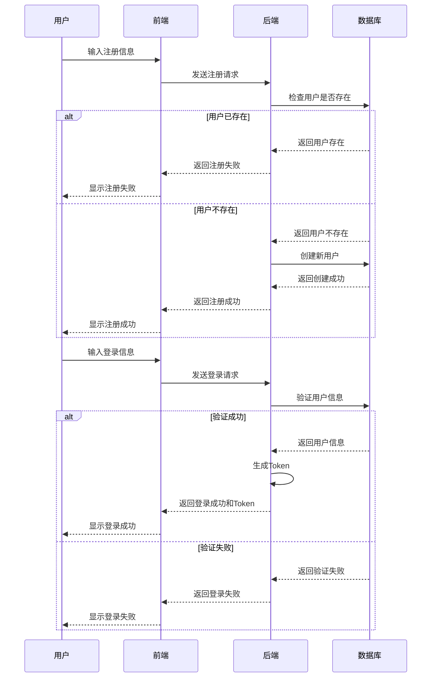
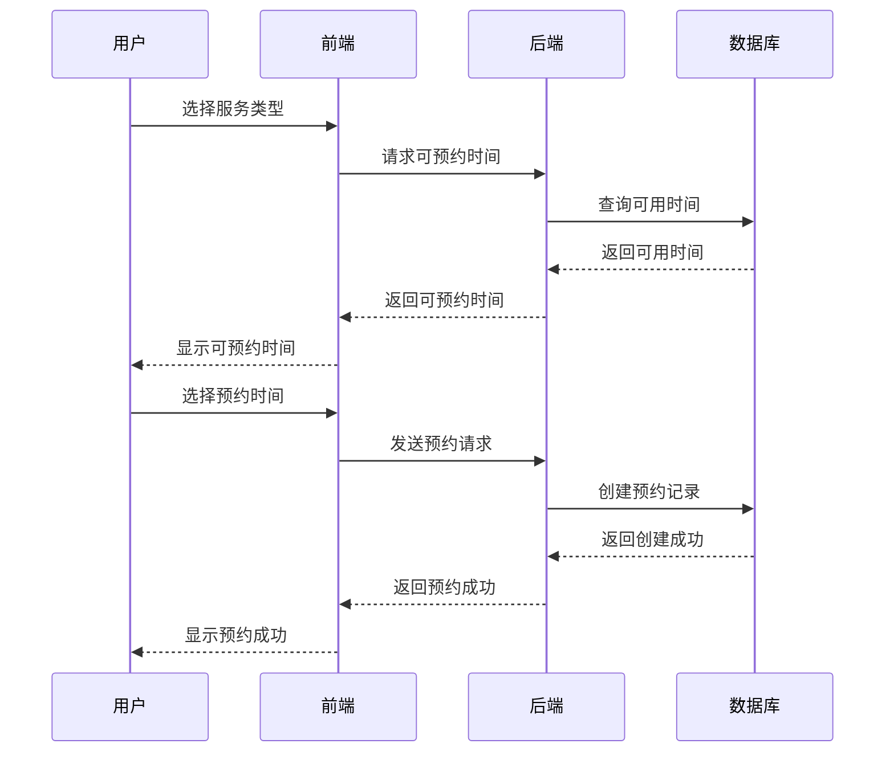
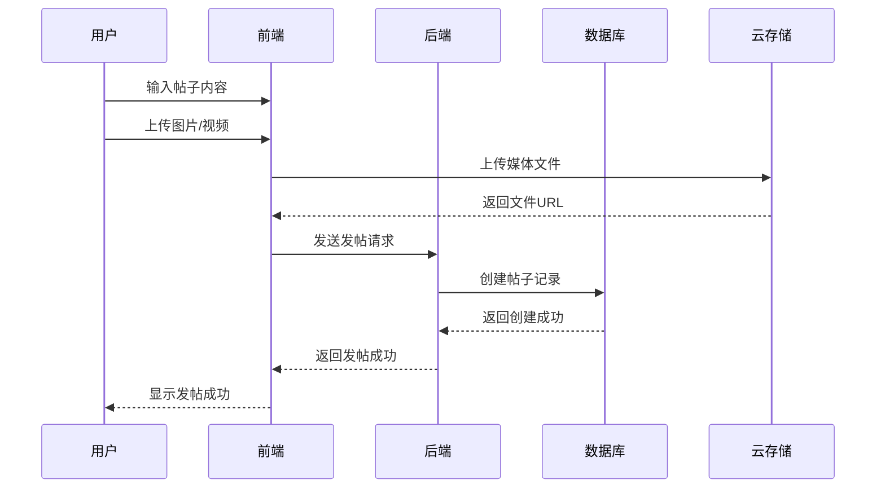
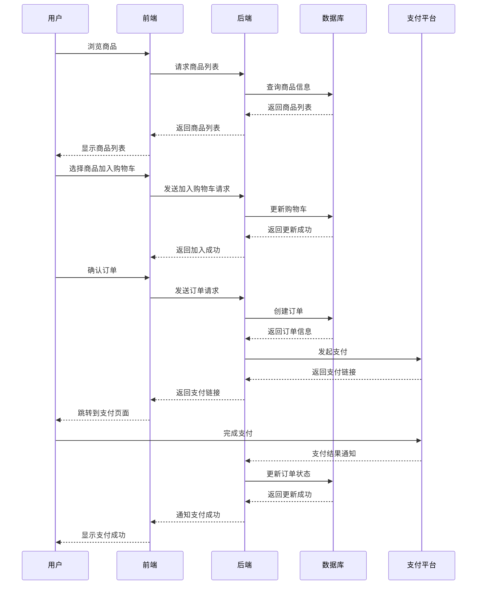
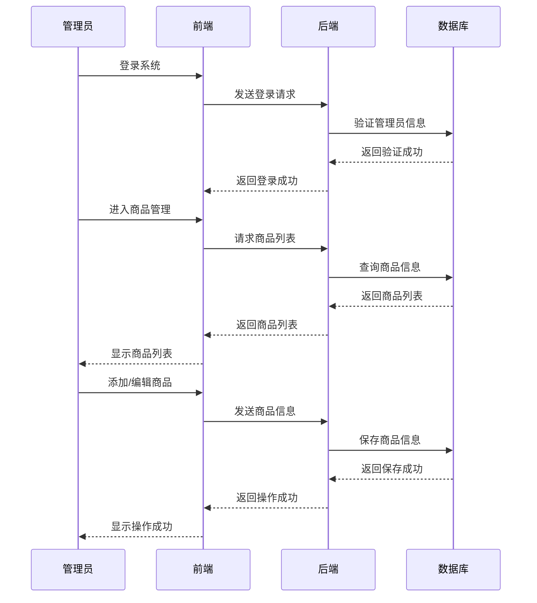
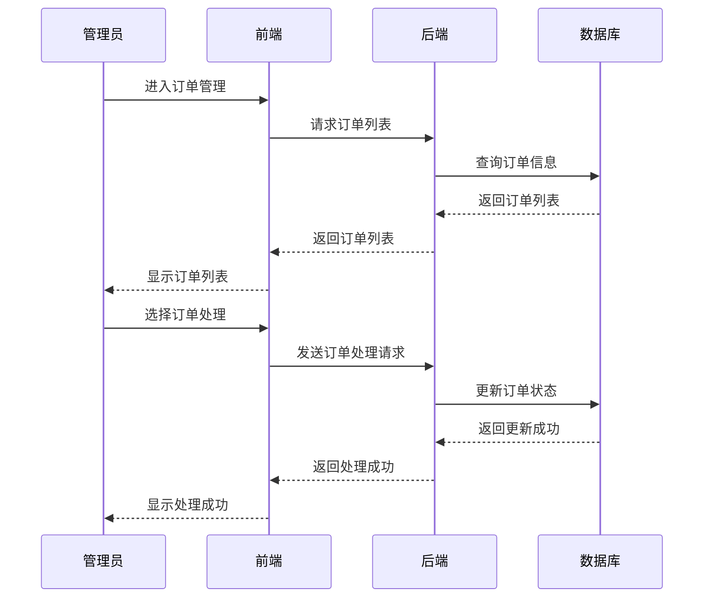
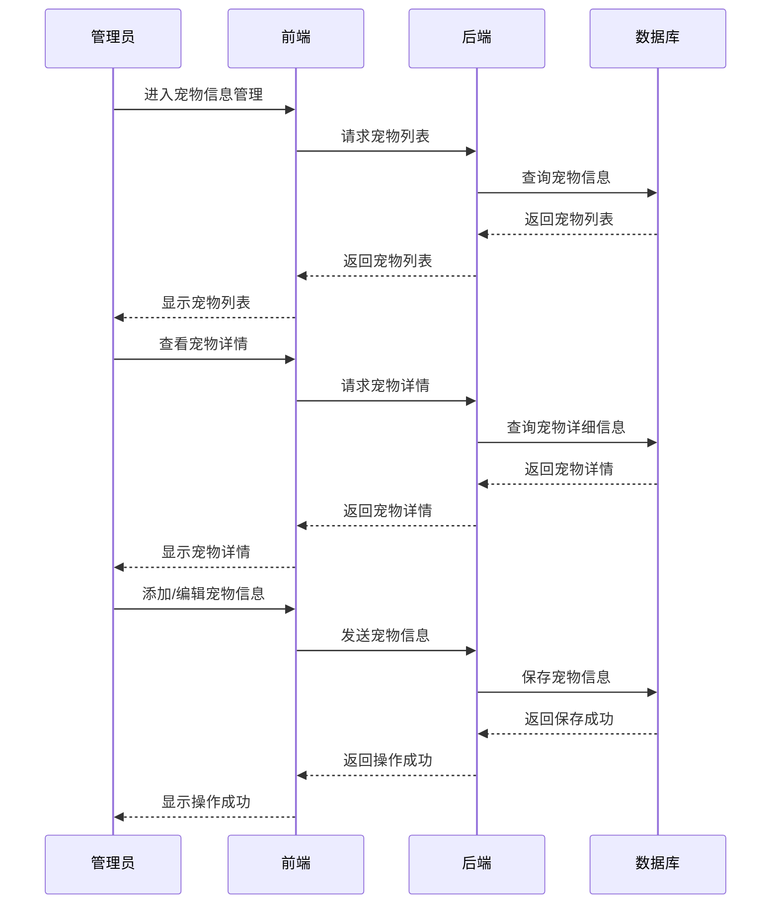
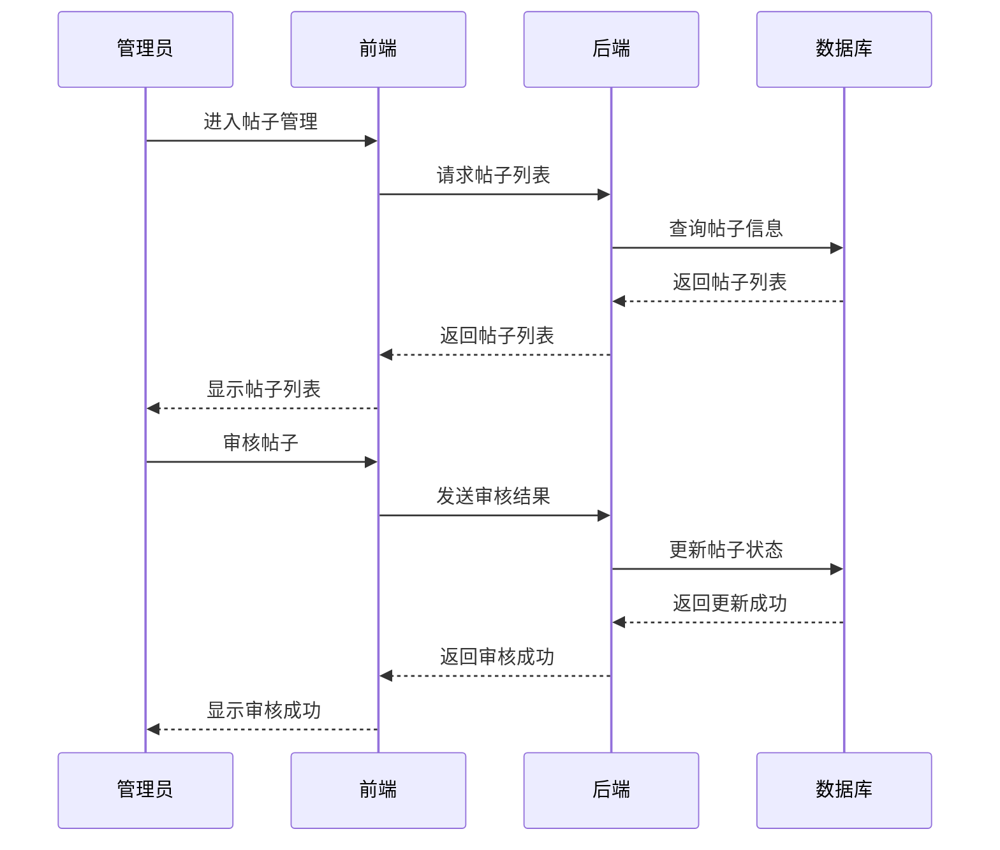
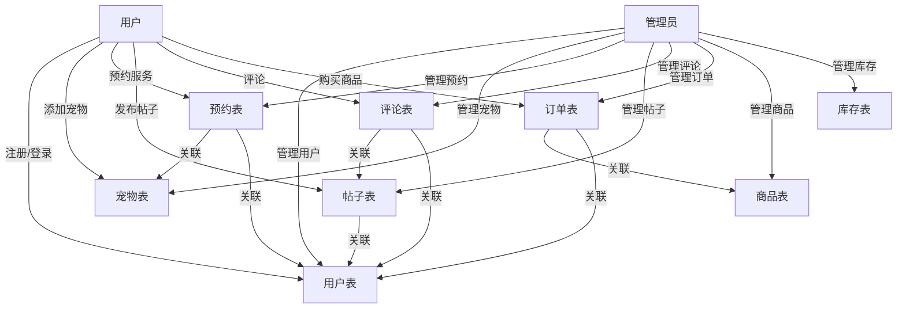

# 宠物服务系统流程图

## 1. 系统架构图

## 2. 对客前端流程

### 2.1 用户注册/登录流程

### 2.2 服务预约流程

### 2.3 宠物圈发帖流程

### 2.4 商品购买流程

## 3. 店端管理系统流程

### 3.1 商品管理流程

### 3.2 订单处理流程

### 3.3 宠物信息管理流程

### 3.4 帖子管理流程

## 4. 数据流程图

