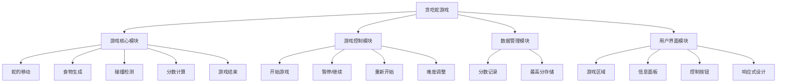

# 贪吃蛇游戏产品结构图

## 模块说明

1. **游戏核心模块**：负责游戏的核心逻辑，包括蛇的移动、食物生成、碰撞检测、分数计算和游戏结束判断。

2. **游戏控制模块**：提供游戏的控制功能，包括开始游戏、暂停/继续、重新开始和难度调整。

3. **数据管理模块**：负责游戏数据的管理，包括实时分数记录和最高分存储。

4. **用户界面模块**：负责游戏的界面展示，包括游戏区域、信息面板、控制按钮和响应式设计。

## 模块关系

- 游戏核心模块是整个游戏的核心，其他模块围绕它展开。
- 游戏控制模块通过用户操作影响游戏核心模块的状态。
- 数据管理模块记录游戏核心模块产生的数据。
- 用户界面模块展示游戏核心模块的状态和数据管理模块的数据。