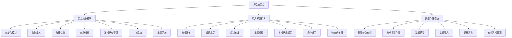
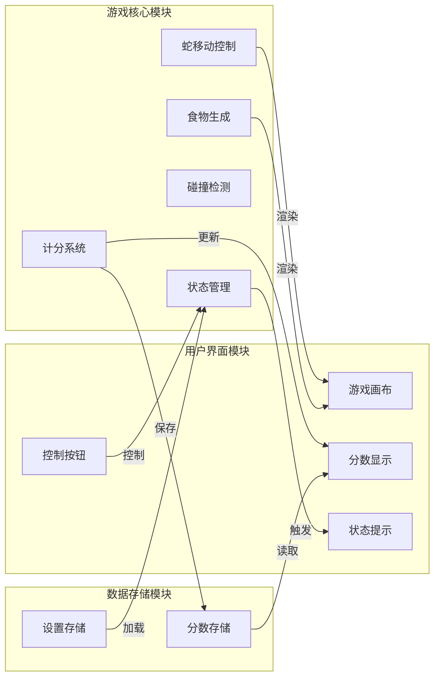
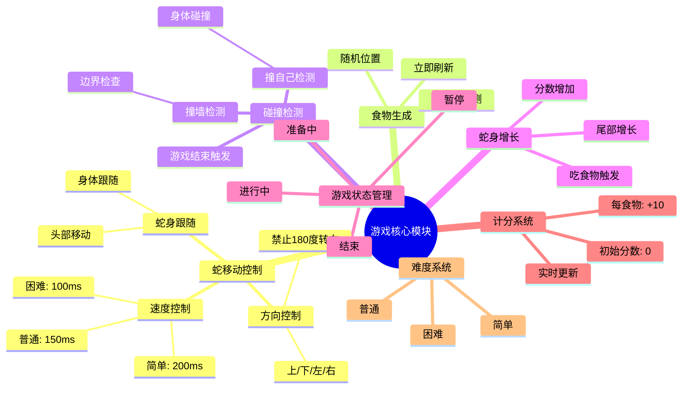
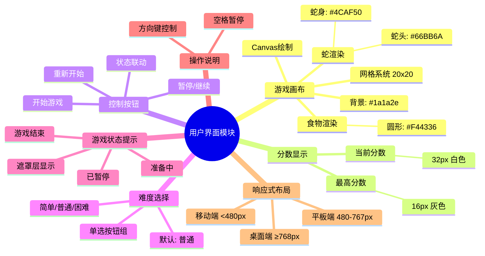
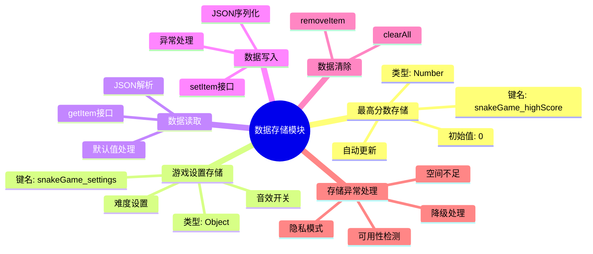
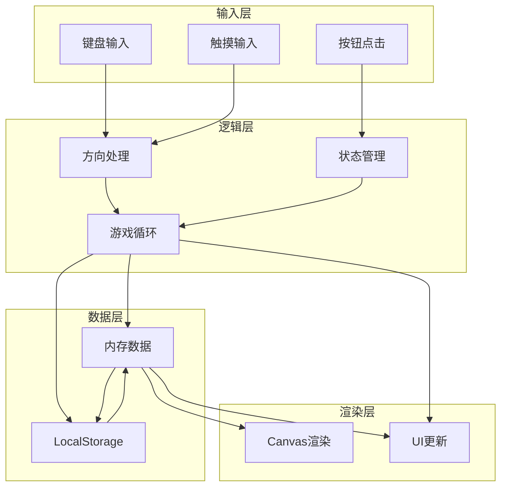
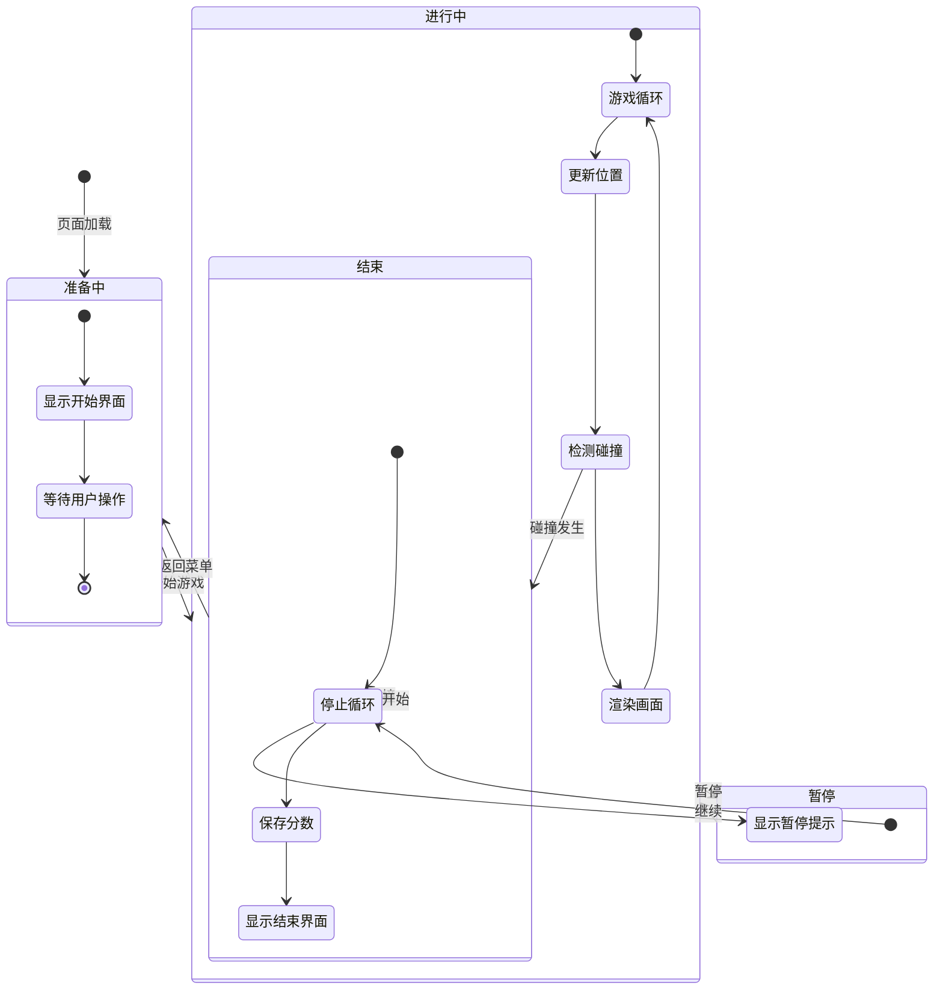
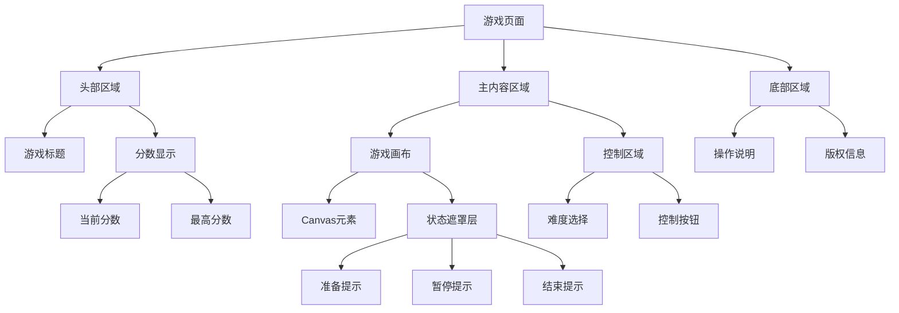
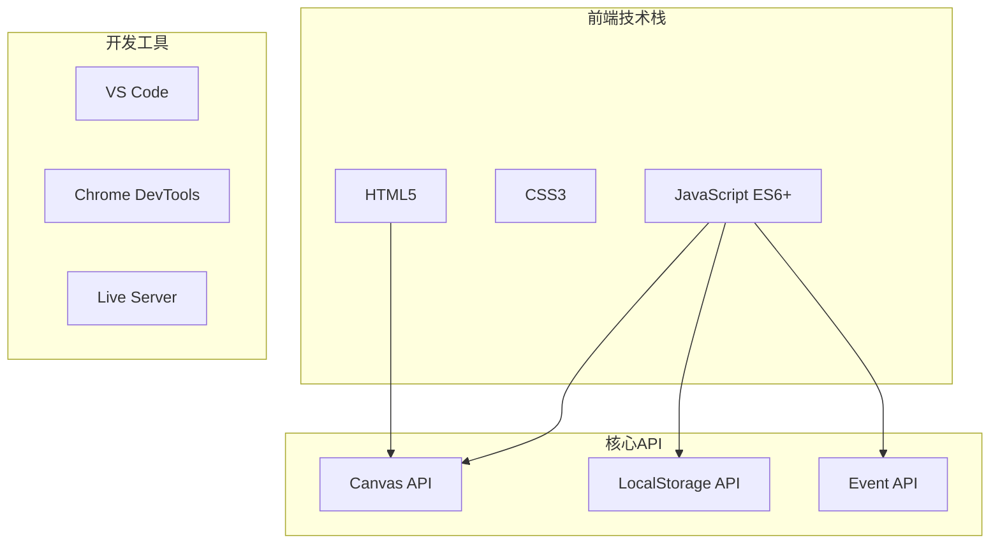

# 贪吃蛇游戏 - 产品结构图

## 文档信息

| 项目 | 内容 |
|------|------|
| 文档名称 | 贪吃蛇游戏产品结构图 |
| 版本 | V1.0 |
| 创建日期 | 2026-03-29 |
| 最后更新 | 2026-03-29 |
| 负责人 | ProductExpert |

---

## 1. 产品架构概览



---

## 2. 模块关系图



---

## 3. 功能模块详细结构

### 3.1 游戏核心模块



### 3.2 用户界面模块



### 3.3 数据存储模块



---

## 4. 数据流结构



---

## 5. 状态流转结构



---

## 6. 页面结构



---

## 7. 技术栈结构



---

## 8. 文件结构

```
贪吃蛇游戏/
├── index.html              # 主页面
├── css/
│   └── style.css          # 样式文件
├── js/
│   ├── main.js            # 入口文件
│   ├── game.js            # 游戏核心逻辑
│   ├── renderer.js        # 渲染模块
│   ├── storage.js         # 存储模块
│   └── utils.js           # 工具函数
├── assets/
│   └── sounds/            # 音效文件（可选）
└── docs/                  # 文档
```

---

## 9. 优先级矩阵

| 功能模块 | 优先级 | 复杂度 | 风险等级 |
|---------|--------|--------|---------|
| 蛇移动控制 | P0 | 中 | 低 |
| 食物生成 | P0 | 低 | 低 |
| 碰撞检测 | P0 | 中 | 低 |
| 蛇身增长 | P0 | 低 | 低 |
| 游戏状态管理 | P0 | 中 | 低 |
| 计分系统 | P0 | 低 | 低 |
| 游戏画布 | P0 | 中 | 低 |
| 分数显示 | P0 | 低 | 低 |
| 控制按钮 | P0 | 低 | 低 |
| 最高分数存储 | P0 | 低 | 低 |
| 难度系统 | P1 | 低 | 低 |
| 难度选择 | P1 | 低 | 低 |
| 游戏设置存储 | P1 | 低 | 低 |
| 响应式布局 | P1 | 中 | 中 |
| 操作说明 | P2 | 低 | 低 |
| 数据清除 | P2 | 低 | 低 |

---

## 10. 更新记录

| 版本 | 日期 | 变更内容 | 变更人 |
|------|------|----------|--------|
| 1.0 | 2026-03-29 | 初始版本，创建完整的产品结构图 | ProductExpert |

---

**文档版本**: V1.0  
**创建日期**: 2026-03-29  
**最后更新**: 2026-03-29  
**负责人**: ProductExpert
