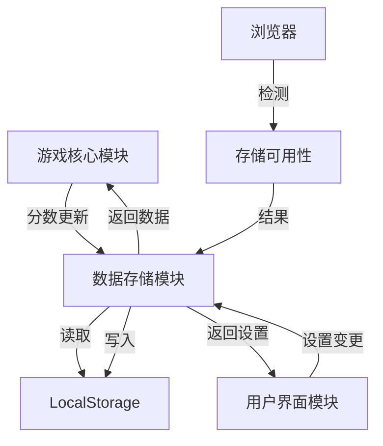

# 数据存储模块 - 详细需求文档

## 1. 变更记录

| 版本 | 日期 | 变更内容 | 变更人 | 审批人 |
|------|------|----------|--------|--------|
| 1.0 | 2026-03-29 | 初始版本 | ProductExpert | 项目管理专家 |

---

## 2. 模块概述

### 2.1 模块名称
数据存储模块（Data Storage Module）

### 2.2 模块定位
数据存储模块负责游戏数据的持久化存储，包括最高分数记录和游戏设置。该模块使用浏览器的LocalStorage API实现数据的本地存储，确保玩家数据在页面刷新后不会丢失。

### 2.3 模块目标
- 持久化存储最高分数
- 保存用户游戏设置
- 提供数据的读取和写入接口
- 处理存储异常和容量限制
- 支持数据导出和导入（可选）

---

## 3. 功能需求

### 3.1 最高分数存储

#### 3.1.1 功能描述
保存玩家的历史最高分数，在游戏结束时自动更新。

#### 3.1.2 详细需求
- 存储键名：snakeGame_highScore
- 存储值类型：数字
- 初始值：0
- 当当前分数超过最高分数时自动更新
- 支持按难度分别存储最高分数（可选）

#### 3.1.3 需求优先级
**P0（Must Have）** - 核心功能，必须实现

#### 3.1.4 用户故事
```
作为 一名玩家
我想要 我的最高分数被保存
以便于 挑战自己的记录

验收标准：
- Given 游戏结束
- When 当前分数超过历史最高
- Then 最高分数被更新并保存
- When 刷新页面后再次打开游戏
- Then 能看到之前的最高分数
```

#### 3.1.5 字段定义

| 字段名称 | 字段类型 | 字段取值逻辑 | 验证规则 |
|---------|---------|-------------|----------|
| highScore | Number | 历史最高分数 | 整数，≥0，默认0 |
| currentScore | Number | 当前游戏分数 | 整数，≥0 |
| storageKey | String | LocalStorage键名 | 默认'snakeGame_highScore' |

#### 3.1.6 操作逻辑

| 操作 | 操作逻辑 | 成功提示 | 错误提示 |
|------|---------|---------|----------|
| 保存最高分数 | 1. 检查currentScore > highScore<br>2. 如满足，更新highScore<br>3. 写入LocalStorage | 无 | 存储失败时记录日志 |
| 读取最高分数 | 1. 从LocalStorage读取<br>2. 如不存在，返回0<br>3. 解析为数字 | 无 | 解析失败时返回0 |
| 重置最高分数 | 1. 设置highScore为0<br>2. 写入LocalStorage | 无 | 存储失败时记录日志 |

#### 3.1.7 存储结构

```javascript
// 简单模式（单一最高分）
{
    "snakeGame_highScore": 150
}

// 扩展模式（按难度存储）
{
    "snakeGame_highScores": {
        "easy": 200,
        "normal": 150,
        "hard": 100
    }
}
```

---

### 3.2 游戏设置存储

#### 3.2.1 功能描述
保存用户的游戏设置，如难度偏好、音效开关等。

#### 3.2.2 详细需求
- 存储键名：snakeGame_settings
- 存储值类型：JSON对象
- 默认设置：{difficulty: 'normal', soundEnabled: true}
- 游戏启动时自动加载设置
- 设置变更时自动保存

#### 3.2.3 需求优先级
**P1（Should Have）** - 重要功能，建议实现

#### 3.2.4 用户故事
```
作为 一名玩家
我想要 我的游戏设置被保存
以便于 下次打开游戏时保持我的偏好

验收标准：
- Given 我更改了游戏难度
- When 刷新页面后再次打开游戏
- Then 难度设置保持我上次的选择
```

#### 3.2.5 字段定义

| 字段名称 | 字段类型 | 字段取值逻辑 | 验证规则 |
|---------|---------|-------------|----------|
| settings | Object | 游戏设置对象 | 包含difficulty和soundEnabled |
| difficulty | String | 难度设置 | 'easy', 'normal', 'hard'，默认'normal' |
| soundEnabled | Boolean | 音效开关 | true/false，默认true |
| settingsKey | String | LocalStorage键名 | 默认'snakeGame_settings' |

#### 3.2.6 操作逻辑

| 操作 | 操作逻辑 | 成功提示 | 错误提示 |
|------|---------|---------|----------|
| 保存设置 | 1. 将settings对象转为JSON<br>2. 写入LocalStorage | 无 | 存储失败时记录日志 |
| 读取设置 | 1. 从LocalStorage读取<br>2. 解析JSON<br>3. 合并默认设置 | 无 | 解析失败时返回默认设置 |
| 更新设置 | 1. 修改settings对象<br>2. 调用保存设置 | 无 | 存储失败时记录日志 |

#### 3.2.7 存储结构

```javascript
{
    "snakeGame_settings": {
        "difficulty": "normal",
        "soundEnabled": true
    }
}
```

---

### 3.3 数据读取

#### 3.3.1 功能描述
提供统一的接口从LocalStorage读取数据。

#### 3.3.2 详细需求
- 支持读取指定键的数据
- 自动处理JSON解析
- 数据不存在时返回默认值
- 解析失败时返回默认值并记录错误

#### 3.3.3 需求优先级
**P0（Must Have）** - 核心功能，必须实现

#### 3.3.4 用户故事
```
作为 游戏系统
我想要 能够读取存储的数据
以便于 在游戏启动时加载玩家数据

验收标准：
- Given 游戏启动
- When 调用数据读取接口
- Then 返回存储的数据或默认值
```

#### 3.3.5 接口定义

| 接口名称 | 参数 | 返回值 | 说明 |
|---------|------|--------|------|
| getItem(key, defaultValue) | key: String, defaultValue: any | any | 读取指定键的数据 |
| getHighScore() | 无 | Number | 读取最高分数 |
| getSettings() | 无 | Object | 读取游戏设置 |

#### 3.3.6 读取逻辑

```javascript
function getItem(key, defaultValue = null) {
    try {
        const item = localStorage.getItem(key);
        if (item === null) {
            return defaultValue;
        }
        return JSON.parse(item);
    } catch (error) {
        console.error(`读取数据失败: ${key}`, error);
        return defaultValue;
    }
}
```

---

### 3.4 数据写入

#### 3.4.1 功能描述
提供统一的接口向LocalStorage写入数据。

#### 3.4.2 详细需求
- 支持写入指定键的数据
- 自动处理JSON序列化
- 处理存储容量超限异常
- 写入失败时记录错误日志

#### 3.4.3 需求优先级
**P0（Must Have）** - 核心功能，必须实现

#### 3.4.4 用户故事
```
作为 游戏系统
我想要 能够写入数据到存储
以便于 保存玩家的游戏进度和设置

验收标准：
- Given 游戏数据需要保存
- When 调用数据写入接口
- Then 数据被成功写入LocalStorage
```

#### 3.4.5 接口定义

| 接口名称 | 参数 | 返回值 | 说明 |
|---------|------|--------|------|
| setItem(key, value) | key: String, value: any | Boolean | 写入指定键的数据 |
| setHighScore(score) | score: Number | Boolean | 保存最高分数 |
| setSettings(settings) | settings: Object | Boolean | 保存游戏设置 |

#### 3.4.6 写入逻辑

```javascript
function setItem(key, value) {
    try {
        const serialized = JSON.stringify(value);
        localStorage.setItem(key, serialized);
        return true;
    } catch (error) {
        if (error.name === 'QuotaExceededError') {
            console.error('存储空间不足');
        } else {
            console.error(`写入数据失败: ${key}`, error);
        }
        return false;
    }
}
```

---

### 3.5 数据清除

#### 3.5.1 功能描述
提供清除存储数据的功能，用于重置游戏数据。

#### 3.5.2 详细需求
- 支持清除指定键的数据
- 支持清除所有游戏相关数据
- 清除后数据恢复为默认值
- 提供确认机制防止误操作

#### 3.5.3 需求优先级
**P2（Could Have）** - 可选功能，可实现

#### 3.5.4 用户故事
```
作为 一名玩家
我想要 能够重置我的游戏数据
以便于 清除记录重新开始

验收标准：
- Given 我确认要重置数据
- When 调用数据清除功能
- Then 所有游戏数据被清除
- And 数据恢复为默认值
```

#### 3.5.5 接口定义

| 接口名称 | 参数 | 返回值 | 说明 |
|---------|------|--------|------|
| removeItem(key) | key: String | Boolean | 清除指定键的数据 |
| clearAll() | 无 | Boolean | 清除所有游戏数据 |

---

### 3.6 存储异常处理

#### 3.6.1 功能描述
处理LocalStorage可能出现的各种异常情况。

#### 3.6.2 详细需求
- 检测浏览器是否支持LocalStorage
- 处理存储空间不足的情况
- 处理隐私模式下的存储限制
- 记录异常日志便于调试

#### 3.6.3 需求优先级
**P1（Should Have）** - 重要功能，建议实现

#### 3.6.4 异常类型

| 异常类型 | 触发条件 | 处理方式 |
|---------|---------|---------|
| 不支持LocalStorage | 浏览器禁用或不支持 | 使用内存存储，数据不持久化 |
| 存储空间不足 | 超出浏览器存储配额 | 提示用户，尝试清理旧数据 |
| 隐私模式限制 | 浏览器隐私/无痕模式 | 使用内存存储，数据不持久化 |
| 数据解析失败 | JSON格式错误 | 返回默认值，记录错误 |

#### 3.6.5 检测逻辑

```javascript
function isStorageAvailable() {
    try {
        const test = '__storage_test__';
        localStorage.setItem(test, test);
        localStorage.removeItem(test);
        return true;
    } catch (e) {
        return false;
    }
}
```

---

## 4. 非功能需求

### 4.1 性能需求
- 数据读取延迟<10ms
- 数据写入延迟<50ms
- 不影响游戏主循环性能

### 4.2 可靠性需求
- 数据写入成功率>99%
- 数据读取成功率>99%
- 异常情况下 graceful degradation

### 4.3 安全性需求
- 不存储敏感个人信息
- 数据仅在本地存储，不上传服务器
- 遵循同源策略

---

## 5. 接口定义

### 5.1 完整接口列表

| 接口名称 | 参数 | 返回值 | 说明 |
|---------|------|--------|------|
| init() | 无 | Boolean | 初始化存储模块，检测可用性 |
| isAvailable() | 无 | Boolean | 检查LocalStorage是否可用 |
| getItem(key, defaultValue) | key: String, defaultValue: any | any | 读取数据 |
| setItem(key, value) | key: String, value: any | Boolean | 写入数据 |
| removeItem(key) | key: String | Boolean | 删除数据 |
| clearAll() | 无 | Boolean | 清除所有数据 |
| getHighScore() | 无 | Number | 获取最高分数 |
| setHighScore(score) | score: Number | Boolean | 设置最高分数 |
| getSettings() | 无 | Object | 获取游戏设置 |
| setSettings(settings) | settings: Object | Boolean | 设置游戏设置 |

### 5.2 存储键常量

```javascript
const STORAGE_KEYS = {
    HIGH_SCORE: 'snakeGame_highScore',
    SETTINGS: 'snakeGame_settings',
    HIGH_SCORES: 'snakeGame_highScores',  // 扩展：按难度存储
    GAME_STATS: 'snakeGame_stats'         // 扩展：游戏统计
};
```

### 5.3 默认配置

```javascript
const DEFAULTS = {
    HIGH_SCORE: 0,
    SETTINGS: {
        difficulty: 'normal',
        soundEnabled: true
    }
};
```

---

## 6. 数据流图



---

## 7. 使用示例

### 7.1 初始化

```javascript
import storage from './storage.js';

// 初始化存储模块
if (storage.init()) {
    console.log('存储模块初始化成功');
} else {
    console.warn('LocalStorage不可用，使用内存存储');
}
```

### 7.2 保存最高分数

```javascript
// 游戏结束时保存分数
function onGameEnd(finalScore) {
    const highScore = storage.getHighScore();
    if (finalScore > highScore) {
        storage.setHighScore(finalScore);
        console.log('新纪录！', finalScore);
    }
}
```

### 7.3 读取设置

```javascript
// 游戏启动时加载设置
function loadSettings() {
    const settings = storage.getSettings();
    game.setDifficulty(settings.difficulty);
    audio.setEnabled(settings.soundEnabled);
}
```

### 7.4 保存设置

```javascript
// 用户更改设置时保存
function onSettingsChange(newSettings) {
    storage.setSettings(newSettings);
}
```

---

## 8. 验收标准

### 8.1 功能验收

| 验收项 | 验收方法 | 验收标准 | 验收结果 |
|-------|---------|---------|---------|
| 最高分数存储 | 功能测试 | 分数正确保存和读取 | ☐ 通过 ☐ 失败 |
| 游戏设置存储 | 功能测试 | 设置正确保存和读取 | ☐ 通过 ☐ 失败 |
| 数据读取 | 功能测试 | 能正确读取各类数据 | ☐ 通过 ☐ 失败 |
| 数据写入 | 功能测试 | 能正确写入各类数据 | ☐ 通过 ☐ 失败 |
| 数据清除 | 功能测试 | 能正确清除数据 | ☐ 通过 ☐ 失败 |
| 异常处理 | 异常测试 | 异常情况正确处理 | ☐ 通过 ☐ 失败 |

### 8.2 性能验收
- [ ] 数据读取延迟<10ms
- [ ] 数据写入延迟<50ms
- [ ] 不影响游戏主循环

### 8.3 兼容性验收
- [ ] Chrome浏览器正常
- [ ] Firefox浏览器正常
- [ ] Safari浏览器正常
- [ ] Edge浏览器正常
- [ ] 隐私模式下 graceful degradation

---

## 9. 扩展功能（可选）

### 9.1 按难度存储最高分
为每种难度分别存储最高分数。

```javascript
{
    "snakeGame_highScores": {
        "easy": 200,
        "normal": 150,
        "hard": 100
    }
}
```

### 9.2 游戏统计
存储更多的游戏统计数据。

```javascript
{
    "snakeGame_stats": {
        "totalGames": 50,
        "totalPlayTime": 3600,
        "totalFoodEaten": 500,
        "averageScore": 80
    }
}
```

### 9.3 数据导出/导入
支持将游戏数据导出为文件，或从文件导入。

---

**文档版本**: V1.0  
**创建日期**: 2026-03-29  
**最后更新**: 2026-03-29  
**负责人**: ProductExpert
