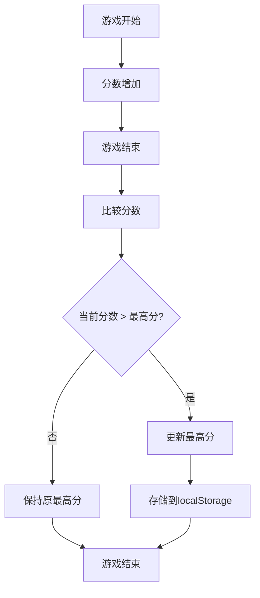

# 数据管理模块详细需求文档

## 1. 变更记录

| 版本 | 日期 | 变更内容 | 变更人 |
|------|------|----------|--------|
| v1.0 | 2026-03-03 | 初始化文档 | 产品专家 |

## 2. 功能需求

### 2.1 分数记录

#### 字段定义
| 字段名称 | 字段类型 | 字段取值逻辑 |
|---------|---------|------------|
| 当前分数 | 数字 | 初始值为0，每吃掉一个食物增加10分 |
| 分数显示 | 文本 | 实时显示当前分数 |

#### 操作逻辑
- 游戏开始时，分数重置为0
- 每吃掉一个食物，分数增加10分
- 分数实时更新并显示在界面上

### 2.2 最高分存储

#### 字段定义
| 字段名称 | 字段类型 | 字段取值逻辑 |
|---------|---------|------------|
| 最高分 | 数字 | 存储在localStorage中，初始值为0 |
| 最高分显示 | 文本 | 显示历史最高分 |

#### 操作逻辑
- 游戏结束时，比较当前分数与存储的最高分
- 如果当前分数高于最高分，更新最高分并存储到localStorage
- 最高分实时显示在界面上
- 页面刷新后，最高分仍然保持

## 3. 状态流转

## 4. 数据权限

本模块为游戏数据管理逻辑，无数据权限限制。