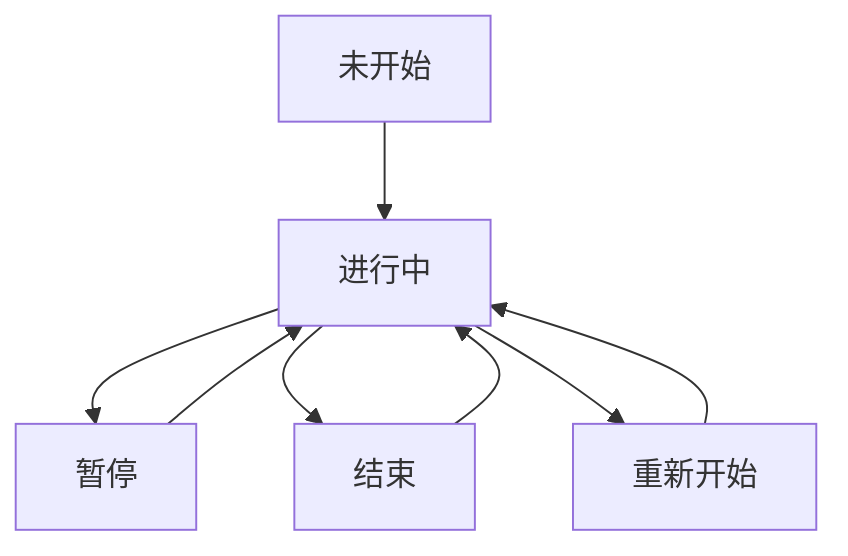

# 游戏控制模块详细需求文档

## 1. 变更记录

| 版本 | 日期 | 变更内容 | 变更人 |
|------|------|----------|--------|
| v1.0 | 2026-03-03 | 初始化文档 | 产品专家 |

## 2. 功能需求

### 2.1 开始游戏

#### 字段定义
| 字段名称 | 字段类型 | 字段取值逻辑 |
|---------|---------|------------|
| 开始按钮 | 按钮 | 点击后开始游戏 |
| 游戏状态 | 字符串 | 从"未开始"变为"进行中" |

#### 操作逻辑
- 点击开始按钮，游戏开始
- 蛇开始移动
- 生成初始食物
- 分数重置为0

### 2.2 暂停/继续

#### 字段定义
| 字段名称 | 字段类型 | 字段取值逻辑 |
|---------|---------|------------|
| 暂停按钮 | 按钮 | 点击后暂停游戏 |
| 继续按钮 | 按钮 | 点击后继续游戏 |
| 游戏状态 | 字符串 | 暂停时为"暂停"，继续时为"进行中" |

#### 操作逻辑
- 游戏进行中时，点击暂停按钮，游戏暂停
- 游戏暂停时，点击继续按钮，游戏继续
- 暂停时，蛇停止移动
- 继续时，蛇恢复移动

### 2.3 重新开始

#### 字段定义
| 字段名称 | 字段类型 | 字段取值逻辑 |
|---------|---------|------------|
| 重新开始按钮 | 按钮 | 点击后重新开始游戏 |
| 游戏状态 | 字符串 | 变为"进行中" |
| 蛇的位置 | 数组 | 重置为初始位置 |
| 当前分数 | 数字 | 重置为0 |

#### 操作逻辑
- 点击重新开始按钮，游戏重新开始
- 蛇的位置重置为初始位置
- 分数重置为0
- 生成新的食物
- 游戏状态变为"进行中"

### 2.4 难度调整

#### 字段定义
| 字段名称 | 字段类型 | 字段取值逻辑 |
|---------|---------|------------|
| 难度选择 | 下拉菜单 | 选项为"简单"、"中等"、"困难" |
| 移动速度 | 数字 | 简单：200ms，中等：150ms，困难：100ms |

#### 操作逻辑
- 选择不同的难度级别，影响蛇的移动速度
- 难度调整可以在游戏开始前或游戏过程中进行
- 游戏过程中调整难度，立即生效

## 3. 状态流转

## 4. 数据权限

本模块为游戏控制逻辑，无数据权限限制。