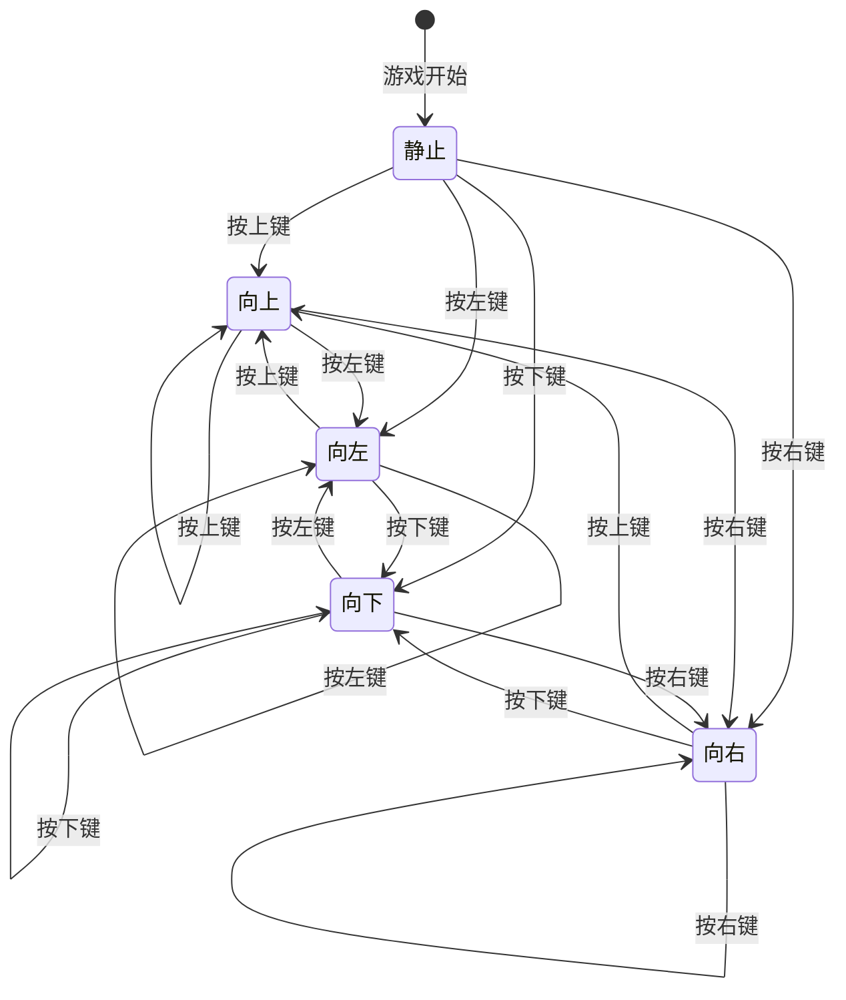
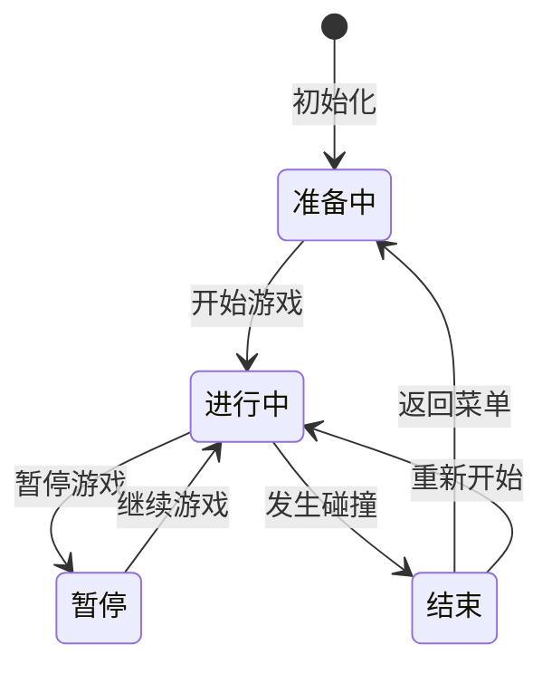

# 游戏核心模块 - 详细需求文档

## 1. 变更记录

| 版本 | 日期 | 变更内容 | 变更人 | 审批人 |
|------|------|----------|--------|--------|
| 1.0 | 2026-03-29 | 初始版本 | ProductExpert | 项目管理专家 |

---

## 2. 模块概述

### 2.1 模块名称
游戏核心模块（Game Core Module）

### 2.2 模块定位
游戏核心模块是贪吃蛇游戏的核心，负责处理蛇的移动、食物的生成、碰撞检测和游戏状态管理。该模块确保游戏逻辑的正确性和流畅性，是整个游戏系统的基础。

### 2.3 模块目标
- 实现蛇的移动控制逻辑
- 实现食物生成和吃掉逻辑
- 实现碰撞检测（墙壁、自身）
- 实现游戏状态管理
- 实现计分系统

---

## 3. 功能需求

### 3.1 蛇移动控制

#### 3.1.1 功能描述
玩家通过键盘方向键控制蛇的移动方向，蛇按照设定的速度在画布上移动。

#### 3.1.2 详细需求
- 支持四个方向的移动：上、下、左、右
- 禁止180度反向移动（如正在向右移动时不能直接向左）
- 蛇身跟随蛇头移动
- 移动速度根据难度级别调整

#### 3.1.3 需求优先级
**P0（Must Have）** - 核心玩法，必须实现

#### 3.1.4 用户故事
```
作为 一名玩家
我想要 使用方向键控制蛇的移动
以便于 操控蛇去吃食物

验收标准：
- Given 游戏进行中
- When 我按下方向键
- Then 蛇按照对应方向移动
- And 不能直接反向移动
```

#### 3.1.5 字段定义

| 字段名称 | 字段类型 | 字段取值逻辑 | 验证规则 |
|---------|---------|-------------|----------|
| snakeBody | Array<Object> | 蛇身各节坐标数组，格式[{x, y}, ...]，蛇头为第一个元素 | 数组长度≥1，每个元素包含x、y坐标 |
| direction | String | 当前移动方向：'up', 'down', 'left', 'right' | 枚举值，必填 |
| nextDirection | String | 下一帧将要移动的方向 | 枚举值，需验证是否反向 |
| gridSize | Number | 网格大小（像素） | 默认20，用于计算坐标 |

#### 3.1.6 操作逻辑

| 操作 | 操作逻辑 | 成功提示 | 错误提示 |
|------|---------|---------|----------|
| 方向键上 | 1. 检查当前方向是否为'down'<br>2. 如不是，设置nextDirection为'up'<br>3. 下一帧按新方向移动 | 无 | 无（反向移动被忽略） |
| 方向键下 | 1. 检查当前方向是否为'up'<br>2. 如不是，设置nextDirection为'down'<br>3. 下一帧按新方向移动 | 无 | 无（反向移动被忽略） |
| 方向键左 | 1. 检查当前方向是否为'right'<br>2. 如不是，设置nextDirection为'left'<br>3. 下一帧按新方向移动 | 无 | 无（反向移动被忽略） |
| 方向键右 | 1. 检查当前方向是否为'left'<br>2. 如不是，设置nextDirection为'right'<br>3. 下一帧按新方向移动 | 无 | 无（反向移动被忽略） |

#### 3.1.7 状态流转



**注意**：向上状态不能直接转为向下，向下不能直接转为向上，向左不能直接转为向右，向右不能直接转为向左。

---

### 3.2 食物生成

#### 3.2.1 功能描述
在游戏画布上随机生成食物，食物位置不能与蛇身重叠。

#### 3.2.2 详细需求
- 食物在画布范围内随机生成
- 食物位置不能与蛇身任何一节重叠
- 食物大小与蛇身一节相同
- 吃掉食物后立即生成新食物

#### 3.2.3 需求优先级
**P0（Must Have）** - 核心玩法，必须实现

#### 3.2.4 用户故事
```
作为 一名玩家
我想要 食物随机出现在画布上
以便于 操控蛇去吃食物获得分数

验收标准：
- Given 游戏开始或吃掉食物后
- When 生成食物
- Then 食物出现在随机位置
- And 食物不与蛇身重叠
```

#### 3.2.5 字段定义

| 字段名称 | 字段类型 | 字段取值逻辑 | 验证规则 |
|---------|---------|-------------|----------|
| foodPosition | Object | 食物坐标 {x, y} | x、y为网格坐标，不能位于蛇身上 |
| foodColor | String | 食物颜色 | 默认'#F44336' |
| canvasWidth | Number | 画布宽度（网格数） | 默认20（400px / 20px） |
| canvasHeight | Number | 画布高度（网格数） | 默认20（400px / 20px） |

#### 3.2.6 操作逻辑

| 操作 | 操作逻辑 | 成功提示 | 错误提示 |
|------|---------|---------|----------|
| 生成食物 | 1. 随机生成x坐标（0到canvasWidth-1）<br>2. 随机生成y坐标（0到canvasHeight-1）<br>3. 检查是否与蛇身重叠<br>4. 如重叠则重新生成<br>5. 设置foodPosition | 无 | 无 |

#### 3.2.7 算法说明

```javascript
function generateFood() {
    let newFood;
    let isOnSnake;
    
    do {
        newFood = {
            x: Math.floor(Math.random() * canvasWidth),
            y: Math.floor(Math.random() * canvasHeight)
        };
        
        // 检查是否与蛇身重叠
        isOnSnake = snakeBody.some(segment => 
            segment.x === newFood.x && segment.y === newFood.y
        );
    } while (isOnSnake);
    
    return newFood;
}
```

---

### 3.3 碰撞检测

#### 3.3.1 功能描述
检测蛇头是否撞到墙壁或自身身体，触发游戏结束。

#### 3.3.2 详细需求
- 检测蛇头是否超出画布边界（撞墙）
- 检测蛇头是否与蛇身任何一节重叠（撞自己）
- 任一碰撞发生时游戏立即结束
- 游戏结束时停止游戏循环

#### 3.3.3 需求优先级
**P0（Must Have）** - 核心玩法，必须实现

#### 3.3.4 用户故事
```
作为 一名玩家
我想要 当蛇撞墙或撞到自己时游戏结束
以便于 增加游戏挑战性

验收标准：
- Given 游戏进行中
- When 蛇头撞到墙壁
- Then 游戏结束
- When 蛇头撞到自身
- Then 游戏结束
```

#### 3.3.5 字段定义

| 字段名称 | 字段类型 | 字段取值逻辑 | 验证规则 |
|---------|---------|-------------|----------|
| headX | Number | 蛇头x坐标 | 0 ≤ headX < canvasWidth |
| headY | Number | 蛇头y坐标 | 0 ≤ headY < canvasHeight |
| isGameOver | Boolean | 游戏是否结束 | true表示游戏结束 |

#### 3.3.6 操作逻辑

| 操作 | 操作逻辑 | 成功提示 | 错误提示 |
|------|---------|---------|----------|
| 碰撞检测 | 1. 获取蛇头坐标<br>2. 检查是否超出边界<br>3. 检查是否与蛇身重叠（从第二节开始）<br>4. 如发生碰撞，设置isGameOver为true<br>5. 停止游戏循环<br>6. 触发游戏结束事件 | 无 | 无 |

#### 3.3.7 算法说明

```javascript
function checkCollision() {
    const head = snakeBody[0];
    
    // 撞墙检测
    if (head.x < 0 || head.x >= canvasWidth || 
        head.y < 0 || head.y >= canvasHeight) {
        return true;
    }
    
    // 撞自己检测（从第二节开始检查）
    for (let i = 1; i < snakeBody.length; i++) {
        if (head.x === snakeBody[i].x && head.y === snakeBody[i].y) {
            return true;
        }
    }
    
    return false;
}
```

---

### 3.4 蛇身增长

#### 3.4.1 功能描述
当蛇吃到食物时，蛇身增加一节，分数增加。

#### 3.4.2 详细需求
- 蛇头触碰到食物时触发增长
- 在蛇尾增加一节
- 每吃一个食物增加10分
- 立即生成新食物

#### 3.4.3 需求优先级
**P0（Must Have）** - 核心玩法，必须实现

#### 3.4.4 用户故事
```
作为 一名玩家
我想要 蛇吃到食物后身体变长
以便于 获得分数并增加游戏难度

验收标准：
- Given 游戏进行中
- When 蛇头触碰到食物
- Then 蛇身增加一节
- And 分数增加10分
- And 生成新食物
```

#### 3.4.5 字段定义

| 字段名称 | 字段类型 | 字段取值逻辑 | 验证规则 |
|---------|---------|-------------|----------|
| score | Number | 当前游戏分数 | 整数，≥0，每食物+10 |
| snakeLength | Number | 蛇身长度 | 等于snakeBody数组长度 |

#### 3.4.6 操作逻辑

| 操作 | 操作逻辑 | 成功提示 | 错误提示 |
|------|---------|---------|----------|
| 吃食物 | 1. 检测蛇头与食物位置是否重合<br>2. 如重合，在蛇尾增加一节<br>3. 分数增加10分<br>4. 生成新食物 | 无 | 无 |

#### 3.4.7 算法说明

```javascript
function eatFood() {
    const head = snakeBody[0];
    
    // 检查是否吃到食物
    if (head.x === foodPosition.x && head.y === foodPosition.y) {
        // 增加分数
        score += 10;
        
        // 在蛇尾增加一节（下一帧会自动跟随）
        // 实际上不需要立即添加，只需不删除尾部即可
        
        // 生成新食物
        generateFood();
        
        return true;
    }
    
    return false;
}
```

---

### 3.5 游戏状态管理

#### 3.5.1 功能描述
管理游戏的各种状态：准备中、进行中、暂停、结束。

#### 3.5.2 详细需求
- 游戏开始前状态为"准备中"
- 点击开始游戏后状态变为"进行中"
- 游戏中可以暂停，状态变为"暂停"
- 碰撞发生后状态变为"结束"
- 不同状态下响应不同的操作

#### 3.5.3 需求优先级
**P0（Must Have）** - 核心功能，必须实现

#### 3.5.4 用户故事
```
作为 一名玩家
我想要 游戏有不同的状态（开始、暂停、结束）
以便于 控制游戏进程

验收标准：
- Given 游戏在准备状态
- When 点击开始
- Then 游戏状态变为进行中
- When 按暂停键
- Then 游戏状态变为暂停
- When 发生碰撞
- Then 游戏状态变为结束
```

#### 3.5.5 字段定义

| 字段名称 | 字段类型 | 字段取值逻辑 | 验证规则 |
|---------|---------|-------------|----------|
| gameState | String | 游戏状态：'ready', 'playing', 'paused', 'over' | 枚举值 |
| isPaused | Boolean | 游戏是否暂停 | gameState === 'paused'时为true |

#### 3.5.6 操作逻辑

| 操作按钮 | 操作逻辑 | 成功提示 | 错误提示 |
|---------|---------|---------|----------|
| 开始游戏 | 1. 检查gameState是否为'ready'或'over'<br>2. 初始化游戏数据<br>3. 设置gameState为'playing'<br>4. 启动游戏循环 | 游戏开始 | 游戏进行中时无响应 |
| 暂停游戏 | 1. 检查gameState是否为'playing'<br>2. 设置gameState为'paused'<br>3. 暂停游戏循环 | 显示"已暂停" | 非游戏进行中无响应 |
| 继续游戏 | 1. 检查gameState是否为'paused'<br>2. 设置gameState为'playing'<br>3. 恢复游戏循环 | "已暂停"提示消失 | 非暂停状态无响应 |
| 游戏结束 | 1. 设置gameState为'over'<br>2. 停止游戏循环<br>3. 显示游戏结束界面 | 显示"游戏结束" | 无 |

#### 3.5.7 状态流转



---

### 3.6 计分系统

#### 3.6.1 功能描述
记录玩家在游戏中的得分，每吃一个食物获得固定分数。

#### 3.6.2 详细需求
- 初始分数为0
- 每吃一个食物增加10分
- 实时显示当前分数
- 游戏结束时保存最终分数

#### 3.6.3 需求优先级
**P0（Must Have）** - 核心功能，必须实现

#### 3.6.4 用户故事
```
作为 一名玩家
我想要 看到我的游戏分数
以便于 了解游戏进度和成绩

验收标准：
- Given 游戏进行中
- Then 我能看到当前分数
- When 吃到食物
- Then 分数增加10分
```

#### 3.6.5 字段定义

| 字段名称 | 字段类型 | 字段取值逻辑 | 验证规则 |
|---------|---------|-------------|----------|
| score | Number | 当前游戏分数 | 整数，≥0，初始值为0 |
| scoreIncrement | Number | 每次吃食物的分数增量 | 默认10 |

#### 3.6.6 操作逻辑

| 操作 | 操作逻辑 | 成功提示 | 错误提示 |
|------|---------|---------|----------|
| 增加分数 | 1. 检测到吃食物事件<br>2. score += scoreIncrement<br>3. 更新分数显示 | 分数显示更新 | 无 |
| 重置分数 | 1. 新游戏开始时<br>2. score = 0<br>3. 更新分数显示 | 分数显示为0 | 无 |

---

### 3.7 难度系统

#### 3.7.1 功能描述
提供三种难度级别，通过调整蛇的移动速度来改变游戏难度。

#### 3.7.2 详细需求
- 简单模式：速度慢（200ms/帧）
- 普通模式：标准速度（150ms/帧）
- 困难模式：速度快（100ms/帧）
- 游戏开始前可选择难度
- 难度影响蛇的移动速度

#### 3.7.3 需求优先级
**P1（Should Have）** - 重要功能，建议实现

#### 3.7.4 用户故事
```
作为 一名玩家
我想要 选择不同的游戏难度
以便于 根据自己的水平选择合适的挑战

验收标准：
- Given 游戏开始前
- When 我选择难度
- Then 游戏以对应速度开始
- And 简单模式速度最慢
- And 困难模式速度最快
```

#### 3.7.5 字段定义

| 字段名称 | 字段类型 | 字段取值逻辑 | 验证规则 |
|---------|---------|-------------|----------|
| difficulty | String | 难度级别：'easy', 'normal', 'hard' | 枚举值，默认'normal' |
| gameSpeed | Number | 游戏速度（毫秒/帧） | easy:200, normal:150, hard:100 |

#### 3.7.6 操作逻辑

| 操作 | 操作逻辑 | 成功提示 | 错误提示 |
|------|---------|---------|----------|
| 选择难度 | 1. 玩家点击难度按钮<br>2. 设置difficulty值<br>3. 根据difficulty设置gameSpeed<br>4. 高亮显示选中的难度 | 选中难度高亮显示 | 无 |

---

## 4. 非功能需求

### 4.1 性能需求
- 游戏帧率≥30 FPS
- 输入响应延迟<50ms
- 游戏循环稳定运行，无卡顿

### 4.2 可靠性需求
- 游戏逻辑计算准确无误
- 碰撞检测精确
- 状态切换正确

---

## 5. 接口定义

### 5.1 对外接口

| 接口名称 | 参数 | 返回值 | 说明 |
|---------|------|--------|------|
| startGame(difficulty) | difficulty: String | void | 开始游戏 |
| pauseGame() | 无 | void | 暂停游戏 |
| resumeGame() | 无 | void | 继续游戏 |
| endGame() | 无 | void | 结束游戏 |
| restartGame() | 无 | void | 重新开始 |
| changeDirection(direction) | direction: String | void | 改变移动方向 |
| getScore() | 无 | Number | 获取当前分数 |
| getGameState() | 无 | String | 获取游戏状态 |

### 5.2 事件通知

| 事件名称 | 触发条件 | 参数 |
|---------|---------|------|
| gameStarted | 游戏开始 | {difficulty, speed} |
| gamePaused | 游戏暂停 | 无 |
| gameResumed | 游戏继续 | 无 |
| gameOver | 游戏结束 | {score, isNewRecord} |
| scoreChanged | 分数变化 | {newScore, increment} |
| foodEaten | 吃到食物 | {position, newScore} |

---

## 6. 验收标准

### 6.1 功能验收

| 验收项 | 验收方法 | 验收标准 | 验收结果 |
|-------|---------|---------|---------|
| 蛇移动控制 | 功能测试 | 方向键可控制蛇移动，不能反向 | ☐ 通过 ☐ 失败 |
| 食物生成 | 功能测试 | 食物随机生成，不与蛇身重叠 | ☐ 通过 ☐ 失败 |
| 碰撞检测 | 功能测试 | 撞墙/撞自己时游戏结束 | ☐ 通过 ☐ 失败 |
| 蛇身增长 | 功能测试 | 吃食物后蛇身增长，分数增加 | ☐ 通过 ☐ 失败 |
| 游戏状态管理 | 功能测试 | 状态切换正确，操作响应正常 | ☐ 通过 ☐ 失败 |
| 计分系统 | 功能测试 | 分数计算正确，显示正常 | ☐ 通过 ☐ 失败 |
| 难度系统 | 功能测试 | 三种难度速度不同 | ☐ 通过 ☐ 失败 |

### 6.2 性能验收
- [ ] 游戏帧率≥30 FPS
- [ ] 输入响应延迟<50ms
- [ ] 游戏运行稳定，无卡顿

---

**文档版本**: V1.0  
**创建日期**: 2026-03-29  
**最后更新**: 2026-03-29  
**负责人**: ProductExpert
