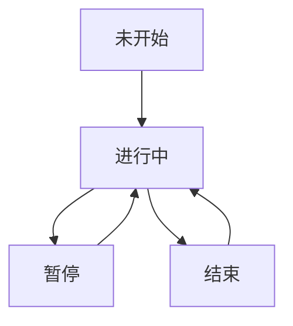

# 游戏核心模块详细需求文档

## 1. 变更记录

| 版本 | 日期 | 变更内容 | 变更人 |
|------|------|----------|--------|
| v1.0 | 2026-03-03 | 初始化文档 | 产品专家 |

## 2. 功能需求

### 2.1 蛇的移动

#### 字段定义
| 字段名称 | 字段类型 | 字段取值逻辑 |
|---------|---------|------------|
| 蛇的位置 | 数组 | 存储蛇身各节的坐标，格式为[{x, y}, {x, y}, ...] |
| 移动方向 | 字符串 | 取值为"up"、"down"、"left"、"right" |
| 移动速度 | 数字 | 根据难度级别确定，简单：200ms，中等：150ms，困难：100ms |

#### 操作逻辑
- 蛇会自动向当前方向移动，移动速度根据难度级别调整
- 键盘方向键控制蛇的移动方向，不能直接反向移动（如当前向左移动时，不能直接向右移动）
- 移动时，蛇头向当前方向移动一节，蛇身各节跟随前一节移动
- 吃掉食物后，蛇的长度增加一节

### 2.2 食物生成

#### 字段定义
| 字段名称 | 字段类型 | 字段取值逻辑 |
|---------|---------|------------|
| 食物位置 | 对象 | 存储食物的坐标，格式为{x, y} |
| 食物大小 | 数字 | 与蛇身一节的大小相同 |

#### 操作逻辑
- 游戏开始时生成一个食物
- 食物被吃掉后，重新生成一个食物
- 食物生成位置随机，但不能与蛇身重叠
- 食物生成在游戏区域内

### 2.3 碰撞检测

#### 字段定义
| 字段名称 | 字段类型 | 字段取值逻辑 |
|---------|---------|------------|
| 游戏区域边界 | 对象 | 存储游戏区域的边界坐标，格式为{left, top, right, bottom} |
| 碰撞状态 | 布尔值 | true表示发生碰撞，false表示未发生碰撞 |

#### 操作逻辑
- 边界碰撞：检测蛇头坐标是否超出游戏区域边界
- 自身碰撞：检测蛇头坐标是否与蛇身其他节的坐标重叠
- 发生碰撞后，游戏结束

### 2.4 分数计算

#### 字段定义
| 字段名称 | 字段类型 | 字段取值逻辑 |
|---------|---------|------------|
| 当前分数 | 数字 | 初始值为0，每吃掉一个食物增加10分 |
| 最高分 | 数字 | 存储在localStorage中，初始值为0 |

#### 操作逻辑
- 每吃掉一个食物，分数增加10分
- 游戏结束时，比较当前分数与存储的最高分
- 如果当前分数高于最高分，更新最高分

### 2.5 游戏结束

#### 字段定义
| 字段名称 | 字段类型 | 字段取值逻辑 |
|---------|---------|------------|
| 游戏状态 | 字符串 | 取值为"未开始"、"进行中"、"暂停"、"结束" |

#### 操作逻辑
- 发生碰撞后，游戏状态变为"结束"
- 显示当前得分和最高分
- 显示重新开始按钮

## 3. 状态流转

## 4. 数据权限

本模块为游戏核心逻辑，无数据权限限制。