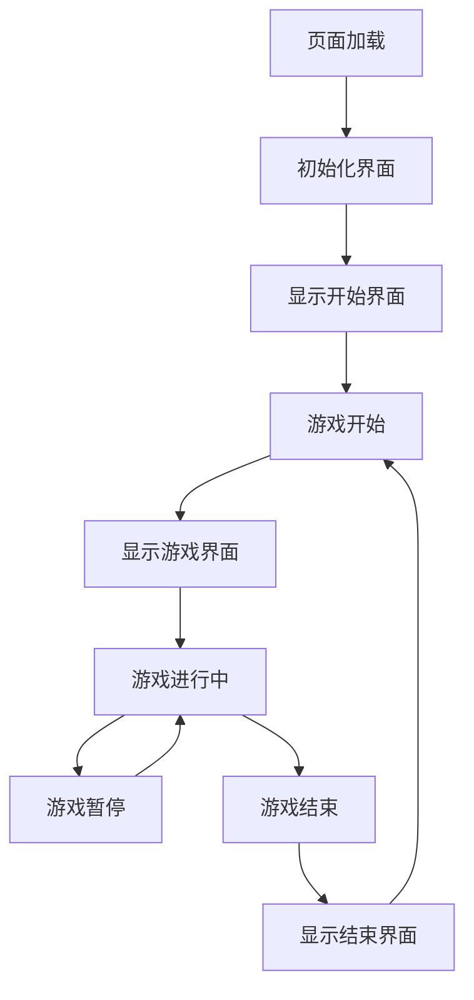

# 用户界面模块详细需求文档

## 1. 变更记录

| 版本 | 日期 | 变更内容 | 变更人 |
|------|------|----------|--------|
| v1.0 | 2026-03-03 | 初始化文档 | 产品专家 |

## 2. 功能需求

### 2.1 游戏区域

#### 字段定义
| 字段名称 | 字段类型 | 字段取值逻辑 |
|---------|---------|------------|
| 游戏画布 | Canvas | 用于绘制游戏画面 |
| 游戏区域大小 | 对象 | 宽度和高度，根据屏幕尺寸自适应 |
| 网格大小 | 数字 | 蛇身一节的大小，默认为20px |

#### 操作逻辑
- 游戏区域使用Canvas元素绘制
- 游戏区域大小根据屏幕尺寸自适应，确保在不同设备上都能正常显示
- 蛇和食物在游戏区域内绘制
- 游戏区域背景为浅色，蛇为深色，食物为鲜艳颜色，确保视觉清晰

### 2.2 信息面板

#### 字段定义
| 字段名称 | 字段类型 | 字段取值逻辑 |
|---------|---------|------------|
| 当前分数显示 | 文本 | 显示当前游戏分数 |
| 最高分显示 | 文本 | 显示历史最高分 |
| 游戏状态显示 | 文本 | 显示游戏当前状态（未开始、进行中、暂停、结束） |

#### 操作逻辑
- 信息面板位于游戏区域上方或下方
- 实时显示当前分数、最高分和游戏状态
- 游戏结束时，显示游戏结束信息和最终得分

### 2.3 控制按钮

#### 字段定义
| 字段名称 | 字段类型 | 字段取值逻辑 |
|---------|---------|------------|
| 开始按钮 | 按钮 | 点击后开始游戏 |
| 暂停按钮 | 按钮 | 点击后暂停游戏 |
| 继续按钮 | 按钮 | 点击后继续游戏 |
| 重新开始按钮 | 按钮 | 点击后重新开始游戏 |
| 难度选择 | 下拉菜单 | 选择游戏难度 |

#### 操作逻辑
- 控制按钮位于信息面板下方或游戏区域下方
- 按钮样式统一，大小适中，便于点击
- 按钮状态根据游戏状态动态变化（如游戏进行中时显示暂停按钮，暂停时显示继续按钮）
- 难度选择下拉菜单位于控制按钮区域

### 2.4 响应式设计

#### 字段定义
| 字段名称 | 字段类型 | 字段取值逻辑 |
|---------|---------|------------|
| 屏幕尺寸 | 对象 | 存储当前屏幕的宽度和高度 |
| 游戏区域大小 | 对象 | 根据屏幕尺寸动态调整 |
| 字体大小 | 数字 | 根据屏幕尺寸动态调整 |

#### 操作逻辑
- 游戏界面能够适应不同屏幕尺寸，包括电脑、平板和手机
- 游戏区域大小根据屏幕尺寸自动调整
- 字体大小和按钮大小根据屏幕尺寸自动调整
- 在小屏幕设备上，界面元素排列更加紧凑

## 3. 状态流转

## 4. 数据权限

本模块为游戏界面展示逻辑，无数据权限限制。