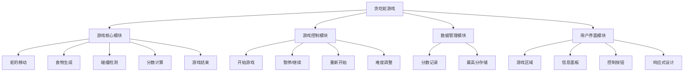
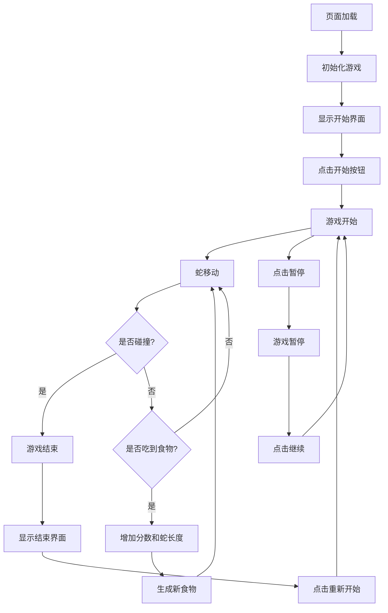

# 贪吃蛇游戏需求文档

## 1. 变更记录

| 版本 | 日期 | 变更内容 | 变更人 |
|------|------|----------|--------|
| v1.0 | 2026-03-03 | 初始化文档 | 产品专家 |

## 2. 文档概述

本需求文档描述了贪吃蛇本地网页小游戏的功能需求、非功能需求、用户界面设计等内容。游戏使用HTML5 + CSS3 + JavaScript开发，无需后端支持，可在本地浏览器中运行。

## 3. 项目背景

贪吃蛇是一款经典的休闲益智游戏，具有简单易上手、趣味性强的特点。为了满足用户对本地网页小游戏的需求，我们计划开发一款基于HTML5的贪吃蛇游戏，提供流畅的游戏体验和友好的用户界面。

## 4. 业务场景

用户打开网页即可开始游戏，通过键盘方向键控制蛇的移动，吃掉食物增加分数和蛇的长度，避免碰撞边界和自身。游戏结束后可以查看得分并重新开始。

## 5. 目标用户

- **年龄**：8-35岁的休闲游戏玩家
- **设备**：主要使用电脑、平板等设备访问网页
- **需求**：寻求简单、有趣的休闲游戏，无需下载安装，随时可玩

## 6. 产品结构

## 7. 流程图

## 8. 高保真原型

### 8.1 游戏主界面

- **游戏区域**：中央矩形区域，用于显示蛇和食物
- **信息面板**：位于游戏区域上方，显示当前分数、最高分和游戏状态
- **控制按钮**：位于游戏区域下方，包含开始、暂停/继续、重新开始按钮和难度选择下拉菜单

### 8.2 游戏结束界面

- **游戏区域**：显示游戏结束信息
- **分数显示**：显示最终得分和最高分
- **重新开始按钮**：点击后重新开始游戏

## 9. 功能需求

### 9.1 游戏核心模块

#### 9.1.1 蛇的移动
- 通过键盘方向键控制蛇的移动方向
- 蛇会自动向前移动，移动速度根据难度级别调整
- 不能直接反向移动（如当前向左移动时，不能直接向右移动）
- 吃掉食物后，蛇的长度增加一节

#### 9.1.2 食物生成
- 游戏开始时生成一个食物
- 食物被吃掉后，重新生成一个食物
- 食物生成位置随机，但不能与蛇身重叠
- 食物生成在游戏区域内

#### 9.1.3 碰撞检测
- 边界碰撞：检测蛇头坐标是否超出游戏区域边界
- 自身碰撞：检测蛇头坐标是否与蛇身其他节的坐标重叠
- 发生碰撞后，游戏结束

#### 9.1.4 分数计算
- 每吃掉一个食物，分数增加10分
- 游戏结束时，比较当前分数与存储的最高分
- 如果当前分数高于最高分，更新最高分

#### 9.1.5 游戏结束
- 发生碰撞后，游戏状态变为"结束"
- 显示当前得分和最高分
- 显示重新开始按钮

### 9.2 游戏控制模块

#### 9.2.1 开始游戏
- 点击开始按钮，游戏开始
- 蛇开始移动
- 生成初始食物
- 分数重置为0

#### 9.2.2 暂停/继续
- 游戏进行中时，点击暂停按钮，游戏暂停
- 游戏暂停时，点击继续按钮，游戏继续
- 暂停时，蛇停止移动
- 继续时，蛇恢复移动

#### 9.2.3 重新开始
- 点击重新开始按钮，游戏重新开始
- 蛇的位置重置为初始位置
- 分数重置为0
- 生成新的食物
- 游戏状态变为"进行中"

#### 9.2.4 难度调整
- 提供简单、中等、困难三个难度级别
- 不同难度级别影响蛇的移动速度（简单：200ms，中等：150ms，困难：100ms）
- 难度调整可以在游戏开始前或游戏过程中进行
- 游戏过程中调整难度，立即生效

### 9.3 数据管理模块

#### 9.3.1 分数记录
- 游戏开始时，分数重置为0
- 每吃掉一个食物，分数增加10分
- 分数实时更新并显示在界面上

#### 9.3.2 最高分存储
- 使用localStorage存储历史最高分
- 游戏结束时，比较当前分数与存储的最高分
- 如果当前分数高于最高分，更新最高分并存储到localStorage
- 最高分实时显示在界面上
- 页面刷新后，最高分仍然保持

### 9.4 用户界面模块

#### 9.4.1 游戏区域
- 使用Canvas元素绘制游戏画面
- 游戏区域大小根据屏幕尺寸自适应
- 蛇和食物在游戏区域内绘制
- 游戏区域背景为浅色，蛇为深色，食物为鲜艳颜色

#### 9.4.2 信息面板
- 位于游戏区域上方或下方
- 实时显示当前分数、最高分和游戏状态
- 游戏结束时，显示游戏结束信息和最终得分

#### 9.4.3 控制按钮
- 位于信息面板下方或游戏区域下方
- 按钮样式统一，大小适中，便于点击
- 按钮状态根据游戏状态动态变化
- 难度选择下拉菜单位于控制按钮区域

#### 9.4.4 响应式设计
- 游戏界面能够适应不同屏幕尺寸
- 游戏区域大小根据屏幕尺寸自动调整
- 字体大小和按钮大小根据屏幕尺寸自动调整
- 在小屏幕设备上，界面元素排列更加紧凑

## 10. 非功能需求

- **性能需求**：游戏运行流畅，无卡顿现象，帧率保持在60FPS以上
- **兼容性**：支持主流浏览器（Chrome、Firefox、Safari、Edge），无需安装插件
- **可用性**：界面简洁直观，操作简单易上手，适合各年龄段用户
- **响应速度**：键盘操作响应迅速，无明显延迟
- **存储需求**：使用localStorage存储最高分，无需后端数据库

## 11. 项目范围

本项目为本地网页小游戏，仅包含前端代码，无需后端支持。主要功能包括蛇的移动、食物生成、碰撞检测、分数计算、游戏控制和用户界面。

## 12. 风险分析

| 风险点 | 影响程度 | 发生概率 | 应对措施 |
|-------|---------|----------|----------|
| 浏览器兼容性问题 | 中等 | 低 | 测试主流浏览器，确保代码兼容 |
| 性能问题 | 低 | 低 | 优化游戏循环，避免不必要的计算 |
| 移动设备操作体验 | 中等 | 中 | 考虑添加触摸控制支持 |
| 数据存储安全 | 低 | 低 | 使用localStorage存储，数据仅保存在本地 |

## 13. 验收标准

- 游戏能够正常运行，无明显bug
- 蛇的移动流畅，响应迅速
- 碰撞检测准确
- 分数计算正确，最高分能够正确存储和显示
- 游戏控制功能正常（开始、暂停/继续、重新开始）
- 难度调整功能正常
- 界面美观，响应式设计良好
- 支持主流浏览器

## 14. 交付物

- 完整的HTML、CSS和JavaScript代码
- 需求文档
- 产品结构图
- 流程图

## 15. 项目时间计划

| 阶段 | 时间 | 任务 |
|------|------|------|
| 需求分析 | 2026-03-03 | 完成需求调研和分析 |
| 设计 | 2026-03-04 | 完成产品设计和界面设计 |
| 开发 | 2026-03-05 | 完成游戏核心功能开发 |
| 测试 | 2026-03-06 | 完成游戏测试和调试 |
| 交付 | 2026-03-07 | 交付最终产品 |

## 16. 联系方式

- 产品专家：[产品专家邮箱]
- 开发团队：[开发团队邮箱]
- 项目管理：[项目管理邮箱]