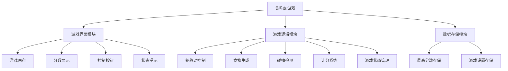
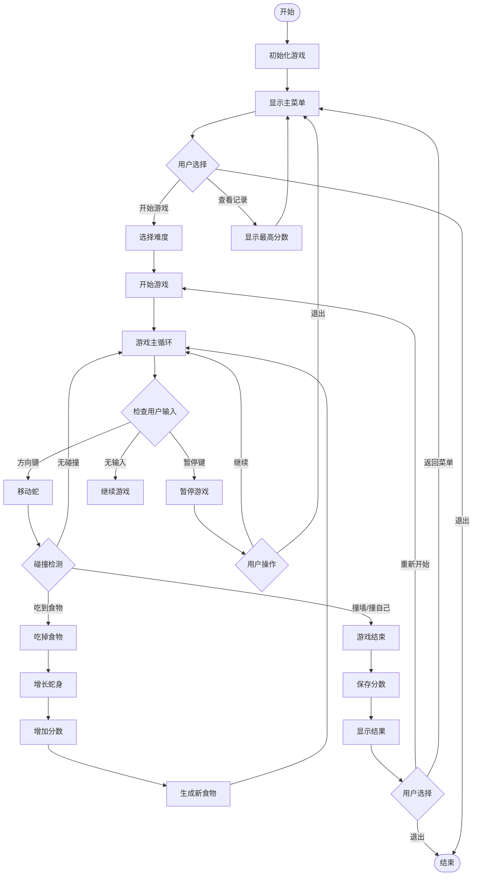
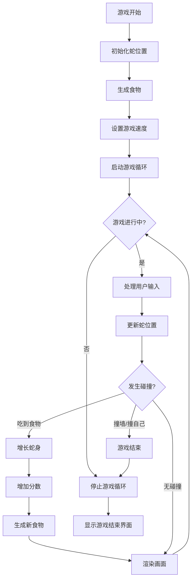
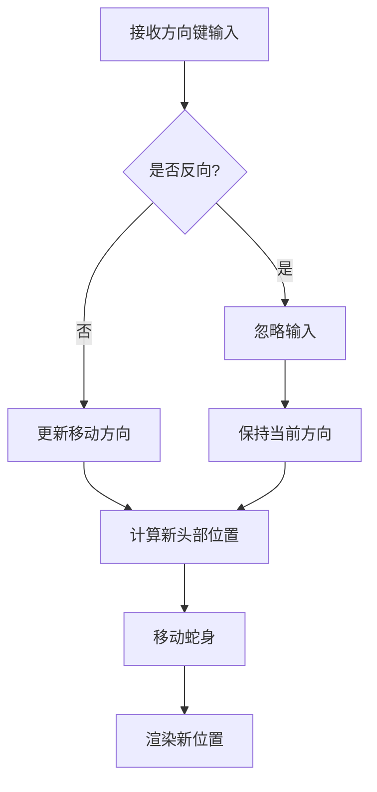
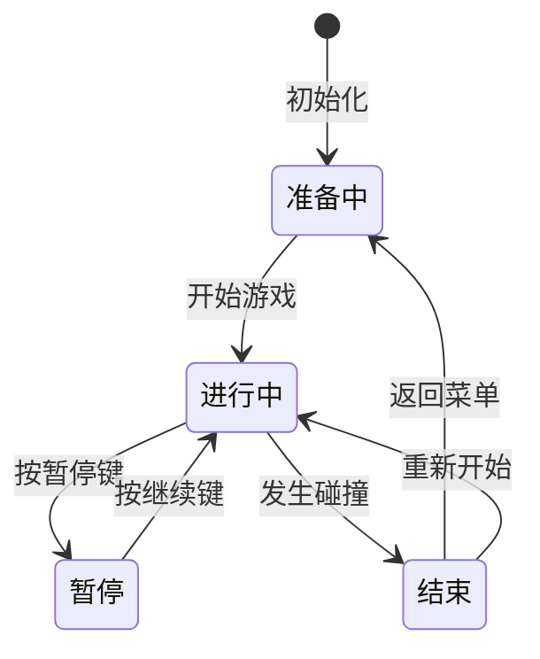

# 贪吃蛇游戏需求文档

## 1. 变更记录

| 版本 | 日期 | 变更内容 | 变更人 | 审批人 |
|------|------|----------|--------|--------|
| 1.0 | 2026-03-29 | 初始版本 | ProductExpert | 项目管理专家 |

---

## 2. 文档概述

### 2.1 文档目的
本文档旨在详细描述贪吃蛇游戏的需求规格，包括功能需求、非功能需求、业务场景、产品结构、原型设计和流程图等内容。本文档将作为开发团队、测试团队和设计团队的工作依据，确保游戏的开发符合业务需求和用户期望。

### 2.2 术语定义

| 术语 | 解释 |
|------|------|
| 蛇身 | 由多个方块组成的蛇的主体，每吃掉一个食物增加一节 |
| 食物 | 游戏中随机生成的目标，蛇吃掉后增长并获得分数 |
| 游戏画布 | 游戏进行的区域，蛇和食物在此区域内移动和显示 |
| 碰撞检测 | 检测蛇头是否撞到墙壁或自身身体的逻辑 |
| FPS | Frames Per Second，每秒帧数，衡量游戏流畅度的指标 |
| 本地存储 | 浏览器提供的 localStorage 或 sessionStorage 存储机制 |

---

## 3. 项目背景

### 3.1 项目简介
贪吃蛇是一款经典的休闲益智游戏，起源于1976年的街机游戏《Blockade》。游戏玩法简单但富有挑战性：玩家控制一条蛇在屏幕上移动，通过吃食物来增长蛇身，同时避免撞墙或撞到自己。随着蛇身不断增长，游戏难度逐渐提升，考验玩家的反应速度和策略规划能力。

本项目旨在开发一个现代化的网页版贪吃蛇游戏，采用 HTML5 Canvas 技术实现，提供流畅的游戏体验和精美的视觉效果。游戏将支持多种难度级别、成绩记录等功能，满足不同玩家的需求。

### 3.2 业务背景
随着移动互联网的发展，休闲游戏市场持续增长。贪吃蛇作为经典游戏IP，具有广泛的用户基础和认知度。当前市场上虽然存在多款贪吃蛇游戏，但普遍存在以下问题：广告过多、功能单一、操作不便、缺乏挑战性等。本项目旨在打造一款纯净、流畅、有趣的贪吃蛇游戏，填补市场空白。

### 3.3 业务痛点
- **广告干扰**：大多数免费游戏广告过多，严重影响用户体验
- **功能单一**：缺乏难度选择、成绩记录等增强可玩性的功能
- **操作不便**：移动端和PC端适配不佳，操作体验差
- **性能问题**：部分网页游戏卡顿、延迟，影响游戏体验
- **视觉陈旧**：界面设计 outdated，缺乏现代感

### 3.4 项目目标
- **目标1**：开发一个功能完善、操作流畅的贪吃蛇游戏，帧率≥30 FPS
- **目标2**：提供简单/普通/困难三种难度级别，满足不同水平玩家需求
- **目标3**：实现本地成绩记录功能，增加游戏可玩性
- **目标4**：采用响应式设计，适配桌面和移动设备
- **目标5**：提供无广告的纯净游戏体验

### 3.5 项目范围

**包含范围**：
- 游戏核心机制（蛇移动、吃食物、碰撞检测）
- 用户界面（游戏画布、分数显示、控制按钮）
- 游戏控制（键盘控制、暂停/继续、重新开始）
- 难度选择系统（简单/普通/困难）
- 成绩记录功能（本地存储最高分数）
- 响应式设计（适配桌面和移动设备）

**排除范围**：
- 多人在线对战功能
- 社交分享功能
- 云存档功能
- 虚拟货币系统
- 道具/技能系统

---

## 4. 业务场景

### 4.1 典型业务场景

**场景一：休闲游戏**
- **描述**：用户在午休时间打开游戏，进行几局轻松的游戏
- **流程**：
  1. 用户打开游戏页面
  2. 选择简单难度
  3. 点击开始游戏
  4. 使用方向键控制蛇移动
  5. 吃掉食物，获得分数
  6. 游戏结束后查看分数
  7. 选择重新开始或退出

**场景二：挑战高分**
- **描述**：挑战玩家选择困难模式，追求更高分数
- **流程**：
  1. 用户打开游戏页面
  2. 选择困难难度
  3. 开始游戏，快速移动
  4. 策略性地控制蛇移动
  5. 创造新的高分记录
  6. 系统提示"新纪录"
  7. 查看历史最高分数

**场景三：移动端游戏**
- **描述**：用户在手机上利用碎片时间游戏
- **流程**：
  1. 用户在手机上打开游戏页面
  2. 界面自动适配手机屏幕
  3. 使用屏幕上的虚拟方向键控制
  4. 游戏过程中可以暂停
  5. 游戏结束后可以重新开始

### 4.2 业务流程
- **游戏主流程**：开始游戏 → 游戏进行 → 游戏结束 → 重新开始/退出
- **难度选择流程**：选择难度 → 应用速度设置 → 开始游戏
- **成绩记录流程**：游戏结束 → 比较分数 → 更新最高分数 → 显示记录

---

## 5. 目标用户

### 5.1 用户画像

**用户画像 1：休闲玩家 - 小李**
- **年龄**：28岁
- **职业**：办公室职员
- **游戏习惯**：每天午休时玩15-20分钟
- **痛点**：现有游戏广告多、加载慢、操作复杂
- **需求**：快速开始、无广告、简单操作、随时可暂停

**用户画像 2：怀旧玩家 - 老王**
- **年龄**：35岁
- **职业**：程序员
- **游戏习惯**：周末休闲时玩，追求经典体验
- **痛点**：现代游戏过于复杂，找不到纯粹的游戏乐趣
- **需求**：经典玩法、复古风格、流畅体验、键盘控制

**用户画像 3：挑战玩家 - 阿强**
- **年龄**：22岁
- **职业**：大学生
- **游戏习惯**：每天挑战高分，追求排名
- **痛点**：游戏难度不够，缺乏挑战性
- **需求**：多种难度、成绩记录、排行榜、高难度挑战

### 5.2 用户角色

| 角色 | 职责 | 核心需求 | 使用频率 |
|------|------|----------|----------|
| 休闲玩家 | 工作间隙放松娱乐 | 简单易上手、无广告、随时可玩 | 每天1-2次 |
| 怀旧玩家 | 追求经典游戏体验 | 经典玩法、操作流畅、复古风格 | 每周2-3次 |
| 挑战玩家 | 追求高分和挑战 | 多种难度、成绩记录、排行榜 | 每天多次 |

### 5.3 用户需求
- 流畅无卡顿的游戏体验
- 简单直观的操作方式
- 多种难度选择
- 成绩记录和展示
- 无广告干扰
- 支持多设备访问

---

## 6. 产品结构

### 6.1 系统整体架构

贪吃蛇游戏采用纯前端架构，无需后端服务支持：

- **前端层**：HTML5 + CSS3 + JavaScript
- **渲染层**：HTML5 Canvas API
- **存储层**：Browser LocalStorage
- **交互层**：Keyboard Events + Touch Events

### 6.2 模块关系

```
┌─────────────────────────────────────────────────────┐
│                    贪吃蛇游戏系统                      │
├─────────────────────────────────────────────────────┤
│  ┌──────────┐  ┌──────────┐  ┌──────────┐          │
│  │ 游戏界面  │  │ 游戏逻辑  │  │ 数据存储  │          │
│  │  模块    │  │  模块    │  │  模块    │          │
│  └────┬─────┘  └────┬─────┘  └────┬─────┘          │
│       │             │             │                │
│       └─────────────┴─────────────┘                │
│                     │                              │
│              ┌──────┴──────┐                       │
│              │  核心控制模块  │                       │
│              └─────────────┘                       │
└─────────────────────────────────────────────────────┘
```

### 6.3 技术实现建议

- **前端框架**：原生 JavaScript（无需框架，减少依赖）
- **渲染技术**：HTML5 Canvas 2D Context
- **游戏循环**：requestAnimationFrame
- **存储方案**：localStorage
- **样式方案**：CSS3 + Flexbox/Grid
- **响应式**：Viewport + Media Queries

### 6.4 产品结构图



---

## 7. 流程图

### 7.1 系统整体流程



### 7.2 游戏核心逻辑流程



### 7.3 蛇移动控制流程



---

## 8. 高保真原型

### 8.1 设计风格

**整体风格**：现代简约风格，色彩鲜明但不刺眼

**配色方案**：
- 主色调：深绿色 (#2E7D32) - 代表蛇的颜色
- 背景色：浅灰色 (#F5F5F5) - 游戏画布背景
- 食物色：红色 (#F44336) - 食物颜色
- 文字色：深灰色 (#333333) - 文字显示
- 强调色：橙色 (#FF9800) - 按钮和高亮

**设计原则**：
- 简洁明了，减少视觉干扰
- 色彩对比度适中，保护视力
- 响应式布局，适配多设备
- 动画流畅，提升体验

### 8.2 页面设计

**页面一：游戏主界面**
- **布局**：
  - 顶部：标题"贪吃蛇游戏" + 当前分数/最高分数
  - 中部：游戏画布（Canvas）
  - 底部：控制按钮（开始、暂停、重新开始）
- **主要元素**：
  - 游戏画布：固定比例，自适应大小
  - 分数显示：大号字体，醒目位置
  - 控制按钮：圆角矩形，悬停效果
- **交互说明**：
  - 点击"开始游戏"按钮开始游戏
  - 游戏进行中显示"暂停"按钮
  - 游戏结束后显示"重新开始"按钮

**页面二：难度选择界面**
- **布局**：
  - 顶部：标题"选择难度"
  - 中部：三个难度按钮（简单/普通/困难）
  - 底部：返回按钮
- **主要元素**：
  - 难度按钮：不同颜色区分
  - 难度说明：显示速度描述
- **交互说明**：
  - 点击难度按钮选择并进入游戏
  - 点击返回返回主界面

**页面三：游戏结束界面**
- **布局**：
  - 中央：游戏结束提示 + 最终分数
  - 下方：新纪录提示（如适用）
  - 底部：重新开始/返回菜单按钮
- **主要元素**：
  - 分数显示：大号字体
  - 新纪录标识：特殊图标或颜色
- **交互说明**：
  - 点击"重新开始"立即开始新游戏
  - 点击"返回菜单"返回主界面

### 8.3 交互设计

**键盘控制**：
- 方向键（↑↓←→）：控制蛇移动方向
- 空格键：暂停/继续游戏
- Enter键：开始游戏/重新开始
- ESC键：返回主菜单

**移动端控制**：
- 屏幕下方显示虚拟方向键
- 点击方向键控制移动
- 点击暂停按钮暂停游戏

**游戏状态提示**：
- 游戏开始前：显示"按方向键开始"
- 游戏暂停时：显示"已暂停"
- 游戏结束时：显示"游戏结束"和最终分数

---

## 9. 功能需求

### 9.1 游戏核心模块

#### 9.1.1 功能描述
游戏核心模块是贪吃蛇游戏的核心，负责处理蛇的移动、食物的生成、碰撞检测和游戏状态管理。该模块确保游戏逻辑的正确性和流畅性。

#### 9.1.2 详细需求
- 蛇的移动控制（上下左右四个方向）
- 食物的随机生成
- 蛇吃到食物后的增长逻辑
- 碰撞检测（墙壁、自身）
- 游戏状态管理（开始、进行中、暂停、结束）
- 计分系统

#### 9.1.3 需求优先级
- **优先级**：P0（Must Have）
- **优先级说明**：这是游戏的核心功能，没有这些功能游戏无法正常运行

#### 9.1.4 用户故事
```
作为 一名玩家
我想要 控制蛇移动并吃掉食物
以便于 获得分数并挑战更高难度

验收标准：
- Given 游戏进行中
- When 我按下方向键
- Then 蛇按照对应方向移动
- When 蛇头碰到食物
- Then 蛇身增长一节，分数增加
- When 蛇头撞到墙壁或自身
- Then 游戏结束
```

#### 9.1.5 功能详细设计

**输入**：
- 键盘方向键（ArrowUp, ArrowDown, ArrowLeft, ArrowRight）
- 暂停键（Space）
- 游戏难度设置

**处理逻辑**：
1. 监听键盘事件获取用户输入
2. 根据输入方向更新蛇的移动方向（禁止180度转向）
3. 按照游戏速度定时更新蛇的位置
4. 检测蛇头是否碰到食物
5. 检测蛇头是否撞到墙壁或自身
6. 更新游戏状态和分数

**输出**：
- 蛇的新位置
- 游戏状态（进行中/暂停/结束）
- 当前分数
- 画面渲染数据

#### 9.1.6 字段定义

| 字段名称 | 字段类型 | 字段取值逻辑 | 验证规则 |
|---------|---------|-------------|----------|
| snakeBody | Array | 蛇身各节的坐标数组，格式[{x, y}, ...] | 数组长度≥1 |
| direction | String | 当前移动方向：'up', 'down', 'left', 'right' | 枚举值 |
| foodPosition | Object | 食物坐标 {x, y} | 不能位于蛇身上 |
| gameState | String | 游戏状态：'ready', 'playing', 'paused', 'over' | 枚举值 |
| score | Number | 当前游戏分数 | 整数，≥0 |
| speed | Number | 游戏速度（毫秒/帧） | 简单:200, 普通:150, 困难:100 |

#### 9.1.7 操作逻辑

| 操作按钮 | 操作逻辑 | 成功提示 | 错误提示 |
|---------|---------|---------|----------|
| 方向键 | 1. 检查是否反向移动<br>2. 更新移动方向<br>3. 下一帧按新方向移动 | 无 | 无（反向移动被忽略） |
| 空格键 | 1. 检查游戏状态<br>2. 切换暂停/继续状态<br>3. 更新界面显示 | 显示"继续"或"暂停" | 游戏未开始时无响应 |
| 开始游戏 | 1. 初始化游戏数据<br>2. 重置分数<br>3. 启动游戏循环 | 游戏开始，显示画布 | 无 |
| 重新开始 | 1. 重置游戏数据<br>2. 保持难度设置<br>3. 启动新游戏 | 新游戏开始 | 无 |

#### 9.1.8 状态流转



#### 9.1.9 数据权限

| 角色 | 权限限制 |
|------|----------|
| 所有玩家 | 可以开始游戏、暂停游戏、重新开始、查看分数 |

#### 9.1.10 验收标准

```
Given 游戏处于准备状态
When 玩家点击开始游戏按钮
Then 游戏状态变为进行中，蛇出现在画布中央，食物随机生成

Given 游戏进行中
When 玩家按下方向键
Then 蛇按照对应方向移动，不能立即反向移动

Given 游戏进行中
When 蛇头触碰到食物
Then 蛇身增加一节，分数增加10分，新食物随机生成

Given 游戏进行中
When 蛇头撞到墙壁或自身
Then 游戏状态变为结束，显示最终分数

Given 游戏进行中
When 玩家按下空格键
Then 游戏暂停，显示"已暂停"提示

Given 游戏暂停中
When 玩家再次按下空格键
Then 游戏继续，"已暂停"提示消失
```

---

### 9.2 用户界面模块

#### 9.2.1 功能描述
用户界面模块负责游戏的视觉呈现和交互反馈，包括游戏画布、分数显示、控制按钮和游戏状态提示等。

#### 9.2.2 详细需求
- 游戏画布渲染（蛇、食物、背景）
- 分数显示（当前分数、最高分数）
- 控制按钮（开始、暂停、重新开始）
- 游戏状态提示（准备、进行中、暂停、结束）
- 难度选择界面
- 响应式布局适配

#### 9.2.3 需求优先级
- **优先级**：P0（Must Have）
- **优先级说明**：用户界面是玩家与游戏交互的唯一途径，必须完善

#### 9.2.4 用户故事
```
作为 一名玩家
我想要 清晰地看到游戏画面和分数
以便于 了解游戏状态和进度

验收标准：
- Given 游戏进行中
- Then 我能看到蛇、食物和游戏画布
- And 我能看到当前分数和最高分数
- And 我能看到游戏状态提示
```

#### 9.2.5 字段定义

| 字段名称 | 字段类型 | 字段取值逻辑 | 验证规则 |
|---------|---------|-------------|----------|
| canvasWidth | Number | 画布宽度（像素） | 默认400，响应式调整 |
| canvasHeight | Number | 画布高度（像素） | 默认400，响应式调整 |
| gridSize | Number | 网格大小（像素） | 默认20 |
| snakeColor | String | 蛇的颜色 | 默认'#2E7D32' |
| foodColor | String | 食物的颜色 | 默认'#F44336' |
| bgColor | String | 背景颜色 | 默认'#F5F5F5' |

#### 9.2.6 操作逻辑

| 操作按钮 | 操作逻辑 | 成功提示 | 错误提示 |
|---------|---------|---------|----------|
| 开始游戏按钮 | 1. 检查游戏状态<br>2. 调用游戏核心模块开始游戏<br>3. 更新按钮状态 | 按钮变为"暂停" | 无 |
| 暂停按钮 | 1. 调用游戏核心模块暂停游戏<br>2. 更新按钮状态 | 按钮变为"继续" | 无 |
| 重新开始按钮 | 1. 确认是否重新开始<br>2. 重置游戏<br>3. 开始新游戏 | 新游戏开始 | 无 |

---

### 9.3 数据存储模块

#### 9.3.1 功能描述
数据存储模块负责游戏数据的持久化存储，包括最高分数和游戏设置等。使用浏览器本地存储机制实现。

#### 9.3.2 详细需求
- 最高分数存储
- 游戏设置存储（难度偏好）
- 数据读取和更新
- 数据格式验证

#### 9.3.3 需求优先级
- **优先级**：P1（Should Have）
- **优先级说明**：增强游戏体验，但不是核心功能

#### 9.3.4 用户故事
```
作为 一名玩家
我想要 我的最高分数被保存
以便于 挑战自我，争取更高分

验收标准：
- Given 游戏结束
- When 当前分数高于历史最高分数
- Then 更新最高分数并提示"新纪录"
- And 下次打开游戏时仍能看到最高分数
```

#### 9.3.5 字段定义

| 字段名称 | 字段类型 | 字段取值逻辑 | 验证规则 |
|---------|---------|-------------|----------|
| highScore | Number | 历史最高分数 | 整数，≥0 |
| preferredDifficulty | String | 玩家偏好的难度 | 'easy', 'normal', 'hard' |
| lastPlayTime | Date | 上次游戏时间 | 有效日期格式 |

#### 9.3.6 操作逻辑

| 操作按钮 | 操作逻辑 | 成功提示 | 错误提示 |
|---------|---------|---------|----------|
| 保存分数 | 1. 比较当前分数和最高分数<br>2. 如更高则更新存储<br>3. 显示新纪录提示 | 显示"新纪录！" | 存储失败时静默处理 |
| 读取分数 | 1. 从localStorage读取<br>2. 验证数据格式<br>3. 显示在界面上 | 显示最高分数 | 无记录时显示0 |

---

## 10. 非功能需求

### 10.1 性能要求
- **响应时间**：游戏帧率≥30 FPS，输入响应延迟<50ms
- **页面加载**：首屏加载时间<3秒
- **内存占用**：游戏运行时内存占用<100MB
- **CPU占用**：游戏运行时CPU占用<30%

### 10.2 可靠性要求
- **系统可用性**：游戏可正常运行率>99%
- **数据持久性**：本地存储数据不丢失
- **异常处理**：游戏异常时不崩溃，可优雅降级

### 10.3 安全性要求
- **数据安全**：本地存储数据加密（可选）
- **输入验证**：防止恶意输入
- **XSS防护**：防止跨站脚本攻击

### 10.4 易用性要求
- **用户界面**：界面简洁明了，操作直观
- **学习成本**：用户可在1分钟内学会操作
- **响应式设计**：适配桌面和移动设备
- **无障碍支持**：支持键盘操作，考虑色盲用户

### 10.5 兼容性需求
- **浏览器兼容**：Chrome 90+, Firefox 88+, Safari 14+, Edge 90+
- **设备兼容**：桌面PC、笔记本、平板、手机
- **系统兼容**：Windows、macOS、Linux、iOS、Android

### 10.6 可扩展性要求
- **代码结构**：模块化设计，便于功能扩展
- **配置化**：游戏参数可配置（速度、颜色等）
- **插件机制**：预留插件接口（可选）

---

## 11. 数据需求

### 11.1 数据模型

**最高分数记录**
| 字段名 | 数据类型 | 长度 | 必填 | 默认值 | 说明 |
|-------|---------|-----|------|--------|------|
| highScore | Number | - | 是 | 0 | 最高分数 |
| achievedAt | Date | - | 否 | - | 达成时间 |
| difficulty | String | 10 | 否 | 'normal' | 达成时的难度 |

**游戏设置**
| 字段名 | 数据类型 | 长度 | 必填 | 默认值 | 说明 |
|-------|---------|-----|------|--------|------|
| preferredDifficulty | String | 10 | 是 | 'normal' | 偏好难度 |
| soundEnabled | Boolean | - | 是 | true | 音效开关 |

### 11.2 数据流

```
游戏进行中 → 实时分数计算 → 游戏结束判断
                                    ↓
                            分数比较（当前 vs 最高）
                                    ↓
                    更高 → 更新最高分数 → 本地存储
                    不高 → 保持原记录
```

### 11.3 数据存储方案

使用浏览器 localStorage 进行数据持久化：
- **键名**：`snakeGame_highScore`、`snakeGame_settings`
- **格式**：JSON 字符串
- **容量限制**：约5-10MB（浏览器限制）
- **有效期**：永久（除非用户清除）

---

## 12. 接口需求

### 12.1 内部接口

#### 12.1.1 游戏控制接口
- **接口描述**：控制游戏的开始、暂停、结束等操作
- **调用方式**：JavaScript 函数调用
- **接口方法**：
  - `startGame(difficulty)` - 开始游戏
  - `pauseGame()` - 暂停游戏
  - `resumeGame()` - 继续游戏
  - `endGame()` - 结束游戏
  - `restartGame()` - 重新开始

#### 12.1.2 渲染接口
- **接口描述**：负责游戏画面的渲染
- **调用方式**：Canvas API
- **接口方法**：
  - `render()` - 渲染整个游戏画面
  - `drawSnake()` - 绘制蛇
  - `drawFood()` - 绘制食物
  - `clearCanvas()` - 清空画布

### 12.2 外部接口

本项目为纯前端项目，无外部接口依赖。

### 12.3 浏览器存储接口

使用浏览器提供的 Storage API：
- `localStorage.getItem(key)` - 读取数据
- `localStorage.setItem(key, value)` - 存储数据
- `localStorage.removeItem(key)` - 删除数据

---

## 13. 项目范围

### 13.1 包含范围
- 游戏核心功能（蛇移动、吃食物、碰撞检测）
- 用户界面（游戏画布、分数显示、控制按钮）
- 游戏控制（键盘控制、暂停/继续、重新开始）
- 难度选择系统（简单/普通/困难）
- 成绩记录功能（本地存储最高分数）
- 响应式设计（适配桌面和移动设备）
- 游戏状态管理（开始、进行中、暂停、结束）

### 13.2 排除范围
- 多人在线对战功能
- 社交分享功能（微信、微博等）
- 云存档和账号系统
- 虚拟货币和商城系统
- 道具、技能、皮肤系统
- 音效和背景音乐
- 排行榜和竞技系统
- AI对手

---

## 14. 风险分析

### 14.1 风险识别

| 风险 | 描述 | 可能性 | 影响 | 风险等级 |
|------|------|--------|------|----------|
| 性能问题 | 游戏卡顿、帧率低 | 中 | 高 | 高 |
| 浏览器兼容性 | 某些浏览器不支持Canvas或API | 中 | 中 | 中 |
| 移动端适配 | 触摸控制不灵敏、布局错乱 | 中 | 中 | 中 |
| 数据丢失 | 本地存储数据被清除 | 低 | 低 | 低 |
| 需求变更 | 增加新功能需求 | 中 | 中 | 中 |

### 14.2 风险缓解措施

| 风险 | 缓解措施 |
|------|----------|
| 性能问题 | 使用Canvas而非DOM、requestAnimationFrame优化、定期性能测试 |
| 浏览器兼容性 | 明确支持浏览器列表、使用Polyfill、充分测试 |
| 移动端适配 | 响应式设计、触摸事件优化、多设备测试 |
| 数据丢失 | 数据备份提示、云端同步（后续版本） |
| 需求变更 | 变更控制流程、优先级管理、版本规划 |

---

## 15. 验收标准

### 15.1 功能验收

| 验收项 | 验收方法 | 验收标准 | 验收结果 |
|-------|---------|---------|---------|
| 蛇移动控制 | 功能测试 | 方向键可控制蛇移动，不能反向 | ☐ 通过 ☐ 失败 |
| 吃食物增长 | 功能测试 | 吃到食物后蛇身增长，分数增加 | ☐ 通过 ☐ 失败 |
| 碰撞检测 | 功能测试 | 撞墙/撞自己时游戏结束 | ☐ 通过 ☐ 失败 |
| 暂停功能 | 功能测试 | 空格键可暂停/继续游戏 | ☐ 通过 ☐ 失败 |
| 难度选择 | 功能测试 | 三种难度速度不同 | ☐ 通过 ☐ 失败 |
| 分数记录 | 功能测试 | 最高分数被正确保存和显示 | ☐ 通过 ☐ 失败 |
| 响应式布局 | 兼容性测试 | 在不同设备上显示正常 | ☐ 通过 ☐ 失败 |

### 15.2 性能验收
- [ ] 游戏帧率≥30 FPS
- [ ] 页面加载时间<3秒
- [ ] 输入响应延迟<50ms
- [ ] 内存占用<100MB

### 15.3 兼容性验收
- [ ] Chrome 90+ 正常运行
- [ ] Firefox 88+ 正常运行
- [ ] Safari 14+ 正常运行
- [ ] Edge 90+ 正常运行
- [ ] iOS Safari 正常运行
- [ ] Android Chrome 正常运行

### 15.4 可用性验收
- [ ] 界面简洁明了
- [ ] 操作直观易懂
- [ ] 学习成本<1分钟
- [ ] 无广告干扰

---

## 16. 交付物

### 16.1 文档交付物
- [x] 需求调研文档
- [x] 需求文档（本文档）
- [ ] 详细需求文档（模块化）
- [ ] 流程图文档
- [ ] 高保真原型文档
- [ ] 测试计划
- [ ] 测试用例
- [ ] 测试报告
- [ ] 项目总结报告

### 16.2 代码交付物
- [ ] 前端源代码（HTML/CSS/JS）
- [ ] 项目配置文件
- [ ] 开发文档

### 16.3 其他交付物
- [ ] 部署文档
- [ ] 用户手册
- [ ] 版本控制报告
- [ ] 质量检查报告

---

## 17. 项目时间计划

### 17.1 项目阶段

| 阶段 | 时间 | 主要任务 | 交付物 |
|------|------|----------|--------|
| 需求阶段 | Day 1-2 | 需求调研、需求分析、文档撰写 | 需求文档 |
| 设计阶段 | Day 2-3 | 流程图绘制、原型设计 | 流程图、原型 |
| 开发阶段 | Day 3-5 | 前端开发、游戏逻辑实现 | 可运行代码 |
| 测试阶段 | Day 5-6 | 功能测试、兼容性测试、性能测试 | 测试报告 |
| 交付阶段 | Day 6-7 | 质量检查、文档整理、项目总结 | 完整项目包 |

### 17.2 关键里程碑

| 里程碑 | 日期 | 交付物 | 验收标准 |
|--------|------|--------|----------|
| M1 - 需求完成 | Day 2 | 需求文档、流程图 | 文档完整，评审通过 |
| M2 - 设计完成 | Day 3 | 高保真原型 | 原型符合需求，评审通过 |
| M3 - 开发完成 | Day 5 | 可运行代码 | 功能完整，代码审查通过 |
| M4 - 测试完成 | Day 6 | 测试报告 | P0、P1缺陷已修复 |
| M5 - 项目交付 | Day 7 | 完整项目 | 质量检查通过 |

---

## 18. 联系方式

### 18.1 项目团队

| 角色 | 智能体 | 职责 |
|------|--------|------|
| 产品负责人 | ProductExpert | 需求分析、文档撰写 |
| 流程专家 | ProcessExpert | 流程图绘制 |
| 设计专家 | DesignExpert | 原型设计 |
| 前端开发 | frontend-development-expert | 前端开发 |
| 测试负责人 | testing-expert | 测试用例、测试执行 |
| 质量专家 | QualityExpert | 质量检查 |
| 项目协调 | 项目管理专家 | 项目协调、进度管理 |

### 18.2 沟通方式
- **项目会议**：每日站会，阶段评审会
- **文档协作**：飞书知识库
- **版本控制**：Git
- **问题跟踪**：项目文档中的风险登记册

---

**文档版本**: V1.0  
**创建日期**: 2026-03-29  
**最后更新**: 2026-03-29  
**负责人**: ProductExpert
