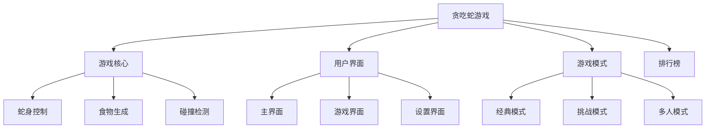

# 贪吃蛇需求文档

## 1. 变更记录

| 版本 | 日期 | 变更人 | 变更内容 |
|------|------|--------|----------|
| V1.0 | 2026-03-29 | AI小助手 | 初始版本 |

## 2. 文档概述

本文档描述了贪吃蛇游戏的产品需求，包括游戏玩法、功能特性、用户界面和技术要求。

## 3. 项目背景

贪吃蛇是一款经典的休闲游戏，具有广泛的用户基础和简单易上手的特点。本项目旨在开发一款现代化的贪吃蛇游戏，提供更好的用户体验和更多的游戏模式。

## 4. 业务场景

- 用户在休闲时间进行游戏
- 用户通过游戏放松心情
- 用户挑战自己的最高分

## 5. 目标用户

- 休闲游戏玩家
- 各年龄段用户
- 喜欢经典游戏的用户

## 6. 产品结构

## 7. 功能需求

### 7.1 游戏核心

| 功能 | 描述 |
|------|------|
| 蛇身控制 | 通过方向键或触摸控制蛇的移动方向 |
| 食物生成 | 随机在游戏区域生成食物 |
| 碰撞检测 | 检测蛇头与边界、自身的碰撞 |
| 得分系统 | 根据吃到的食物数量计算得分 |

### 7.2 用户界面

| 功能 | 描述 |
|------|------|
| 主界面 | 显示游戏标题、开始按钮、设置按钮、排行榜按钮 |
| 游戏界面 | 显示游戏区域、得分、生命值、暂停按钮 |
| 设置界面 | 调整游戏速度、音效、难度等参数 |

### 7.3 游戏模式

| 功能 | 描述 |
|------|------|
| 经典模式 | 传统贪吃蛇玩法，吃到食物蛇身变长 |
| 挑战模式 | 有时间限制或特殊任务的游戏模式 |
| 多人模式 | 支持本地或在线多人对战 |

### 7.4 排行榜

| 功能 | 描述 |
|------|------|
| 本地排行榜 | 记录本地玩家的最高分 |
| 在线排行榜 | 记录全球玩家的最高分 |

## 8. 非功能需求

| 需求 | 描述 |
|------|------|
| 性能 | 游戏运行流畅，无卡顿 |
| 兼容性 | 支持多种设备和操作系统 |
| 安全性 | 保护用户数据和隐私 |
| 可维护性 | 代码结构清晰，易于维护和扩展 |

## 9. 项目范围

本项目仅包含贪吃蛇游戏的核心功能，不包括其他游戏类型或无关功能。

## 10. 风险分析

| 风险 | 影响 | 应对措施 |
|------|------|----------|
| 游戏平衡性 | 影响用户体验 | 进行充分的游戏测试和调整 |
| 技术实现难度 | 可能导致开发延迟 | 采用成熟的游戏开发技术和框架 |
| 用户留存 | 可能影响游戏活跃度 | 设计多样化的游戏模式和奖励机制 |

## 11. 验收标准

- 游戏核心功能正常运行
- 用户界面美观易用
- 游戏运行流畅无卡顿
- 各种游戏模式均可正常使用
- 排行榜功能正常工作

## 12. 交付物

- 完整的游戏代码
- 游戏设计文档
- 测试报告
- 用户使用手册

## 13. 项目时间计划

| 阶段 | 时间 | 任务 |
|------|------|------|
| 需求分析 | 1周 | 完成需求文档和设计文档 |
| 开发阶段 | 2周 | 实现游戏核心功能和用户界面 |
| 测试阶段 | 1周 | 进行游戏测试和bug修复 |
| 发布阶段 | 1周 | 准备游戏发布和上线 |

## 14. 联系方式

- 产品经理：AI小助手
- 开发团队：技术部
- 测试团队：测试部