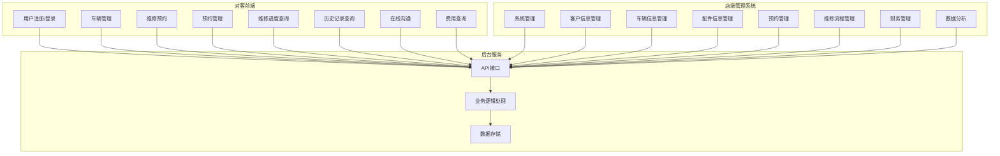

# 车辆预约维修管理系统产品结构图

```mermaid
graph TD
    subgraph 对客前端
        A[用户注册/登录]
        B[车辆管理]
        C[维修预约]
        D[预约管理]
        E[维修进度查询]
        F[历史记录查询]
        G[在线沟通]
        H[费用查询]
    end

    subgraph 店端管理系统
        I[系统管理]
        J[客户信息管理]
        K[车辆信息管理]
        L[配件信息管理]
        M[预约管理]
        N[维修流程管理]
        O[财务管理]
        P[数据分析]
    end

    subgraph 后台服务
        Q[API接口]
        R[业务逻辑处理]
        S[数据存储]
    end

    A --> Q
    B --> Q
    C --> Q
    D --> Q
    E --> Q
    F --> Q
    G --> Q
    H --> Q

    I --> Q
    J --> Q
    K --> Q
    L --> Q
    M --> Q
    N --> Q
    O --> Q
    P --> Q

    Q --> R
    R --> S
```