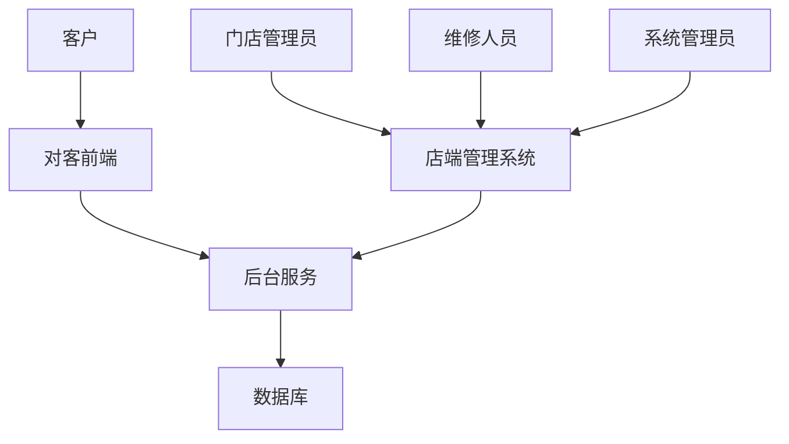
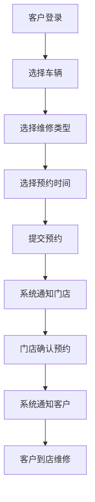
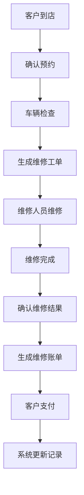
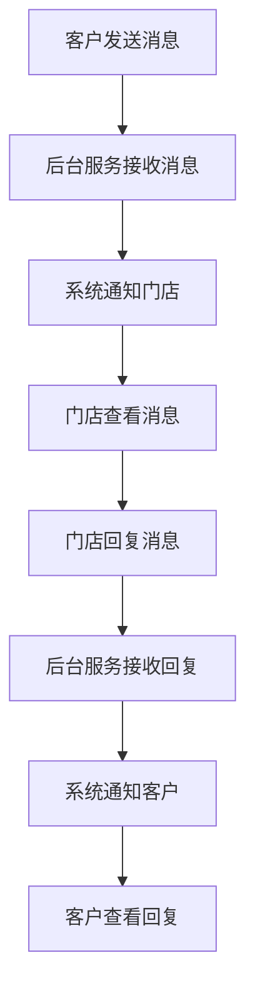

# 车辆预约维修管理系统需求文档

## 1. 变更记录
| 版本 | 日期 | 变更内容 | 变更人 |
|------|------|----------|--------|
| 1.0 | 2026-03-01 | 初始版本 | 产品专家 |
| 1.1 | 2026-03-01 | 完善需求文档结构，添加变更记录、术语定义、系统整体流程图等 | 产品专家 |
| 1.2 | 2026-03-01 | 补充在线沟通功能的详细需求，包括消息类型、发送规则等 | 产品专家 |

## 2. 文档概述

### 2.1 文档目的
本文档旨在详细描述车辆预约维修管理系统的需求，包括功能需求、非功能需求、业务场景、产品结构、原型设计和流程图等内容，为开发团队提供清晰的指导，确保系统的开发符合业务需求和用户期望。

### 2.2 术语定义
| 术语 | 解释 |
|------|------|
| 预约 | 客户通过系统提交的维修服务申请 |
| 维修工单 | 维修店根据预约生成的维修任务单，包含维修项目、费用等信息 |
| VIN码 | 车辆识别码，是车辆的唯一标识 |
| 维修类型 | 维修服务的类别，如常规保养、故障维修、事故维修等 |
| 预约状态 | 预约的当前状态，如待确认、已确认、已完成、已取消等 |
| 维修状态 | 维修工单的当前状态，如待处理、维修中、已完成等 |

## 3. 项目背景

### 3.1 项目简介
随着汽车保有量的持续增长，汽车维修服务市场也在不断扩大。传统的维修服务模式已经无法满足客户的需求，需要开发一套车辆预约维修管理系统，包含对客前端和店端管理系统两部分，实现维修服务的数字化、标准化和智能化。

### 3.2 业务痛点
- 预约流程繁琐，客户需要电话或到店预约
- 维修进度不透明，客户无法实时了解维修状态
- 信息管理混乱，维修店难以有效管理客户和车辆信息
- 配件管理不规范，影响维修效率
- 数据统计分析能力不足，难以优化服务流程

### 3.3 项目目标
- 简化预约流程，实现线上预约
- 提高维修进度透明度，实时更新维修状态
- 规范信息管理，提高数据准确性和完整性
- 优化配件管理，提高维修效率
- 增强数据分析能力，为决策提供支持

## 4. 业务场景

### 4.1 典型业务场景
- 客户通过对客前端预约车辆维修服务
- 维修店通过店端管理系统处理客户预约
- 维修人员通过系统记录维修过程和费用
- 客户通过系统查询维修进度和历史记录

### 4.2 业务流程
- 客户预约流程：客户登录系统 → 选择车辆 → 选择维修类型和时间 → 提交预约 → 门店确认 → 客户到店维修
- 维修流程：客户到店 → 车辆检查 → 生成工单 → 维修 → 确认结果 → 生成账单 → 客户支付 → 系统更新记录

## 5. 目标用户

### 5.1 用户角色
| 角色 | 职责 | 核心需求 |
|------|------|----------|
| 客户 | 预约维修服务，查询维修进度和费用 | 便捷的预约流程，实时的维修进度查询，透明的费用明细 |
| 门店管理员 | 管理客户预约，安排维修人员，处理维修工单 | 高效的预约管理，合理的人员调度，准确的工单处理 |
| 维修人员 | 执行维修任务，记录维修过程和费用 | 清晰的维修任务，便捷的记录方式，准确的费用计算 |
| 系统管理员 | 系统配置和维护，用户权限管理 | 安全的系统配置，灵活的权限管理，稳定的系统运行 |

### 5.2 用户需求
- 客户：方便快捷的预约服务，实时的维修进度查询，透明的费用明细，历史记录查询
- 门店管理员：高效的预约管理，客户信息管理，车辆信息管理，配件管理，数据分析
- 维修人员：清晰的维修任务，便捷的维修记录，准确的费用计算
- 系统管理员：系统配置，用户权限管理，系统监控和维护

## 6. 产品结构

### 6.1 系统整体架构
系统分为对客前端和店端管理系统两部分，通过后台服务模块进行数据交互。对客前端面向客户，提供预约、查询等功能；店端管理系统面向维修店内部人员，提供管理和操作功能。

### 6.2 模块关系
- 对客前端模块：用户管理、车辆管理、预约管理、维修进度查询、历史记录查询、在线沟通、费用查询
- 店端管理系统模块：系统管理、客户信息管理、车辆信息管理、配件信息管理、预约管理、维修流程管理、财务管理、数据分析、在线沟通
- 后台服务模块：API接口、业务逻辑处理、数据存储

### 6.3 技术实现建议
- 前端：React或Vue.js
- 后端：Spring Boot或Node.js
- 数据库：MySQL或PostgreSQL
- 缓存：Redis
- 消息队列：RabbitMQ
- 部署：Docker容器化部署

## 7. 流程图

### 7.1 系统整体流程


### 7.2 核心业务流程
- 客户预约流程：


- 维修流程：


- 在线沟通流程：


## 8. 高保真原型

### 8.1 设计风格
系统采用简洁、现代的设计风格，以蓝色为主色调，体现专业、可靠的服务形象。界面布局清晰，操作流程简单直观，减少用户学习成本。

### 8.2 页面设计
- 对客前端：
  - 首页：http://localhost:8000/对客前端-首页.html
  - 登录页面：http://localhost:8000/对客前端-登录页面.html
  - 注册页面：http://localhost:8000/对客前端-注册页面.html
  - 车辆信息管理页面：http://localhost:8000/对客前端-车辆信息管理页面.html
  - 预约车辆维修页面：http://localhost:8000/对客前端-预约车辆维修页面.html
  - 预约管理页面：http://localhost:8000/对客前端-预约管理页面.html
  - 维修进度查询页面：http://localhost:8000/对客前端-维修进度查询页面.html
  - 历史记录查询页面：http://localhost:8000/对客前端-历史记录查询页面.html
  - 费用查询页面：http://localhost:8000/对客前端-费用查询页面.html
  - 在线沟通页面：http://localhost:8000/对客前端-在线沟通页面.html

- 店端管理系统：
  - 登录页面：http://localhost:8000/店端管理系统-登录页面.html
  - 首页：http://localhost:8000/店端管理系统-首页.html
  - 客户信息管理页面：http://localhost:8000/店端管理系统-客户信息管理页面.html
  - 车辆信息管理页面：http://localhost:8000/店端管理系统-车辆信息管理页面.html
  - 配件信息管理页面：http://localhost:8000/店端管理系统-配件信息管理页面.html
  - 预约管理页面：http://localhost:8000/店端管理系统-预约管理页面.html

### 8.3 交互设计
系统采用响应式设计，适配不同设备屏幕尺寸。操作流程简洁明了，关键操作有明确的反馈提示。表单验证实时进行，减少用户错误操作。

## 9. 功能需求

### 9.1 对客前端

#### 9.1.1 用户注册/登录
- **功能描述**：客户注册和登录系统
- **详细需求**：
  - 支持手机号注册，验证码登录
  - 支持密码找回功能
  - 支持记住密码功能

##### 9.1.1.1 字段定义
| 字段名称 | 字段类型 | 字段取值逻辑 |
|---------|---------|------------|
| 手机号 | 字符串 | 11位数字，符合手机号格式 |
| 验证码 | 字符串 | 6位数字，系统生成并发送 |
| 密码 | 字符串 | 8-20位，包含字母和数字 |
| 确认密码 | 字符串 | 与密码一致 |

##### 9.1.1.2 筛选字段
| 筛选字段 | 筛选类型 | 筛选操作逻辑 |
|---------|---------|------------|
| 手机号 | 精确匹配 | 输入手机号进行登录 |

##### 9.1.1.3 操作逻辑
| 操作按钮 | 操作逻辑 | 成功提示 | 错误提示 |
|---------|---------|---------|----------|
| 注册 | 验证手机号和密码，创建用户 | 注册成功 | 手机号已存在/密码格式不正确 |
| 登录 | 验证手机号和密码，登录系统 | 登录成功 | 手机号或密码错误 |
| 获取验证码 | 发送验证码到手机 | 验证码已发送 | 手机号格式不正确/发送失败 |
| 忘记密码 | 验证手机号和验证码，重置密码 | 密码重置成功 | 验证码错误/操作失败 |

##### 9.1.1.4 状态流转
```
未注册 → 注册 → 登录 → 已登录
```

##### 9.1.1.5 数据权限
| 角色 | 权限限制 |
|------|----------|
| 客户 | 只能访问自己的账户信息 |

#### 9.1.2 车辆管理
- **功能描述**：客户添加和管理车辆信息
- **详细需求**：
  - 支持添加多辆车辆
  - 记录车辆基本信息、行驶里程、保险信息等
  - 支持车辆信息的编辑和删除

##### 9.1.2.1 字段定义
| 字段名称 | 字段类型 | 字段取值逻辑 |
|---------|---------|------------|
| 车牌号 | 字符串 | 符合车牌号格式 |
| VIN码 | 字符串 | 17位字母数字组合 |
| 品牌 | 字符串 | 选择或输入 |
| 型号 | 字符串 | 选择或输入 |
| 购买日期 | 日期 | 选择日期 |
| 行驶里程 | 数字 | 大于等于0 |
| 保险到期日 | 日期 | 选择日期 |

##### 9.1.2.2 筛选字段
| 筛选字段 | 筛选类型 | 筛选操作逻辑 |
|---------|---------|------------|
| 车牌号 | 模糊匹配 | 输入车牌号进行搜索 |
| 品牌 | 下拉选择 | 选择品牌进行筛选 |

##### 9.1.2.3 操作逻辑
| 操作按钮 | 操作逻辑 | 成功提示 | 错误提示 |
|---------|---------|---------|----------|
| 添加车辆 | 验证车辆信息，添加到系统 | 添加成功 | 信息填写不完整/格式不正确 |
| 编辑车辆 | 修改车辆信息，保存到系统 | 编辑成功 | 信息填写不完整/格式不正确 |
| 删除车辆 | 删除车辆信息 | 删除成功 | 删除失败 |

##### 9.1.2.4 状态流转
```
未添加车辆 → 添加车辆 → 车辆列表 → 编辑/删除车辆
```

##### 9.1.2.5 数据权限
| 角色 | 权限限制 |
|------|----------|
| 客户 | 只能管理自己的车辆信息 |

#### 9.1.3 维修预约
- **功能描述**：客户在线预约维修服务
- **详细需求**：
  - 选择维修类型、预约时间、服务门店等
  - 提交预约申请
  - 查看预约状态

##### 9.1.3.1 字段定义
| 字段名称 | 字段类型 | 字段取值逻辑 |
|---------|---------|------------|
| 车辆ID | 下拉选择 | 从客户车辆列表中选择 |
| 维修类型 | 下拉选择 | 选择维修类型 |
| 预约日期 | 日期 | 选择日期 |
| 预约时间 | 时间 | 选择时间段 |
| 服务门店 | 下拉选择 | 选择服务门店 |
| 备注 | 文本 | 输入备注信息 |

##### 9.1.3.2 筛选字段
| 筛选字段 | 筛选类型 | 筛选操作逻辑 |
|---------|---------|------------|
| 维修类型 | 下拉选择 | 选择维修类型进行筛选 |
| 预约日期 | 日期范围 | 选择日期范围进行筛选 |

##### 9.1.3.3 操作逻辑
| 操作按钮 | 操作逻辑 | 成功提示 | 错误提示 |
|---------|---------|---------|----------|
| 提交预约 | 验证预约信息，提交申请 | 预约提交成功 | 信息填写不完整/预约时间已被占用 |
| 取消预约 | 取消未确认的预约 | 预约取消成功 | 预约已被确认，无法取消 |

##### 9.1.3.4 状态流转
```
提交预约 → 待确认 → 已确认/已取消 → 维修中 → 已完成
```

##### 9.1.3.5 数据权限
| 角色 | 权限限制 |
|------|----------|
| 客户 | 只能查看和管理自己的预约 |

#### 9.1.4 维修进度查询
- **功能描述**：客户查询维修进度
- **详细需求**：
  - 实时查看维修状态
  - 查看维修详情

##### 9.1.4.1 字段定义
| 字段名称 | 字段类型 | 字段取值逻辑 |
|---------|---------|------------|
| 预约ID | 字符串 | 系统生成 |
| 维修状态 | 枚举 | 待处理、维修中、已完成 |
| 维修详情 | 文本 | 维修人员填写 |

##### 9.1.4.2 筛选字段
| 筛选字段 | 筛选类型 | 筛选操作逻辑 |
|---------|---------|------------|
| 预约ID | 精确匹配 | 输入预约ID进行查询 |
| 维修状态 | 下拉选择 | 选择维修状态进行筛选 |

##### 9.1.4.3 操作逻辑
| 操作按钮 | 操作逻辑 | 成功提示 | 错误提示 |
|---------|---------|---------|----------|
| 查询 | 根据筛选条件查询维修进度 | 查询成功 | 查询失败 |

##### 9.1.4.4 状态流转
```
待处理 → 维修中 → 已完成
```

##### 9.1.4.5 数据权限
| 角色 | 权限限制 |
|------|----------|
| 客户 | 只能查看自己的维修进度 |

#### 9.1.5 在线沟通
- **功能描述**：客户与维修店之间的在线沟通
- **详细需求**：
  - 支持文字消息、图片消息、文件消息
  - 支持消息已读/未读状态
  - 支持消息历史记录查询
  - 支持按预约单进行沟通

##### 9.1.5.1 字段定义
| 字段名称 | 字段类型 | 字段取值逻辑 |
|---------|---------|------------|
| 消息ID | 字符串 | 系统生成 |
| 发送方ID | 字符串 | 系统关联用户ID |
| 接收方ID | 字符串 | 系统关联用户ID |
| 预约ID | 字符串 | 关联的预约单ID |
| 消息类型 | 枚举 | 文字、图片、文件 |
| 消息内容 | 文本/附件 | 根据消息类型存储对应内容 |
| 发送时间 | 日期时间 | 系统自动生成 |
| 状态 | 枚举 | 已发送、已读 |

##### 9.1.5.2 筛选字段
| 筛选字段 | 筛选类型 | 筛选操作逻辑 |
|---------|---------|------------|
| 预约ID | 精确匹配 | 输入预约ID进行筛选 |
| 消息类型 | 下拉选择 | 选择消息类型进行筛选 |
| 发送时间 | 日期范围 | 选择日期范围进行筛选 |

##### 9.1.5.3 操作逻辑
| 操作按钮 | 操作逻辑 | 成功提示 | 错误提示 |
|---------|---------|---------|----------|
| 发送消息 | 发送消息给对方 | 发送成功 | 发送失败 |
| 发送图片 | 上传并发送图片 | 发送成功 | 上传失败/发送失败 |
| 发送文件 | 上传并发送文件 | 发送成功 | 上传失败/发送失败 |
| 标记已读 | 将消息标记为已读 | 标记成功 | 标记失败 |

##### 9.1.5.4 状态流转
```
未发送 → 已发送 → 已读
```

##### 9.1.5.5 数据权限
| 角色 | 权限限制 |
|------|----------|
| 客户 | 只能查看和发送与自己相关的消息 |
| 门店管理员 | 可查看和发送与本门店相关的所有消息 |
| 维修人员 | 可查看和发送与自己负责的预约相关的消息 |

### 9.2 店端管理系统

#### 9.2.1 系统管理
- **功能描述**：系统基础设置和用户管理
- **详细需求**：
  - 门店信息设置
  - 用户角色管理
  - 权限分配

##### 9.2.1.1 字段定义
| 字段名称 | 字段类型 | 字段取值逻辑 |
|---------|---------|------------|
| 门店名称 | 字符串 | 输入门店名称 |
| 地址 | 字符串 | 输入门店地址 |
| 联系电话 | 字符串 | 输入联系电话 |
| 负责人 | 字符串 | 输入负责人姓名 |
| 角色名称 | 字符串 | 输入角色名称 |
| 权限列表 | 多选 | 选择角色权限 |

##### 9.2.1.2 筛选字段
| 筛选字段 | 筛选类型 | 筛选操作逻辑 |
|---------|---------|------------|
| 角色名称 | 模糊匹配 | 输入角色名称进行搜索 |
| 门店名称 | 模糊匹配 | 输入门店名称进行搜索 |

##### 9.2.1.3 操作逻辑
| 操作按钮 | 操作逻辑 | 成功提示 | 错误提示 |
|---------|---------|---------|----------|
| 保存门店信息 | 保存门店信息到系统 | 保存成功 | 保存失败 |
| 添加角色 | 添加新角色 | 添加成功 | 添加失败 |
| 编辑角色 | 修改角色信息 | 编辑成功 | 编辑失败 |
| 删除角色 | 删除角色 | 删除成功 | 删除失败 |
| 分配权限 | 为角色分配权限 | 分配成功 | 分配失败 |

##### 9.2.1.4 状态流转
```
系统设置 → 门店信息设置 → 保存
角色管理 → 添加/编辑/删除角色 → 分配权限
```

##### 9.2.1.5 数据权限
| 角色 | 权限限制 |
|------|----------|
| 系统管理员 | 可访问和修改所有系统设置 |
| 门店管理员 | 可访问和修改本门店的系统设置 |

#### 9.2.2 客户信息管理
- **功能描述**：管理客户基本信息
- **详细需求**：
  - 记录客户姓名、联系方式、地址等
  - 支持客户信息的添加、编辑、删除和查询

##### 9.2.2.1 字段定义
| 字段名称 | 字段类型 | 字段取值逻辑 |
|---------|---------|------------|
| 客户ID | 字符串 | 系统生成 |
| 姓名 | 字符串 | 输入客户姓名 |
| 手机号 | 字符串 | 输入客户手机号 |
| 地址 | 字符串 | 输入客户地址 |
| 注册时间 | 日期 | 系统自动生成 |

##### 9.2.2.2 筛选字段
| 筛选字段 | 筛选类型 | 筛选操作逻辑 |
|---------|---------|------------|
| 姓名 | 模糊匹配 | 输入姓名进行搜索 |
| 手机号 | 精确匹配 | 输入手机号进行搜索 |
| 注册时间 | 日期范围 | 选择日期范围进行筛选 |

##### 9.2.2.3 操作逻辑
| 操作按钮 | 操作逻辑 | 成功提示 | 错误提示 |
|---------|---------|---------|----------|
| 添加客户 | 添加客户信息 | 添加成功 | 添加失败 |
| 编辑客户 | 修改客户信息 | 编辑成功 | 编辑失败 |
| 删除客户 | 删除客户信息 | 删除成功 | 删除失败 |
| 查询 | 根据筛选条件查询客户信息 | 查询成功 | 查询失败 |

##### 9.2.2.4 状态流转
```
客户列表 → 添加/编辑/删除客户 → 客户列表
```

##### 9.2.2.5 数据权限
| 角色 | 权限限制 |
|------|----------|
| 系统管理员 | 可访问和修改所有客户信息 |
| 门店管理员 | 可访问和修改本门店的客户信息 |
| 维修人员 | 可查看客户信息，不可修改 |

#### 9.2.3 车辆信息管理
- **功能描述**：管理客户车辆信息
- **详细需求**：
  - 记录车辆品牌、型号、车牌号、VIN码、行驶里程等
  - 支持车辆信息的添加、编辑、删除和查询

##### 9.2.3.1 字段定义
| 字段名称 | 字段类型 | 字段取值逻辑 |
|---------|---------|------------|
| 车辆ID | 字符串 | 系统生成 |
| 车牌号 | 字符串 | 输入车牌号 |
| VIN码 | 字符串 | 输入VIN码 |
| 品牌 | 字符串 | 输入品牌 |
| 型号 | 字符串 | 输入型号 |
| 购买日期 | 日期 | 选择日期 |
| 行驶里程 | 数字 | 输入行驶里程 |
| 所属用户ID | 字符串 | 选择所属用户 |

##### 9.2.3.2 筛选字段
| 筛选字段 | 筛选类型 | 筛选操作逻辑 |
|---------|---------|------------|
| 车牌号 | 模糊匹配 | 输入车牌号进行搜索 |
| 品牌 | 下拉选择 | 选择品牌进行筛选 |
| 所属用户 | 模糊匹配 | 输入用户姓名进行搜索 |

##### 9.2.3.3 操作逻辑
| 操作按钮 | 操作逻辑 | 成功提示 | 错误提示 |
|---------|---------|---------|----------|
| 添加车辆 | 添加车辆信息 | 添加成功 | 添加失败 |
| 编辑车辆 | 修改车辆信息 | 编辑成功 | 编辑失败 |
| 删除车辆 | 删除车辆信息 | 删除成功 | 删除失败 |
| 查询 | 根据筛选条件查询车辆信息 | 查询成功 | 查询失败 |

##### 9.2.3.4 状态流转
```
车辆列表 → 添加/编辑/删除车辆 → 车辆列表
```

##### 9.2.3.5 数据权限
| 角色 | 权限限制 |
|------|----------|
| 系统管理员 | 可访问和修改所有车辆信息 |
| 门店管理员 | 可访问和修改本门店的车辆信息 |
| 维修人员 | 可查看车辆信息，不可修改 |

#### 9.2.4 预约管理
- **功能描述**：管理客户预约
- **详细需求**：
  - 查看预约列表
  - 确认或拒绝预约
  - 安排维修人员和时间

##### 9.2.4.1 字段定义
| 字段名称 | 字段类型 | 字段取值逻辑 |
|---------|---------|------------|
| 预约ID | 字符串 | 系统生成 |
| 用户ID | 字符串 | 系统关联 |
| 车辆ID | 字符串 | 系统关联 |
| 预约时间 | 日期时间 | 系统关联 |
| 维修类型 | 字符串 | 系统关联 |
| 服务门店 | 字符串 | 系统关联 |
| 预约状态 | 枚举 | 待确认、已确认、已完成、已取消 |
| 备注 | 文本 | 输入备注信息 |
| 分配维修人员 | 字符串 | 选择维修人员 |

##### 9.2.4.2 筛选字段
| 筛选字段 | 筛选类型 | 筛选操作逻辑 |
|---------|---------|------------|
| 预约状态 | 下拉选择 | 选择预约状态进行筛选 |
| 预约日期 | 日期范围 | 选择日期范围进行筛选 |
| 客户姓名 | 模糊匹配 | 输入客户姓名进行搜索 |
| 车牌号 | 模糊匹配 | 输入车牌号进行搜索 |

##### 9.2.4.3 操作逻辑
| 操作按钮 | 操作逻辑 | 成功提示 | 错误提示 |
|---------|---------|---------|----------|
| 确认预约 | 确认客户预约 | 确认成功 | 确认失败 |
| 拒绝预约 | 拒绝客户预约 | 拒绝成功 | 拒绝失败 |
| 分配维修人员 | 为预约分配维修人员 | 分配成功 | 分配失败 |
| 查询 | 根据筛选条件查询预约 | 查询成功 | 查询失败 |

##### 9.2.4.4 状态流转
```
待确认 → 已确认/已取消 → 维修中 → 已完成
```

##### 9.2.4.5 数据权限
| 角色 | 权限限制 |
|------|----------|
| 系统管理员 | 可访问和管理所有预约 |
| 门店管理员 | 可访问和管理本门店的预约 |
| 维修人员 | 可查看分配给自己的预约 |

#### 9.2.5 在线沟通
- **功能描述**：维修店与客户之间的在线沟通
- **详细需求**：
  - 支持文字消息、图片消息、文件消息
  - 支持消息已读/未读状态
  - 支持消息历史记录查询
  - 支持按预约单进行沟通
  - 支持批量消息管理

##### 9.2.5.1 字段定义
| 字段名称 | 字段类型 | 字段取值逻辑 |
|---------|---------|------------|
| 消息ID | 字符串 | 系统生成 |
| 发送方ID | 字符串 | 系统关联用户ID |
| 接收方ID | 字符串 | 系统关联用户ID |
| 预约ID | 字符串 | 关联的预约单ID |
| 消息类型 | 枚举 | 文字、图片、文件 |
| 消息内容 | 文本/附件 | 根据消息类型存储对应内容 |
| 发送时间 | 日期时间 | 系统自动生成 |
| 状态 | 枚举 | 已发送、已读 |
| 处理状态 | 枚举 | 待处理、已处理 |

##### 9.2.5.2 筛选字段
| 筛选字段 | 筛选类型 | 筛选操作逻辑 |
|---------|---------|------------|
| 预约ID | 精确匹配 | 输入预约ID进行筛选 |
| 客户姓名 | 模糊匹配 | 输入客户姓名进行搜索 |
| 消息类型 | 下拉选择 | 选择消息类型进行筛选 |
| 发送时间 | 日期范围 | 选择日期范围进行筛选 |
| 消息状态 | 下拉选择 | 选择消息状态进行筛选 |

##### 9.2.5.3 操作逻辑
| 操作按钮 | 操作逻辑 | 成功提示 | 错误提示 |
|---------|---------|---------|----------|
| 发送消息 | 发送消息给客户 | 发送成功 | 发送失败 |
| 发送图片 | 上传并发送图片 | 发送成功 | 上传失败/发送失败 |
| 发送文件 | 上传并发送文件 | 发送成功 | 上传失败/发送失败 |
| 标记已读 | 将消息标记为已读 | 标记成功 | 标记失败 |
| 标记已处理 | 将消息标记为已处理 | 标记成功 | 标记失败 |
| 批量操作 | 对选中消息进行批量处理 | 操作成功 | 操作失败 |

##### 9.2.5.4 状态流转
```
未发送 → 已发送 → 已读 → 已处理
```

##### 9.2.5.5 数据权限
| 角色 | 权限限制 |
|------|----------|
| 系统管理员 | 可查看和发送所有消息 |
| 门店管理员 | 可查看和发送与本门店相关的所有消息 |
| 维修人员 | 可查看和发送与自己负责的预约相关的消息 |

## 10. 非功能需求

### 10.1 性能要求
- **响应时间**：页面加载时间不超过2秒，操作响应时间不超过1秒
- **并发处理**：支持同时1000个用户在线操作
- **数据处理**：支持每天处理10000条预约记录

### 10.2 可靠性要求
- **系统可用性**：系统可用性达到99.9%，支持7×24小时运行
- **数据备份**：每天自动备份数据，保留30天的备份记录

### 10.3 安全性要求
- **数据加密**：采用HTTPS协议传输数据，敏感数据加密存储
- **访问控制**：基于角色的访问控制，不同角色拥有不同的权限
- **防止SQL注入**：采用参数化查询，防止SQL注入攻击
- **防止XSS攻击**：对用户输入进行过滤和转义

### 10.4 易用性要求
- **用户界面**：界面设计简洁直观，操作流程清晰
- **响应式设计**：支持PC端、移动端等多种设备访问
- **错误提示**：操作错误时提供明确的错误提示
- **帮助文档**：提供系统使用帮助文档

## 11. 项目范围

### 11.1 包含范围
- 对客前端：用户注册/登录、车辆管理、维修预约、预约管理、维修进度查询、历史记录查询、在线沟通、费用查询
- 店端管理系统：系统管理、客户信息管理、车辆信息管理、配件信息管理、预约管理、维修流程管理、财务管理、数据分析、在线沟通
- 后台服务：API接口、业务逻辑处理、数据存储

### 11.2 排除范围
- 会员系统：不包含会员等级和积分管理
- 支付系统：仅支持在线查询费用，不包含在线支付功能
- 第三方集成：不包含与保险公司、汽车厂商等第三方系统的集成

## 12. 风险分析

### 12.1 风险识别
- **技术风险**：系统性能不足，无法满足并发需求
- **数据风险**：客户数据泄露
- **运营风险**：门店员工使用系统不熟练
- **市场风险**：客户对在线预约接受度低

### 12.2 风险缓解措施
- **技术风险**：采用缓存技术和负载均衡，优化数据库查询，定期进行性能测试
- **数据风险**：建立数据备份机制，采用加密技术保护数据，定期进行安全审计
- **运营风险**：提供系统培训，优化用户界面，减少操作复杂度，提供详细的使用文档
- **市场风险**：进行市场推广，提供优惠活动，提高用户体验，收集用户反馈并持续改进

## 13. 验收标准

### 13.1 功能验收
- 所有功能模块按照需求文档实现
- 功能操作流程正确，无错误
- 数据录入和查询功能正常
- 权限控制有效

### 13.2 性能验收
- 页面加载时间不超过2秒
- 操作响应时间不超过1秒
- 系统支持同时1000个用户在线操作
- 系统支持每天处理10000条预约记录

### 13.3 安全验收
- 数据传输采用HTTPS协议
- 敏感数据加密存储
- 权限控制有效，不同角色只能访问授权的功能
- 系统能够防止SQL注入和XSS攻击

### 13.4 可用性验收
- 系统界面简洁直观，操作流程清晰
- 系统支持PC端、移动端等多种设备访问
- 操作错误时提供明确的错误提示
- 系统提供使用帮助文档

## 14. 交付物

### 14.1 文档交付物
- 需求文档
- 设计文档
- 测试文档
- 使用帮助文档

### 14.2 代码交付物
- 对客前端代码
- 店端管理系统代码
- 后台服务代码
- 数据库脚本

### 14.3 其他交付物
- 系统部署指南
- 系统培训文档

## 15. 项目时间计划

### 15.1 项目阶段
- **需求阶段**：2026-03-01 至 2026-03-15
- **设计阶段**：2026-03-16 至 2026-03-30
- **开发阶段**：2026-04-01 至 2026-05-15
- **测试阶段**：2026-05-16 至 2026-05-30
- **部署阶段**：2026-06-01 至 2026-06-10
- **培训阶段**：2026-06-11 至 2026-06-20

### 15.2 关键里程碑
- 需求文档完成：2026-03-15
- 设计文档完成：2026-03-30
- 开发完成：2026-05-15
- 测试完成：2026-05-30
- 系统上线：2026-06-10
- 培训完成：2026-06-20

## 16. 联系方式

### 16.1 项目团队
- 产品经理：[产品经理姓名]
- 技术负责人：[技术负责人姓名]
- 测试负责人：[测试负责人姓名]
- 项目协调：[项目协调姓名]

### 16.2 沟通方式
- 项目会议：每周一次
- 日常沟通：企业微信
- 问题跟踪：JIRA